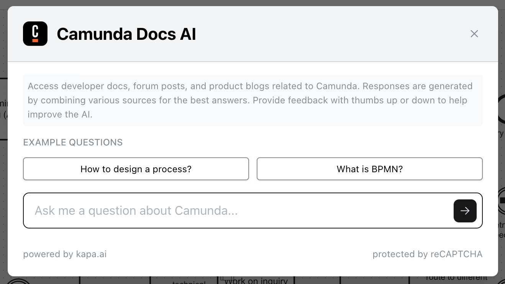

Camunda 8 only
Alpha

:::note
Camunda Docs AI is an alpha feature. To use this feature, enable the [AI-powered features](https://camunda.com/blog/2024/02/camunda-docs-ai-developer-experience-new-level/) through the [alpha features](/components/console/manage-organization/enable-alpha-features.md) menu.
:::

Camunda Docs AI provides you with a smart AI-powered chatbot that helps you easily find answers to your technical and non-technical questions about Camunda instead of navigating and searching across multiple sources of information like documentation, forums, blog posts, etc.

Click on the **Camunda Docs AI** button at the bottom right of the BPMN/DMN canvas to open the chatbot:

