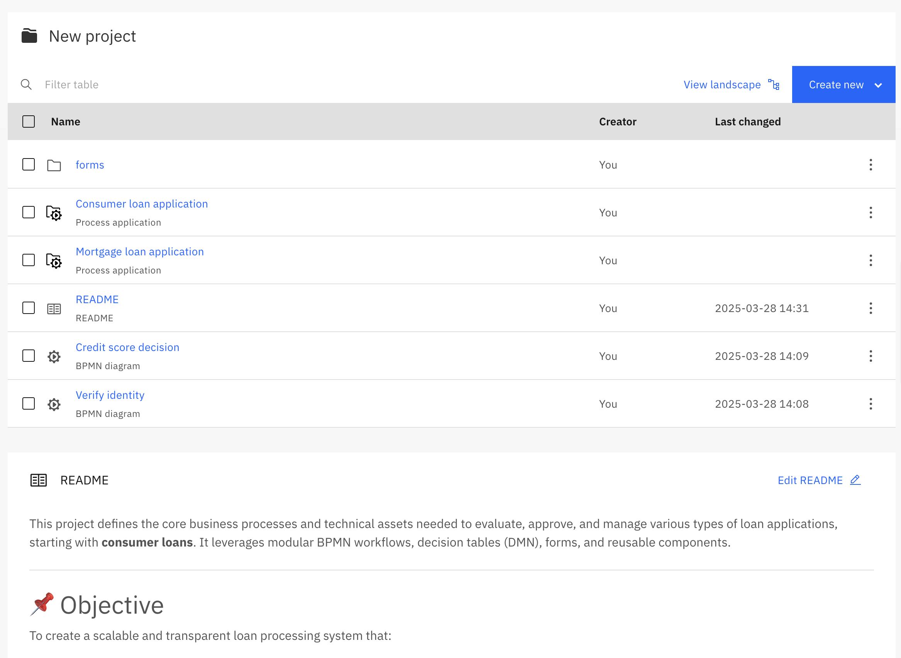
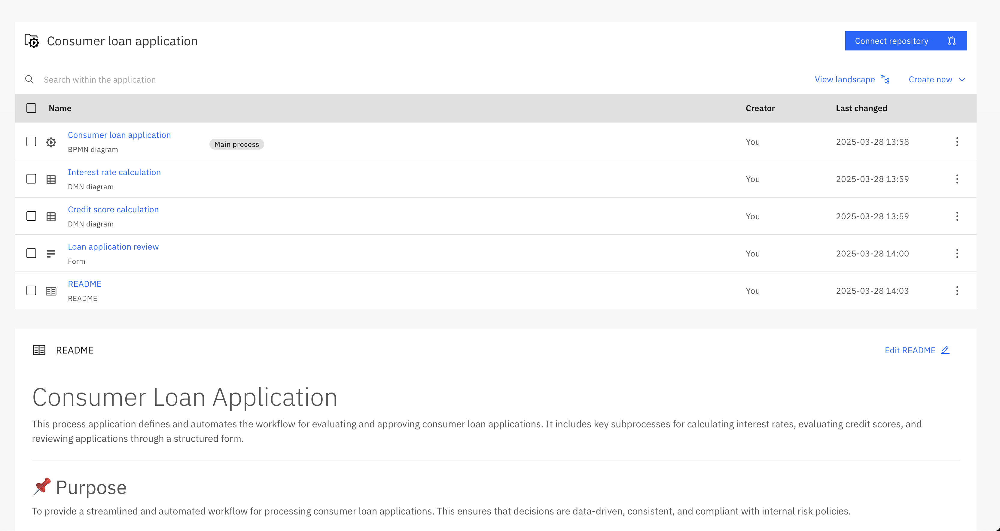
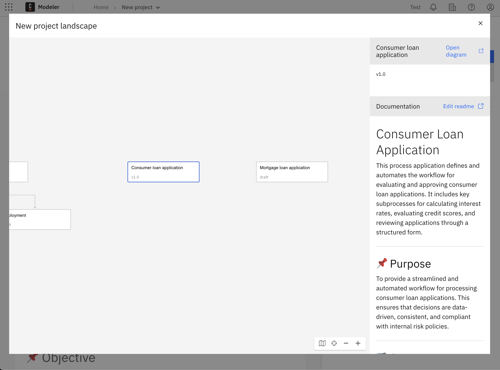
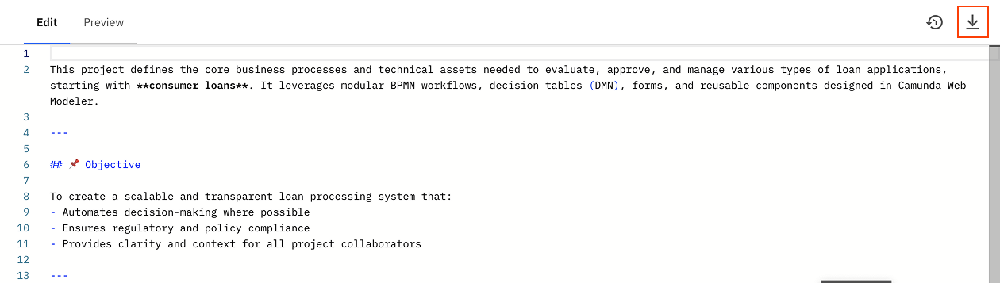
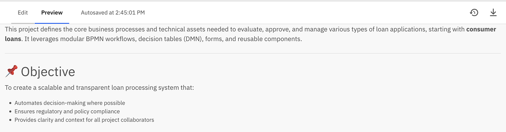

Camunda 8 only

The README feature brings project documentation directly into your modeling workspace.
Whether you're a business user, developer or project owner, README files help capture important context in a way that’s versioned, visible, and easy to maintain.

## Why use READMEs

Process documentation is essential, but it’s often stored outside the modeling tools — making it hard to find, hard to update, and disconnected from your work.
With README support in Web Modeler, you can:

- Document your processes **right where you build them**
- Keep information **versioned and automatically synced** with Git
- Make your projects **easier to understand** for everyone involved — from team members to stakeholders

## What You Can Document:

- Project goals, scope, and stakeholders
- Links to related assets
- Embedded BPMN diagrams
- Go-live dates, status updates, and project health
- Requirements, process owners, and change logs

## Where Readmes Appear

- In every project, process application and folder(each can have its own README)
  
  > Git-connected process application sync README content just like any other file
- In the [Process landscape view](../process-landscape-visualization.md) as context for a node or the whole app
  

> Each README is unique to its folder and can’t be moved through the UI.
> However, you can download or delete associated README file.

## Writing a README

README files are uses standard [Markdown](https://www.markdownguide.org/), a lightweight markup language that’s readable and easy to edit. A README should provide a snapshot of what your project, process application or folder is about. Consider including:

- What this project, application or folder is for
- Who owns or maintains it
- key requirements, and business rules
- Links to related documentation or dashboards

> Refer to [GitHub’s README guide](https://docs.github.com/en/repositories/managing-your-repositorys-settings-and-features/customizing-your-repository/about-readmes) for general inspiration.

## README interaction

1.  README file changes are fully versioned, you can see previous versions and resent changes by clicking on **Show versions** icon
    
2.  README file can be downloaded by clicking **Download** icon making it easy to share or archive documentation.
    
3.  To see the final result of README file appearance go to the **Preview** tab
    

## Related resources

- [Process applications](../process-applications.md)
- [Process landscape visualization](../process-landscape-visualization.md)
