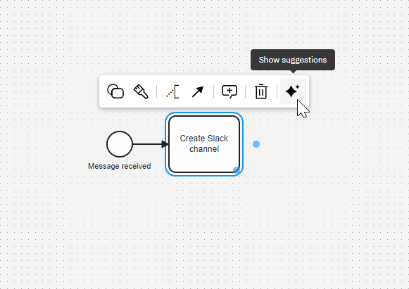
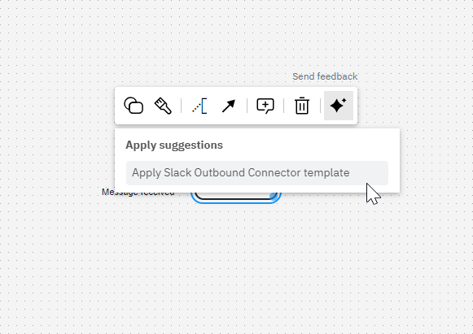
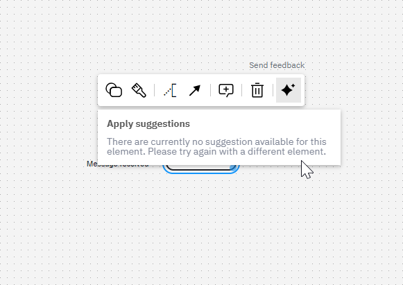

Camunda 8 only
Alpha

:::note
Refactoring suggestions are an alpha feature. To use this feature, enable the [context pad](/components/modeler/web-modeler/new-context-pad.md) and [AI-powered features](https://camunda.com/blog/2024/02/camunda-docs-ai-developer-experience-new-level/) through the [alpha features](/components/console/manage-organization/enable-alpha-features.md) menu.
:::

The refactoring suggestions feature helps you improve your BPMN diagrams by providing suggestions for refactoring your diagrams based on best practices and common patterns. You can access the refactoring suggestions by clicking on the AI **Show suggestions** icon in the context pad:

If there are suggestions available, a list of them will appear. Click on a suggestion to apply it to your diagram:

If there are no suggestions available, a message will indicate this:

