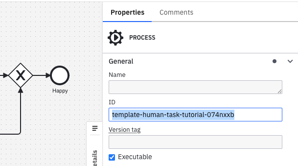

<span class="badge badge--cloud">Camunda 8 only</span>

Test scenario files let you define shareable, low-code tests for your BPMN processes.

They are stored in JSON format and can be created, edited, and managed directly in Web Modeler. You can also download these files or synchronize them with your Git repository using Git Sync.

## Create a test scenario file

You can create a test scenario file by [saving a scenario in Play](../play-your-process.md#save-scenario), or by manually creating a **test scenario file** in Web Modeler.

## Manual editing

### Test case structure

Test scenario files are organized as follows:

```json
{
  "processId": "order-fulfillment-process",
  "testCases": [
    {
      "name": "Happy path order processing",
      "instructions": [
        // Array of instruction objects
      ],
      "metadata": {
        // Optional - for use in Play only
        "processInstanceId": 12345,
        "coveredFlowNodes": [
          { "flowNodeId": "startEvent", "elementType": "START_EVENT" },
          { "flowNodeId": "processOrder", "elementType": "SERVICE_TASK" }
        ],
        "coveredSequenceFlows": ["flow1", "flow2"]
      }
    },
    {
      "name": "Error handling scenario",
      "instructions": [
        // Array of instruction objects for error case
      ]
    }
  ]
}
```

**Top-level fields**

| Field       | Required | Description                                                       |
| ----------- | -------- | ----------------------------------------------------------------- |
| `processId` | Yes      | The ID of the BPMN process definition the test cases run against. |
| `testCases` | Yes      | An array of test case objects.                                    |

**Test case fields**

| Field          | Required | Description                                                                                                |
| -------------- | -------- | ---------------------------------------------------------------------------------------------------------- |
| `name`         | No       | A descriptive name for the test case scenario.                                                             |
| `instructions` | Yes      | An array of instruction objects that define the test steps.                                                |
| `metadata`     | No       | Used by Play to show coverage and process instance details. Camunda does not recommend editing this field. |

### Link a process (`processId`)

To display the file's scenarios in Play, you must first link the file to a process.

Add a `processId` field with the process ID of the BPMN process you want to test:

```json
{
  "processId": "Process_1"
}
```

You can find the BPMN process ID in the properties panel, or in the `<bpmn:process id=` field of the XML.



The `processId` should be shorter than 255 characters and not contain whitespace.

:::note
Play runs only the first executable process within the BPMN diagram. Make sure the process ID you link is the first executable process.
:::

:::caution
If the BPMN diagram's process ID changes (or another process ID is added earlier in the BPMN file), the file's scenarios will not be used in the process's Play scenarios tab.
:::

### Unlink a process

To unlink the file from a process, remove the `processId` field or set it to `null`.

:::caution
Unlinking a file means its scenarios will not be shown in the Play scenarios tab for that process.

To fix this, re-link the file by restoring the `processId` field.
:::

## Instructions

### Common patterns

- **Variables**: Provide variables as JSON strings.
- **Element IDs**: Reference specific BPMN elements in your process definition.
- **Process definition IDs**: Identify which process definition to interact with.

### Create process instance

Creates a new process instance from a process definition.

**Fields**

| Field                 | Required | Description                                         |
| --------------------- | -------- | --------------------------------------------------- |
| `type`                | Yes      | Must be `"create-process-instance"`.                |
| `processDefinitionId` | Yes      | The ID of the process definition to instantiate.    |
| `variables`           | No       | A JSON string containing initial process variables. |

**Example:**

```json
{
  "type": "create-process-instance",
  "processDefinitionId": "order-process",
  "variables": "{\"orderId\": \"ORD-001\", \"priority\": \"high\"}"
}
```

### Create process instance by message

Creates a new process instance by sending a message to a message start event.

**Fields**

| Field                 | Required | Description                                              |
| --------------------- | -------- | -------------------------------------------------------- |
| `type`                | Yes      | Must be `"create-process-instance-by-message"`.          |
| `processDefinitionId` | Yes      | The ID of the process definition to instantiate.         |
| `messageName`         | Yes      | The name of the message that triggers the process start. |
| `variables`           | No       | A JSON string containing initial process variables.      |

**Example:**

```json
{
  "type": "create-process-instance-by-message",
  "processDefinitionId": "message-triggered-process",
  "messageName": "OrderReceived",
  "variables": "{\"orderData\": \"sample data\"}"
}
```

### Create process instance by signal

Creates a new process instance by broadcasting a signal to a signal start event.

**Fields**

| Field                 | Required | Description                                             |
| --------------------- | -------- | ------------------------------------------------------- |
| `type`                | Yes      | Must be `"create-process-instance-by-signal"`.          |
| `processDefinitionId` | Yes      | The ID of the process definition to instantiate.        |
| `signalName`          | Yes      | The name of the signal that triggers the process start. |
| `variables`           | No       | A JSON string containing initial process variables.     |

**Example:**

```json
{
  "type": "create-process-instance-by-signal",
  "processDefinitionId": "signal-triggered-process",
  "signalName": "MarketOpened",
  "variables": "{\"marketData\": \"current rates\"}"
}
```

### Complete job

Completes a service task job during process execution.

**Fields**

| Field       | Required | Description                                                        |
| ----------- | -------- | ------------------------------------------------------------------ |
| `type`      | Yes      | Must be `"complete-job"`.                                          |
| `jobType`   | Yes      | The task’s job type (also called the task definition type).        |
| `elementId` | Yes      | The ID of the BPMN element (service task) to complete.             |
| `variables` | No       | A JSON string containing variables to set when completing the job. |

**Example:**

```json
{
  "type": "complete-job",
  "jobType": "payment-service",
  "elementId": "processPayment",
  "variables": "{\"paymentResult\": \"success\", \"transactionId\": \"TXN-123\"}"
}
```

### Broadcast signal

Broadcasts a signal that can be caught by signal intermediate catch events or signal boundary events.

**Fields**

| Field        | Required | Description                                                 |
| ------------ | -------- | ----------------------------------------------------------- |
| `type`       | Yes      | Must be `"broadcast-signal"`.                               |
| `elementId`  | Yes      | The ID of the BPMN element that will catch the signal.      |
| `signalName` | Yes      | The name of the signal to broadcast.                        |
| `variables`  | No       | A JSON string containing variables to pass with the signal. |

**Example:**

```json
{
  "type": "broadcast-signal",
  "elementId": "waitForApproval",
  "signalName": "ApprovalReceived",
  "variables": "{\"approved\": true, \"approver\": \"manager@company.com\"}"
}
```

### Complete user task

Completes a user task with optional form data or variables.

**Fields**

| Field       | Required | Description                                                |
| ----------- | -------- | ---------------------------------------------------------- |
| `type`      | Yes      | Must be `"complete-user-task"`.                            |
| `elementId` | Yes      | The ID of the BPMN user task element to complete.          |
| `variables` | No       | A JSON string containing form data or variables to submit. |

**Example:**

```json
{
  "type": "complete-user-task",
  "elementId": "reviewOrder",
  "variables": "{\"reviewComment\": \"Order looks good\", \"approved\": true}"
}
```

### Publish message

Publishes a message that can be caught by message intermediate catch events or message boundary events.

**Fields**

| Field            | Required | Description                                                                                                                    |
| ---------------- | -------- | ------------------------------------------------------------------------------------------------------------------------------ |
| `type`           | Yes      | Must be `"publish-message"`.                                                                                                   |
| `elementId`      | Yes      | The ID of the BPMN element that will catch the message.                                                                        |
| `messageName`    | Yes      | The name of the message to publish.                                                                                            |
| `correlationKey` | Yes      | The correlation key used to match the message to the correct process instance.                                                 |
| `variables`      | No       | A JSON string containing variables to pass with the message.                                                                   |
| `timeToLive`     | No       | How long the message should remain available for correlation, in milliseconds as a string (e.g., `"300000"` for five minutes). |
| `messageId`      | No       | Unique identifier for the message to prevent duplicate processing.                                                             |

**Example:**

```json
{
  "type": "publish-message",
  "elementId": "waitForPayment",
  "messageName": "PaymentConfirmed",
  "correlationKey": "order-12345",
  "variables": "{\"paymentAmount\": 99.99, \"paymentMethod\": \"credit_card\"}",
  "timeToLive": "300000",
  "messageId": "payment-msg-001"
}
```

### Throw job error

Simulates a job failure by throwing an error during service task execution.

**Fields**

| Field          | Required | Description                                                                              |
| -------------- | -------- | ---------------------------------------------------------------------------------------- |
| `type`         | Yes      | Must be `"throw-job-error"`.                                                             |
| `elementId`    | Yes      | The ID of the BPMN service task element where the error occurs.                          |
| `errorCode`    | Yes      | The error code that will be matched with an error catch event.                           |
| `jobType`      | No       | The type of job that failed (useful when multiple job types exist for the same element). |
| `errorMessage` | No       | Human-readable description of the error.                                                 |

**Example:**

```json
{
  "type": "throw-job-error",
  "elementId": "processPayment",
  "errorCode": "PAYMENT_FAILED",
  "jobType": "payment-service",
  "errorMessage": "Insufficient funds in customer account"
}
```

### Update variables

Updates process variables during test execution.

**Fields**

| Field       | Required | Description                                       |
| ----------- | -------- | ------------------------------------------------- |
| `type`      | Yes      | Must be `"update-variables"`.                     |
| `variables` | Yes      | A JSON string containing the variables to update. |

**Example:**

```json
{
  "type": "update-variables",
  "variables": "{\"customerId\": \"12345\", \"amount\": 100.50}"
}
```

### Resolve incident

Resolves an incident that was created due to a job failure or another process issue.

**Fields**

| Field       | Required | Description                                                                                          |
| ----------- | -------- | ---------------------------------------------------------------------------------------------------- |
| `type`      | Yes      | Must be `"resolve-incident"`.                                                                        |
| `elementId` | Yes      | The ID of the BPMN element where the incident occurred.                                              |
| `hasJob`    | Yes      | Boolean indicating whether the incident is related to a job that should be retried after resolution. |

**Example:**

```json
{
  "type": "resolve-incident",
  "elementId": "processPayment",
  "hasJob": true
}
```

## Usage tips

- Always use meaningful `elementId` values that match your BPMN diagram.
- Give test cases descriptive names to clearly indicate the scenario being tested.
- Include error scenarios along with happy path tests.
- Use optional `variables` fields to test different data conditions.
- Ensure correlation keys uniquely identify process instances.
- Specify `timeToLive` values in milliseconds as a string (e.g., `"60000"` for one minute, `"300000"` for five minutes).
