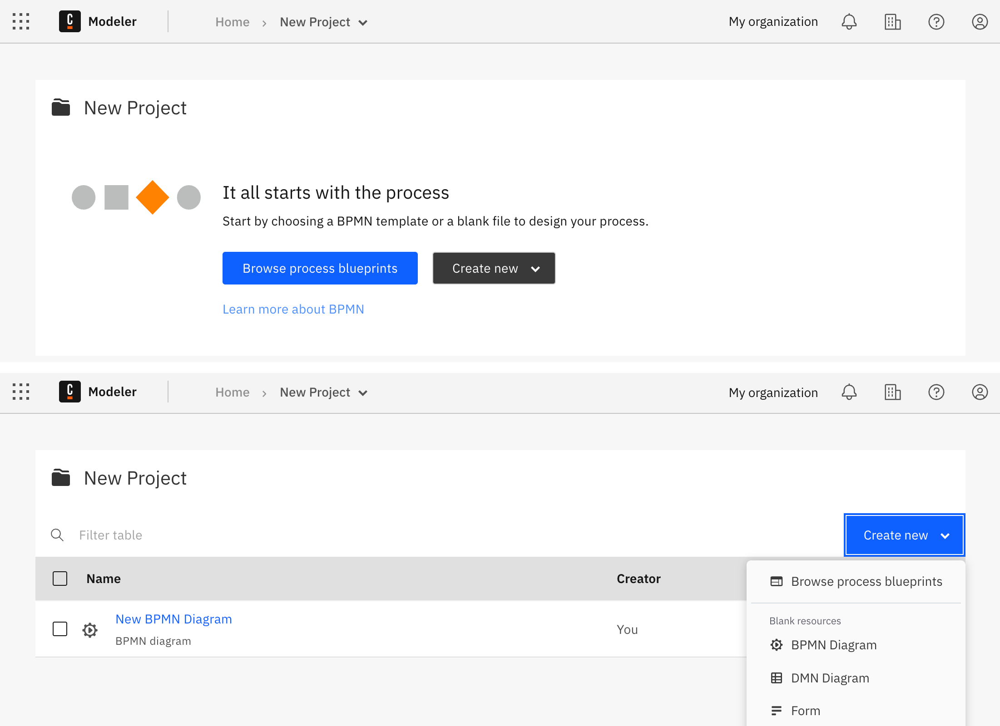

Discover the **Camunda Marketplace**, your go-to destination for leveraging various contributions from the Camunda community, trusted partners, and the Camunda team.

Follow our intuitive guides to explore and harness Connectors and process blueprints using the Web Modeler. If you prefer to utilize these resources within the Desktop Modeler, download them directly from the [Camunda Marketplace](https://marketplace.camunda.com) website.

If you are a **Web Modeler Self-Managed**, please be aware that your organization may restrict access to marketplace resources. If unsure, please contact your organization's owner for clarification.

## Browse Marketplace Connectors

To navigate to the Camunda Marketplace, take the following steps:

1. Log in to your Camunda account, and navigate to Web Modeler using the **Camunda components** icon in the top left corner of your console. Click **Modeler**.
2. Click on an existing project, or create a new project by clicking **New project > Create new file > BPMN Diagram**.
3. While modeling your BPMN diagram, you can incorporate marketplace connectors from the append menu. The append menu can be accessed in three ways:

- From the canvas: Select an element, then click on the **Change element** icon.
- From the properties panel: Navigate to the **Template** section and click **select**.
- From the side palette: Click on the **Create element** icon.
  

4. Click the **blue shop icon** next to Change element to open the Camunda Marketplace modal.
   
5. Browse [available Connectors](/docs/components/connectors/out-of-the-box-connectors/available-connectors-overview.md), tick the boxes on the left side of the modal to implement filters, and search for a specific Connector by typing in the **Search for a connector** search bar.
   

:::note
Want to learn more about a Connector before applying it to your diagram? Every Connector in the Camunda Marketplace offers additional documentation by clicking the **Documentation** link inside the Connector's box. This will open a new tab in your browser of the [Camunda Marketplace](https://marketplace.camunda.com/) and additional details for the Connector you selected.
:::

## Download a Connector to your diagram

Once you find a Connector you want to integrate into your BPMN diagram, click **Download to project**. The resource is then downloaded from the Camunda Marketplace into your project.

Scroll down in the change type context menu and click on your downloaded Connector to change the type of existing task. You can then add the required details in the properties panel on the right side of the screen.

After downloading, you may view a modal reading **Connector already exists**:

- By clicking **Save as copy**, you are not overwriting the current Connector. Instead, you are saving this as a new file you can edit.
- By clicking **Replace resource**, you are replacing the current Connector. If you are downloading a Connector from the Camunda Marketplace, it is read-only and you can view it if you are opening the template using the Camunda template editor. To edit the Connector, click **Customize template** to duplicate this template.

:::note
You can also host custom Connectors developed with [Connector SDK](/docs/components/connectors/custom-built-connectors/connector-sdk.md). Instead of viewing **Download to project**, it may read [**Learn more about self-hosted Connectors**](/docs/guides/host-custom-connector.md).

For the out-of-the-box Connectors provided by Camunda, the Connectors Bundle project provides a set of all Connector templates related to one release version. These are templates that are reusing the Camunda Connectors via the [Protocol Connector Approach](/docs/components/connectors/protocol/rest.md).

This means a developer created a template and reused one of the Camunda Connector runtimes. Only for these templates is direct **Download to project** available.
:::

## Browse Marketplace process blueprints

1. Log in to your Camunda account, navigate to the Web Modeler by clicking the Camunda components icon in the top left corner of your console, and then select Modeler.
2. You can select an existing project or create a new one within the projects tab.
3. If you initiate a project with a predefined process blueprint, navigate to the Marketplace modal by clicking on **Browse process blueprint**. If you wish to incorporate it into an existing project, open the **Create new** dropdown and select **Browse process blueprint**.
   
4. Within the modal, you'll discover a variety of applications submitted by Camunda, partners, or community members to the **Camunda Marketplace**. Utilize the sidebar to filter applications by use case, or leverage the sub-navigation to search and filter by industry, creator, or supported Camunda version.
   
5. Once you've found the desired process blueprint, click **Use blueprint** to open it in the web modeler and start your work. The process blueprint will be automatically saved within the project you initiated.
6. If you can't find the right process blueprint, We invite you to suggest ideas in our [Idea portal](https://marketplace.camunda.com/en-US/pages/connectorsIdeaPortal) or contribute your own process to the [Camunda Marketplace](https://marketplace.camunda.com/en-US/pages/submissionMenu).

## Additional resources

- Learn more about our available [out-of-the-box Connectors](/docs/components/connectors/out-of-the-box-connectors/available-connectors-overview.md).
- Understand different [Connector types](/docs/components/connectors/connector-types.md).
- Learn how to modify BPMN elements with [Connector templates](/docs/components/connectors/custom-built-connectors/connector-templates.md) to create custom modeling experiences.
