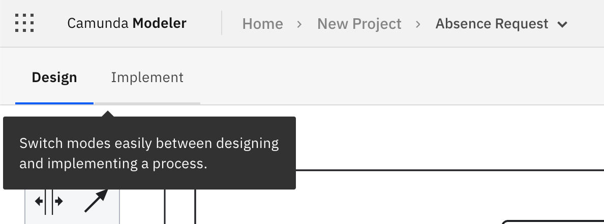

Camunda Platform 8 only

Collaboration between business and IT professionals can be challenging, which is why we introduced three modes in BPMN diagrams that help users with different technical backgrounds to collaborate effectively: **design**, **implement**, and **play**.

The **Design** mode view is tailored to business users, and the **Implement** and **Play** mode views are tailored to developers.

Business users can now focus on modeling, sharing, and collaborating, while developers can work on implementation and debugging with ease.

When accessing a BPMN diagram for the [first time](/components/modeler/web-modeler/model-your-first-diagram.md), the **Design** mode is the first selected option. To switch between modes, you can select one of the tabs on the left side of the screen, above the diagram; any further selection is remembered and kept for the next sessions.

:::note
When a process template is selected, the default mode is **Implement**.
:::
:::note
The **Play** mode is an alpha feature and is not yet available for Enterprise users.
:::
