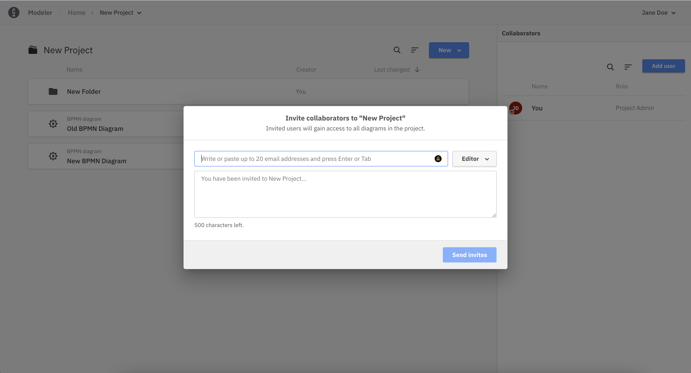
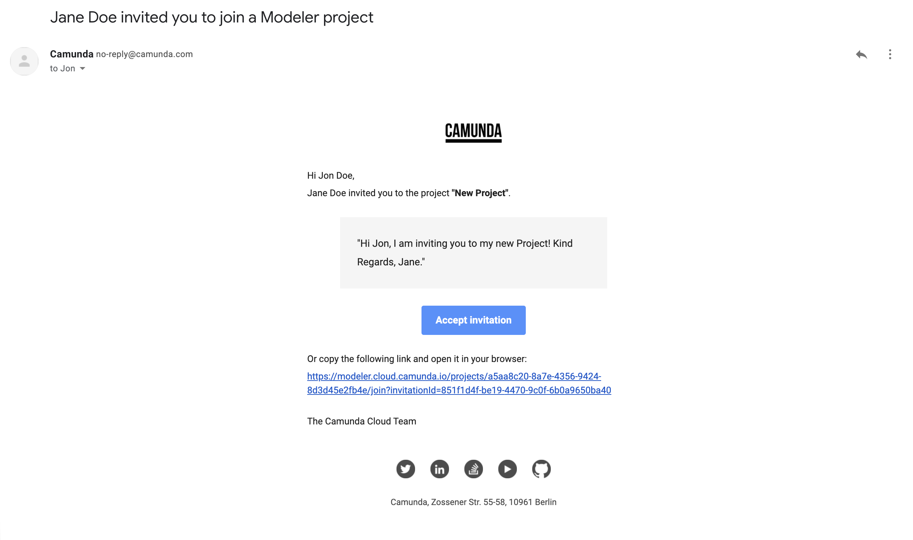

### Projects

After creating a project, you can invite members of your Camunda Cloud organization to collaborate in Web Modeler.
There are four roles with different levels of access rights that can be assigned to each user:

* **Project Admin:** the user can edit the project itself, all folders and diagrams within the project and invite more users to collaborate.
* **Editor:** the user can edit all folders and diagrams within the project.
* **Commenter:** the user cannot edit folders or diagrams nor invite users, but can view and leave comments on diagrams.
* **Viewer:** the user cannot edit folders or diagrams nor leave comments, but can only view diagrams.

## Inviting users to Projects

On the right side of a Project you can see a list of your collaborators and invite more.

1. Click on **Add User**:

2. Choose a role for your new collaborator

3. Start typing and Web Modeler will suggest Camunda Cloud organization members that you can invite to the project

4. Write a message to your new collaborator

5. Click on **Send** and your new collaborator will receive an email with the invitation

## Sharing and embedding diagrams

Diagrams can be shared with various people via a sharing link. This link can also be protected with an additional password.

Similar to the sharing link, a diagram can be included into HTML pages via an iframe tag. This tag can be copied from the sharing dialog via the embed button.

For wiki systems like [Confluence](https://www.atlassian.com/software/confluence), we recommend using the HTML macro and adding the iframe tag from the sharing dialog. This way, diagrams can be easily included in documentation pages. To adjust the dimensions of the diagram, the width and height values of the iframe tag can be modified.

## Comments

When selecting an element of the BPMN diagram, a discussion can be attached to this element. If no element is selected, then the discussion will be attached to the diagram itself.

New comments can be added to the discussion. Afterwards, the comment can be edited or deleted via the context menu icon.

Existing discussions are highlighted within the diagram via additional icons.

In order to be allowed to add comments, the user needs the Editor or Commenter access right.

### Mentioning in comments

By typing the ‘@’ character, a list of users shows up and one user can be selected. When submitting the comment, this user will receive an email as a notification about the new comment.

## Access rights and permissions

Different users can have access to different views in Web Modeler.

### Catalog projects

Other than [projects](#projects), catalog projects do not allow you to manage access rights. All members of your organization automatically have read-only access to your catalog project, meaning that they can see your templates, but not edit them.

As the creator and owner of a catalog project, only you have the right to create, edit, and delete templates.

### Folders