import BulkAddUserImg from '../img/invite-all-organization-members.png';
import SuperUserModeImg from '../img/super-user-mode.png';
import Tabs from "@theme/Tabs";
import TabItem from "@theme/TabItem";

Camunda 8 only

## Projects

Files and folders are stored in projects.
The user access on files and folders is defined at the project level.

When you access Web Modeler via the Camunda 8 dashboard, you can note the **Home** page with all the projects you can access:

### Access rights and permissions

Users can have various levels of access to a project in Web Modeler, outlined in this section.

After creating a project, you can invite members of your Camunda 8 organization to collaborate in Web Modeler.
There are four roles with different levels of access rights that can be assigned to each user:

- **Project Admin**: The user can edit the project itself, all folders, and diagrams within the project, and invite more users to collaborate.
- **Editor**: The user can edit all folders and diagrams within the project.
- **Commenter**: The user cannot edit folders or diagrams or invite users, but can view diagrams and properties and leave comments.
- **Viewer**: The user cannot edit folders or diagrams nor leave comments, but can only view diagrams.

Additionally, users with elevated access have special privileges to do administrative tasks in **super-user mode**.

#### Super-user mode

Super-user mode is only available to users with elevated access and can be enabled via the user menu in Web Modeler:

The main purpose of this mode is to assign collaborators to orphaned projects (which have no collaborators).
Ordinarily, these projects would not be accessible or visible to any users.

When a user activates super-user mode, they are temporarily granted **Project Admin** access to all projects
of the organization. This allows them to assign collaborators to orphaned projects and gives them
full access when none of the ordinary collaborators are available.

##### Required roles/permissions for super-user mode access {#elevated-access}

<Tabs groupId="permissions" defaultValue="saas" queryString values={
[
{label: 'SaaS', value: 'saas' },
{label: 'Self-Managed', value: 'self-managed' },
]}>

<TabItem value='saas'>

The user must be assigned the organization **Owner** or **Admin** role.

</TabItem>

<TabItem value='self-managed'>

The user must be assigned the **Web Modeler Admin** role.

If the role is not pre-existing, it can be created with the following permissions:

- Web Modeler Internal API - `write:*`
- Web Modeler Internal API - `admin:*`
- Camunda Identity Resource Server - `read:users`

Refer to the documentation pages about [assigning roles](../../../../self-managed/components/management-identity/application-user-group-role-management/manage-roles.md) and [adding permissions](/self-managed/components/management-identity/access-management/access-management-overview.md) for detailed instructions.
</TabItem>

</Tabs>

### Add users to projects

:::note
Users without email addresses will not receive any kind of notification about project invitations.
:::

<Tabs groupId="addingUsers" defaultValue="saas" queryString values={
[
{label: 'SaaS', value: 'saas' },
{label: 'Self-Managed', value: 'self-managed' },
]}>

<TabItem value='saas'>

On the right side of a project, view a list of your collaborators and invite more by taking the steps below:

1. Click **Add user**.
   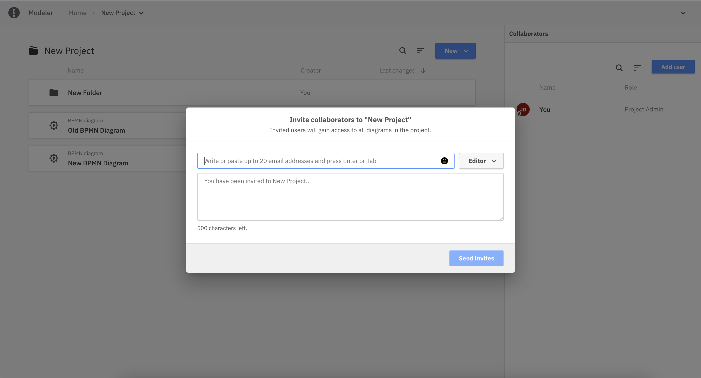

2. Choose a role for your new collaborator.
   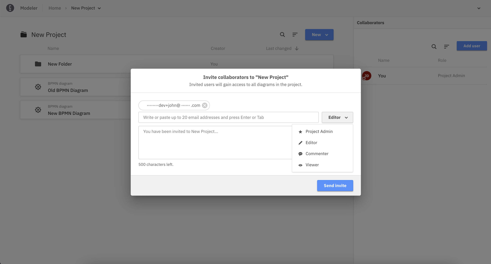

3. Begin typing the name or email of the individual and Web Modeler will suggest Camunda 8 organization members that you can invite to the project.
   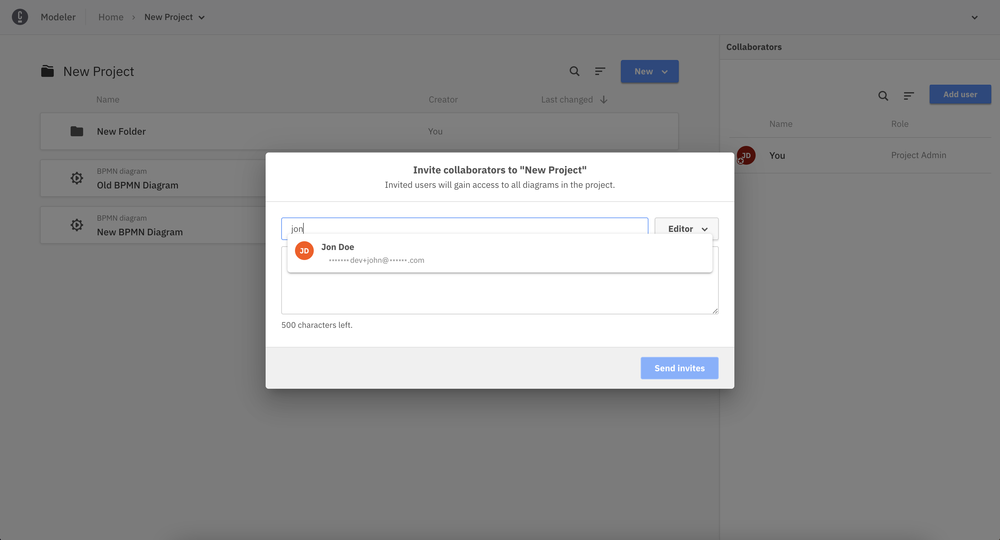

4. Write a message to your new collaborator about their invitation to the project.
   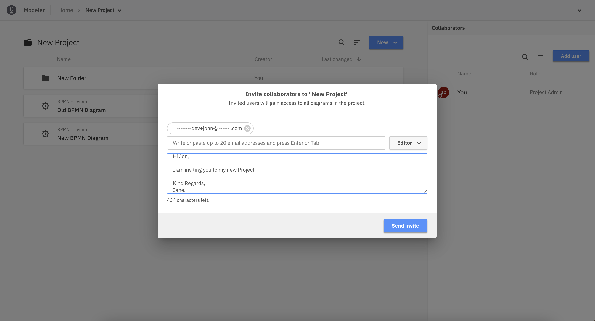

5. Click **Add collaborator**. Your new collaborator will be added to the project and notified via email.
   
   

If the individual is not a member of your organization, they will first receive an organization invitation.
After accepting the invitation and logging into Web Modeler, they will be added to the project.
They will appear as "invited" in the collaborator list until they accept.

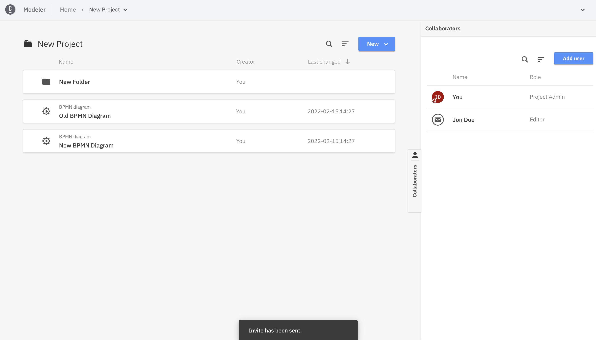

#### Invite the entire organization

You can invite all existing members of your Camunda 8 organization to the project at once by using the **All users in the organization** option.

</TabItem>

<TabItem value='self-managed'>

On the right side of a project, view a list of your collaborators and invite more by following the steps below:

1. Click **Add user**.
   

2. Choose a role for your new collaborator.
   

3. Begin typing the individual's name or email. Web Modeler will suggest members who have already logged into Web Modeler at least once and whom you can invite to the project.
   

4. Write a message to your new collaborator about their invitation to the project.
   

5. Click **Add collaborator**. Your new collaborator will be added to the project and notified via email.
   
   

If the member has not logged into Web Modeler before, they will not appear in the suggestions, but you can still invite them by typing their full email address.
They will appear as "invited" in the collaborator list until they log into Web Modeler for the first time.
After logging in, they will be added to the project.

#### Invite the entire organization

You can invite all members who logged into Web Modeler at least once to the project at once by using the **All users in the organization** option.

:::info Self-Managed license restrictions
For Self-Managed non-production installations, the number of collaborators per project is limited to **five**, including the project administrator.

For more information, refer to the [licensing documentation](/reference/licenses.md#web-modeler).
:::

</TabItem>

</Tabs>

### Folders

You can create folders in a project to semantically group and organize your diagrams.
The user access on a folder is inherited from the project.

## Sharing and embedding diagrams

Diagrams can also be shared with others in read-only mode via a sharing link.
This link can also be protected with an additional password.

1. Navigate to a diagram and click on the share icon button.
   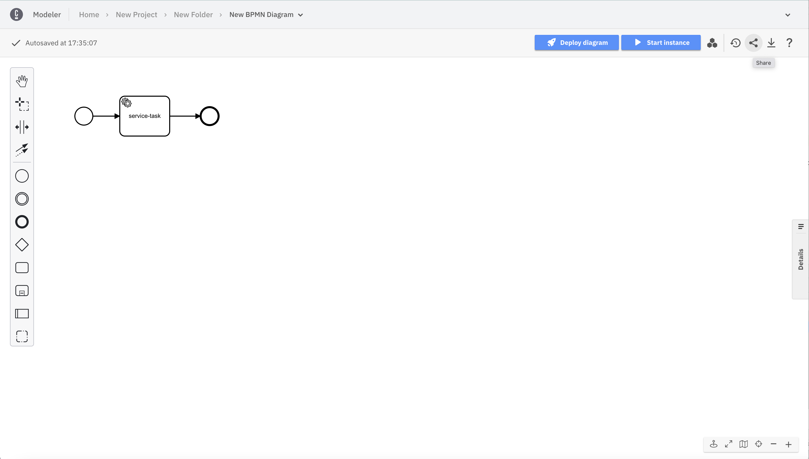

2. Click **Create link**.
   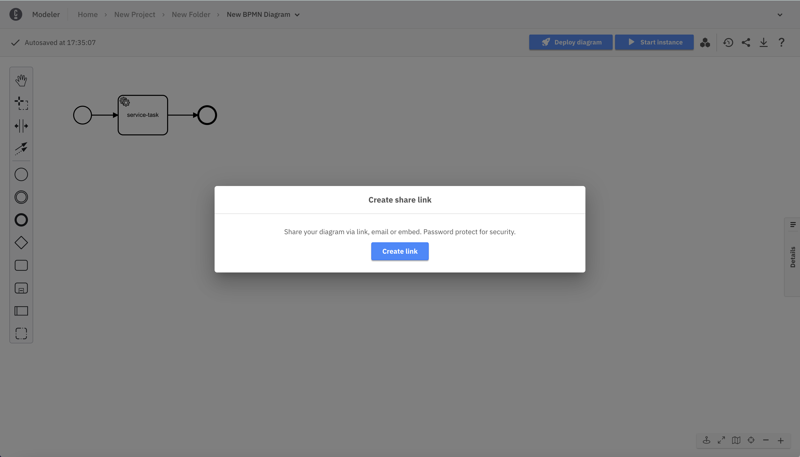

3. Click **Copy** to copy the link to your clipboard.
   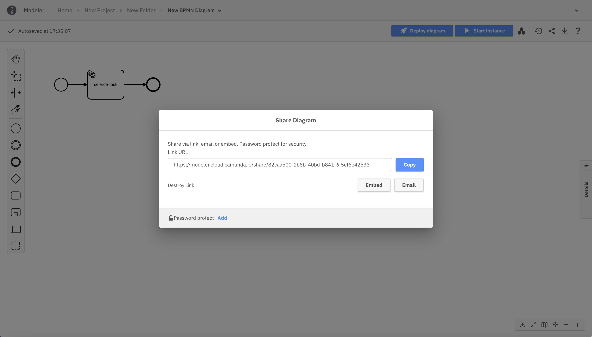

4. Click **Add** and type a new password to protect your link.
   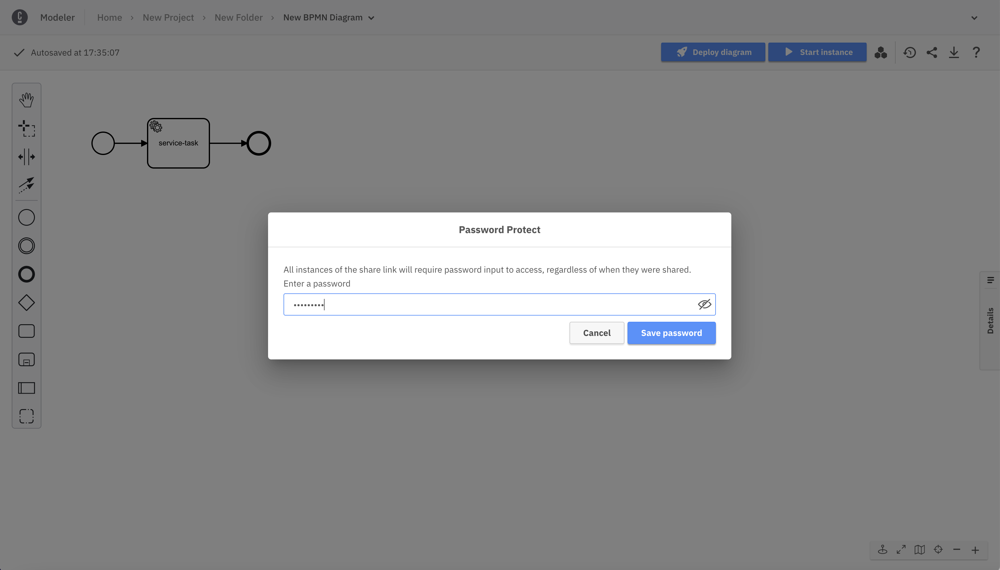

5. Click **Email** to share the new link with multiple recipients.
   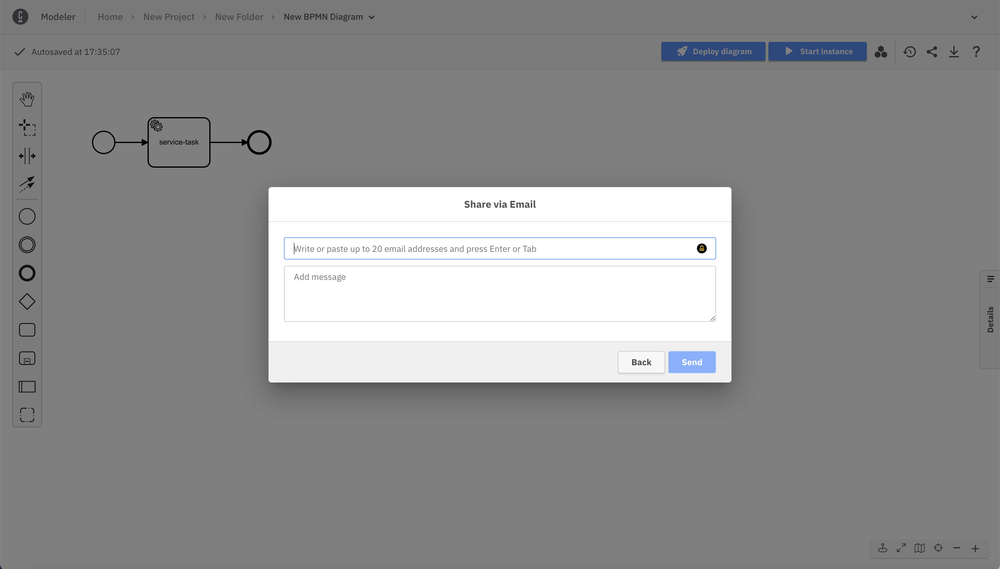

Similar to the sharing link, a diagram can be embedded into HTML pages via an iframe tag. The iframe tag can be copied from the sharing dialog via the **Embed** button.

For wiki systems like [Confluence](https://www.atlassian.com/software/confluence), we recommend using the HTML macro and adding the iframe tag from the sharing dialog. This way, diagrams can be easily included in documentation pages. To adjust the dimensions of the diagram, the width and height values of the iframe tag can be modified.

## Comments

When selecting an element of the BPMN diagram, a discussion can be attached to this element. If no element is selected, the discussion will be attached directly to the diagram.
Switch between the **Properties Panel** and **Comments** using the two tabs present at the top of the right side panel.
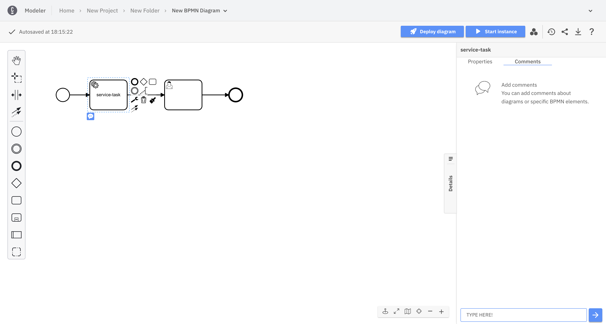

New comments can be added to the discussion by any collaborator with Admin, Editor, or Commenter access rights.

Afterwards, the comment can be edited or deleted via the context menu icon.
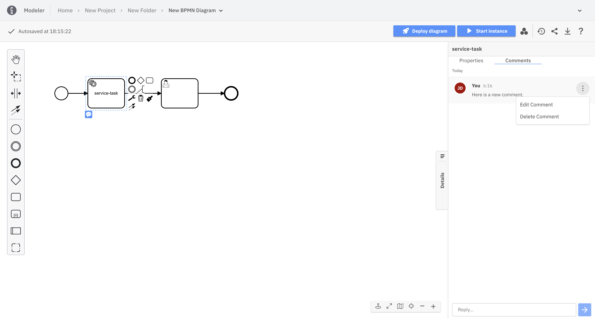

Elements with discussions attached will always have a visible blue overlay, so you can easily identify discussion points.
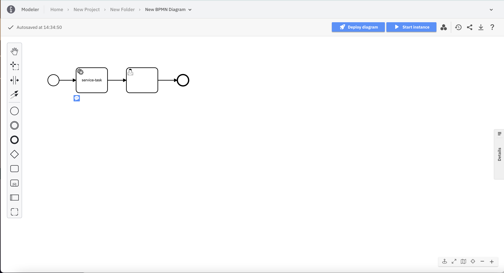

### Mention others in comments

By typing the **@** character, you are able to filter the collaborators on the project and select one of them.
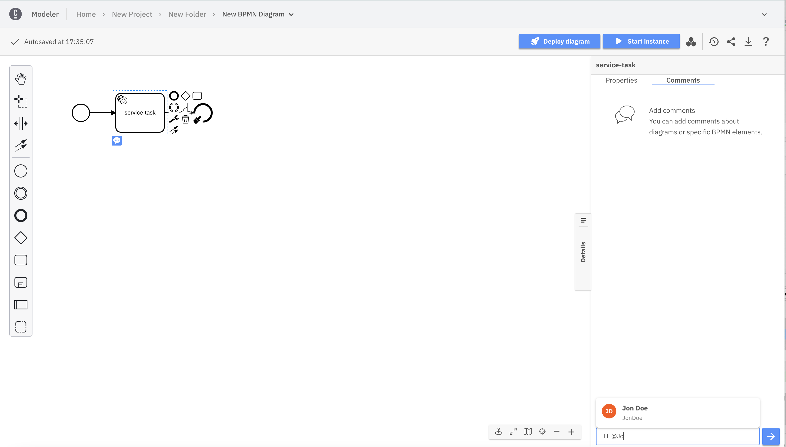

When submitting the comment, this user will receive an email as a notification about the new comment.

:::note
Users without email addresses will not receive any kind of notification about being mentioned in a comment.
:::

## Interact with your collaborators

### Model a diagram together

When others are opening the same diagram as you, the updates on the diagram are sent in real time. You can also note who is in the diagram with you.

### Canvas lock

To prevent conflicts and broken sessions when multiple people open the same diagram, Web Modeler automatically locks the canvas.

When a user with edit permissions starts editing a diagram, the canvas is automatically locked. While the lock is active, no other users can modify the diagram — this prevents conflicting edits.

Other collaborators can still do the following:

- Open and view the diagram in real time
- Switch [modes](./collaborate-with-modes.md)
- Navigate the canvas
- Drill down into subprocesses
- Inspect properties and linked assets
- Add comments (if they have permission)

#### Take over editing

If another user with edit permissions needs to continue working, they can take control by clicking the **Take over** button in the canvas lock bar.
This releases the current lock and immediately assigns edit control to the new user.

This approach enables predictable handovers and prevents conflicting edits while keeping the diagram accessible to all viewers.

### Undo/redo management limitations

When collaborating with others on a diagram, you can only undo or redo your own actions until another collaborator makes a change, as the undo/redo history is reset each time another collaborator makes a change.

### Draw other's attention

Whether you are in a presentation or if others are in the same diagram as you are, use the attention grabber pointer to draw attention to a specific part of the diagram. To do this, take the following steps:

1. Switch on the attention grabber pointer from the canvas tools.
   

2. Drop the pointer by clicking anywhere on the canvas.
   

The pointer will pulsate to draw attention and will match your avatar color.
It can also be seen in real-time by others that are looking at the same diagram as you.
