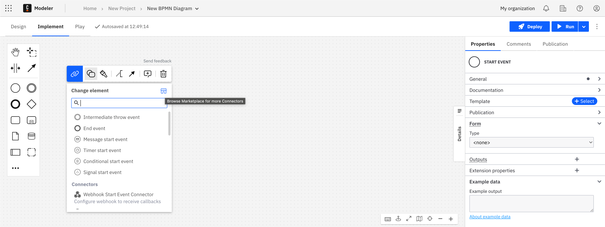

While modeling a process, you can click into the Connector Marketplace to browse through Connectors provided by Camunda engineering, discover Connectors developed by Camunda partners, and explore Connectors developed by the Camunda Community.

This may ease your process of selecting which Connectors to integrate into your process, as you can filter by creator, [inbound versus outbound Connectors](/docs/components/connectors/connector-types.md), [runtime](/docs/components/connectors/introduction.md), and Camunda versions that include specific out-of-the-box Connectors.

## Visit the Connector Marketplace

To navigate to the Camunda Marketplace, take the following steps:

1. Log in to your Camunda account, and navigate to Web Modeler using the **Camunda apps** icon in the top left corner of your console. Click **Modeler**.
2. Click on an existing project, or create a new project by clicking **New project > Create new file > BPMN Diagram**.
3. Change the type of existing task by clicking on it and using the **wrench-shaped** change type context menu icon, or create a new Connector task by using the **Append Connector** context menu. Follow our [guide to using Connectors](/components/connectors/use-connectors/index.md) to learn more.
4. Click the blue shop icon next to **Change element** to open the Connector Marketplace modal.
   
5. Browse [available Connectors](/docs/components/connectors/out-of-the-box-connectors/available-connectors-overview.md), tick the boxes on the left side of the modal to implement filters, and search for a specific Connector by typing in the **Search for a connector** search bar.
   

:::note
Want to learn more about a Connector before applying it to your diagram? Every Connector in the Connector Marketplace offers additional documentation by clicking the **Documentation** link inside the Connector's box. This will open a new tab in your browser of the [Connector Marketplace](https://marketplace.camunda.com/) and additional details for the Connector you selected.
:::

## Download a Connector to your diagram

Once you find a Connector you want to integrate into your BPMN diagram, click **Download to project**. The resource is then downloaded from the Connector Marketplace into your project.

Scroll down in the change type context menu and click on your downloaded Connector to change the type of existing task. You can then add the required details in the properties panel on the right side of the screen.

:::note
You can also host custom Connectors developed with [Connector SDK](/docs/components/connectors/custom-built-connectors/connector-sdk.md). Instead of viewing **Download to project**, it may read [**Learn more about self-hosted Connectors**](/docs/guides/host-custom-connector.md).

For the out-of-the-box Connectors provided by Camunda, the Connectors Bundle project provides a set of all Connector templates related to one release version. These are templates that are reusing the Camunda Connectors via the [Protocol Connector Approach](/docs/components/connectors/protocol/rest.md).

This means a developer created a template and reused one of the Camunda Connector runtimes. Only for these templates is direct **Download to project** available.
:::

After downloading, you may view a modal reading **Connector already exists**:

- By clicking **Save as copy**, you are not overwriting the current Connector. Instead, you are saving this as a new file you can edit.
- By clicking **Replace resource**, you are replacing the current Connector. If you are downloading a Connector from the Connector Marketplace, it is read-only and you can view it if you are opening the template using the Camunda template editor. To edit the Connector, click **Customize template** to duplicate this template.

## Additional resources

- Learn more about our [available out-of-the-box Connectors](/docs/components/connectors/out-of-the-box-connectors/available-connectors-overview.md).
- Understand different [Connector types](/docs/components/connectors/connector-types.md)
- Learn how to modify BPMN elements with [Connector templates](/docs/components/connectors/custom-built-connectors/connector-templates.md) to create custom modeling experiences.
