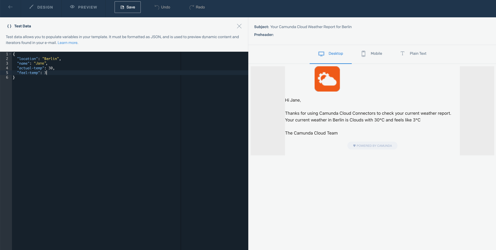
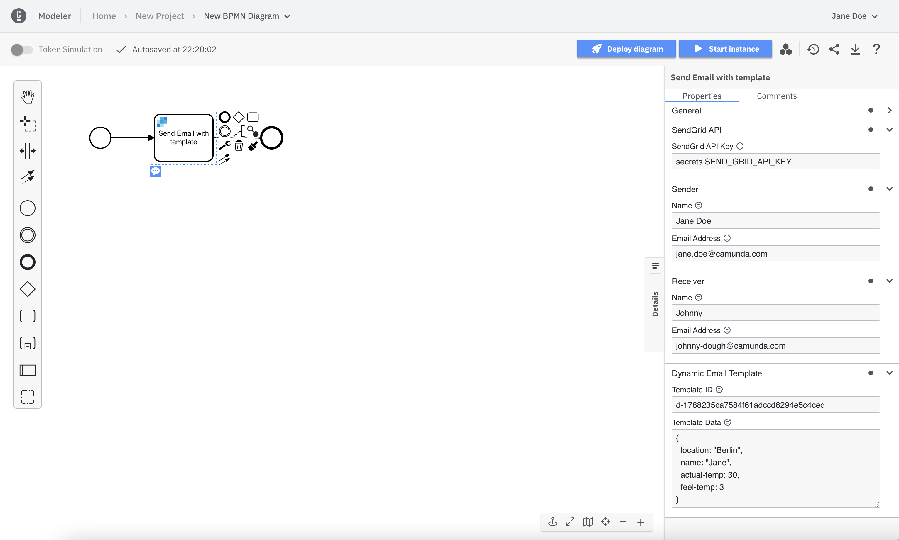
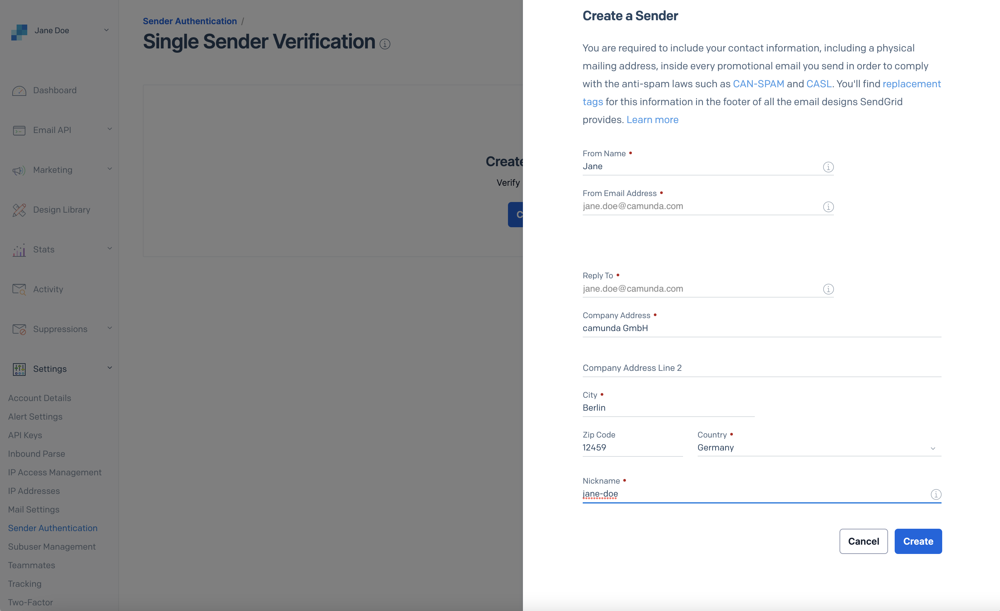

The **SendGrid connector** allows you to quickly and easily send emails from your BPMN processes.

## Prerequisites

To use the SendGrid connector a SendGrip API key is needed. Please follow [these steps](#appendix) in case you do not have a SendGrid account or API key [secret configured](#create-a-new-connector-secret) in your cluster.

## SendGrid connector

The SendGrid connector comes with two options:

1. **SendGrid Email Connector** allows sending simple emails (i.e. text/plain, text/html).
2. **SendGrid Email Template Connector** supports [SendGrid Dynamic Templates](https://sendgrid.com/solutions/email-api/dynamic-email-templates/).

### SendGrid Email Connector

#### Create a SendGrid Email Connector Task

To use a **SendGrid connector** in your process, either change the type of an existing task to **SendGrid: Send Email** using the wrench-shaped **Change type** context menu, or create a new **SendGrid: Send Email** connector task by using the **Append connector** context menu. Follow [our guide on using connectors](../use-connectors.md) to learn more.

#### Make your SendGrid Email Connector executable

To make the **SendGrid Email Connector** executable, you need to fill out all the mandatory fields highlighted in red in the properties panel:


1. Set **SendGrid API Key** to `secrets.SEND_GRID_API_KEY`.
2. Set **Sender Name** to `Jane Doe` (or the [sender identity](#create-a-sender-identity) you configured above).
3. Set **Sender Email** to `jane-doe@camunda.com` (or the [sender identity](#create-a-sender-identity) you configured above).
4. Set **Receiver Name** to `Your Name`.
5. Set **Receiver Email** to `Your email address`.
6. Set **Email Content Subject**.
7. Leave **Content Type** to **text/plain** (or alternatively to **text/html** if you intend to provide an HTML body to your email).
8. Provide a text (or HTML) **Body** for your email.


:::note
Now you can simply [deploy and start a new instance](../../save-and-deploy.md) of your process. As with all connectors the run-time is available out of the box in Camunda 8 SaaS.
:::

### SendGrid Email Template Connector

Send an email via SendGrid Dynamic Template and use the [Handlebars templating language](https://handlebarsjs.com/) to pass dynamic values to your connector.

#### Configure a Dynamic Template

1. Open the [Dynamic Transactional Templates page](https://sendgrid.com/dynamic_templates) and click **Create Template**.
2. Add a unique template name and click **Save**.
3. To begin editing your new template, click **Add Version**.
4. Select an editor and click **Continue**.
5. Design your template. For more information on using Handlebars, click [here](https://docs.sendgrid.com/for-developers/sending-email/using-handlebars).

In our example template we will use the following subject and body:

```text
Subject:
Your Camunda Weather Report for {{location}}
```

```text
Body:
Hi {{name}},

Thanks for using Camunda Connectors to check your current weather report.
Your current weather in Berlin is {{weather}} with {{actual-temp}}°C and feels like {{feel-temp}}°C

The Camunda Team
```

In our example template, we will use the following Handlebars:

`{{name}}` - the name of the user requesting the weather report

`{{location}}` - the location used for the weather report

`{{weather}}` - the current weather condition

`{{actual-temp}}` - the measured temperature

`{{feel-temp}}` - how the temperature feels like in reality

While you are editing your template you can test how your email would look by switching to **Preview** mode, choosing **{} Show Test Data**, and then providing the necessary data:



#### Create a SendGrid Email template Connector task

To use this **SendGrid connector** in your process, either change the type of an existing task to **SendGrid: Send Email via Template** using the wrench-shaped **Change type** context menu, or create a new **SendGrid: Send Email via Template** connector task by using the **Append connector** context menu. Follow [our guide on using connectors](../use-connectors.md) to learn more.

#### Make your SendGrid Email Template Connector executable

To make the **SendGrid Email Template Connector** executable, fill out all the mandatory fields highlighted in red in the properties panel:


1. Set **SendGrid API Key** to `secrets.SEND_GRID_API_KEY`.
2. Set **Sender Name** to `Jane Doe` (or the [sender identity](#create-a-sender-identity) you configured above).
3. Set **Sender Email** to `jane-doe@camunda.com` (or the [sender identity](#create-a-sender-identity) you configured above).
4. Set **Receiver Name** to `Your Name`.
5. Set **Receiver Email** to `Your email address`.
6. Log in to your SendGrid account and navigate to [the Dynamic Template you created](#configure-a-dynamic-template).
7. Copy the id of the template and paste it in the **Template ID field**.


8. Provide the test data in the **Template Data** field as a [FEEL context expression](/components/modeler/feel/language-guide/feel-context-expressions.md):

```text
= {
  name: "Jane",
  location: "Berlin",
  weather: "Clear",
  actual-temp: 30,
  feel-temp: 3
}
```



If you want to provide dynamic content in the email via process variables, you can set them in the **Template Data** field as well:

```text
= {
  name: nameVariable,
  location: locationVariable,
  weather: weatherVariable,
  actual-temp: temerature,
  feel-temp: windChill
}
```

:::note
Now you can simply [deploy and start a new instance](../../save-and-deploy.md) of your process. As with all connectors the run-time is available out of the box in Camunda 8 SaaS.
:::

## Appendix

### Create a SendGrid account

To use the **SendGrid connector**, create a free account in SendGrid if you do not have one yet.

1. Go to [https://signup.sendgrid.com/](https://signup.sendgrid.com/).
2. Set up the account with your email and choose a password.


3. Click **Create Account**.
4. Provide further information required by SendGrid.


5. Click **Get Started**.

### Create a sender identity

Before sending your first email, you'll need to create a sender identity and verify it.

1. Click **Settings > Sender Authentication** or click [here](https://app.sendgrid.com/settings/sender_auth).
2. Choose **Verify a Single Sender** for demo purposes (or alternatively **Authenticate Your Domain** for a production setup.)
3. Provide the details requested by SendGrid in the form and click **Create**.



4. Go to your email inbox and open the email sent to you by SendGrid.
5. Click **Verify Single Sender**.


### Create an API key

To create an API key in SendGrid, take the following steps:

1. Log in to your new account.
2. Go to **Settings**.
3. Click **API Keys > Create API Key**.
4. Give your key a name (i.e. `my-camunda-connector-key`).
5. Click **Create Key**.
6. Copy the **API Key** and move on to the next step for creating a connector Secret.


### Create a new connector Secret

We advise you to keep your API key safe and avoid exposing it in the BPMN `xml` file by creating a Secret:

1. Follow our [guide for creating Secrets](../../../../console/manage-clusters/manage-secrets.md).
2. Name your Secret `SEND_GRID_API_KEY` so you can easily reference it later in our connector.
