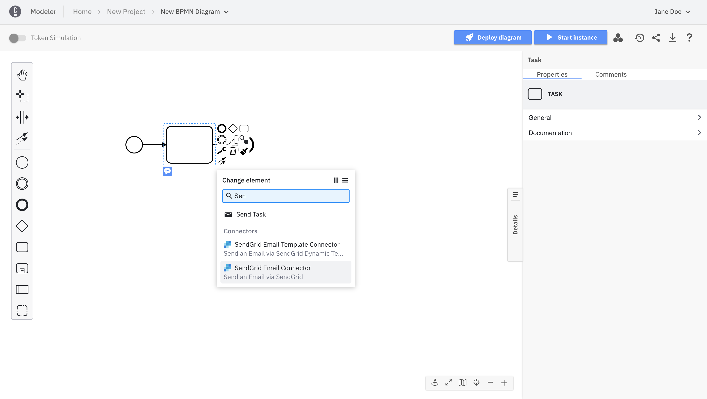

The **Sendgrid Connector** allows you to quickly and easily send emails from your BPMN processes.

## Prerequisites
### Create a Sendgrid account

To use the **Sendgrid Connector**, you have to create a free account in Sendgrid if you do not have one yet.

1. Go to https://signup.sendgrid.com/
2. Setup the account with your email and choose a password


3. Click **Create Account**
4. Provide further info required by Sendgrid


5. Click **Get Started**

### Create a Sender Identity

Before sending your first email, you'll need to create a sender identity and verify it.

1. Click on **Settings** and then **Sender Authentication** or click [here](https://app.sendgrid.com/settings/sender_auth)
2. Choose **Verify a Single Sender** for demo purposes (or alternatively **Authenticate Your Domain** for a production setup)
3. Provide the details requested by SendGrid in the form and click **Create**


4. Go to your email inbox and open the email sent to you by SendGrid
5. Click **Verify Single Sender**


### Create an API Key

To create an API Key in Sendgrid follow the next steps:

1. Login to your newly created account
2. Go to **Settings**
3. Choose **API Keys**
4. Click **Create API Key**
5. Give your key a name (i.e. `my-camunda-connector-key`)
6. Click **Create Key**
7. Copy the **API Key** and move on to the next step for creating a Connector Secret


### Create a new Connector Secret

We advise you to keep your API Key safe and avoid exposing it in the BPMN xml file by creating a secret:

1. Follow our [guide for creating secrets](../../../../console/manage-clusters/manage-secrets.md)
2. Name your secret `SEND_GRID_API_KEY` so you can easily reference it later in our Connector

## Sendgrid Connector

The Sendgrid Connector comes in two flavors:

1. **SendGrid Email Connector** allows sending simple emails (i.e. text/plain, text/html)
2. **SendGrid Email Template Connector** supports [Sendgrid Dynamic Templates](https://sendgrid.com/solutions/email-api/dynamic-email-templates/)

### SendGrid Email Connector

#### Create a SendGrid Email Connector Task
To use this Connector follow the steps below:

1. Open the Web Modeler and create a new BPMN Diagram
2. Add a **Task** and an **EndEvent**
3. Click on the **Task**, click on the little spanner/wrench icon, and select **SendGrid Email Connector**. You can also use the search field and type `Sendgrid`



Alternatively, you can directly create a **Sendgrid Email Connector** by using the append menu:


#### Make your SendGrid Email Connector executable

To make the **SendGrid Email Connector** executable, you need to fill all the mandatory fields that are highlighted in red in the Properties Panel:


1. Set **SendGrid API Key** to `secrets.SEND_GRID_API_KEY`
2. Set **Sender Name** to `Jane Doe` (or the [sender identity](#create-a-sender-identity) you configured above)
3. Set **Sender Email** to `jane-doe@camunda.com` (or the [sender identity](#create-a-sender-identity) you configured above)
4. Set **Receiver Name** to `Your Name`
5. Set **Receiver Email** to `Your email address`
6. Set **Email Content Subject**
7. Leave **Content Type** to **text/plain** (or alternatively to **text/html** if you intend to provide an html body to your email)
8. Provide a text (or html) **Body** for your email


:::note
Now you can simply [deploy and start a new instance](../../save-and-deploy.md) of your process.
The connector execution logic will be available for you at runtime.
:::

### SendGrid Email Template Connector
Send an Email via SendGrid Dynamic Template and use the [Handlebars templating language](https://handlebarsjs.com/) to pass dynamic values to your connector.

#### Configure a Dynamic Template

1. Open the [Dynamic Transactional Templates page](https://sendgrid.com/dynamic_templates) and click **Create Template**
2. Add a unique template name and then click **Save**
3. To begin editing your new template, click **Add Version**
4. Select an editor and click **Continue**
5. Design your template. For more information on using Handlebars, click [here](https://docs.sendgrid.com/for-developers/sending-email/using-handlebars).

In our example template we will use the following subject and body:

```text
Subject:
Your Camunda Cloud Weather Report for {{location}}
```
```text
Body:
Hi {{name}},

Thanks for using Camunda Cloud Connectors to check your current weather report.
Your current weather in Berlin is Clouds with {{actual-temp}}°C and feels like {{feel-temp}}°C

The Camunda Cloud Team
```

In our example template we will use the following Handlebars:

`{{location}}` - the location used for the weather report

`{{name}}` - the name of the user requesting the weather report

`{{actual-temp}}` - the measured temperature

`{{feel-temp}}` - how the temperature feels like in reality

While you are editing your Template you can test how your email would look like by switching to **Preview** mode and choosing **{} Show Test Data** and then providing the necessary data:


#### Create a SendGrid Email Template Connector task

To use this Connector follow the steps below:

1. Open the Web Modeler and create a new BPMN Diagram
2. Add a **Task** and an **EndEvent**
3. Click on the **Task**, click on the little spanner/wrench icon, and select **SendGrid Email Template Connector**. You can also use the search field and type `Sendgrid`


Alternatively, you can directly create a **Sendgrid Email Template Connector** by using the append menu:


#### Make your SendGrid Email Template Connector executable

To make the **SendGrid Email Template Connector** executable, you need to fill all the mandatory fields that are highlighted in red in the Properties Panel:


1. Set **SendGrid API Key** to `secrets.SEND_GRID_API_KEY`
2. Set **Sender Name** to `Jane Doe` (or the [sender identity](#create-a-sender-identity) you configured above)
3. Set **Sender Email** to `jane-doe@camunda.com` (or the [sender identity](#create-a-sender-identity) you configured above)
4. Set **Receiver Name** to `Your Name`
5. Set **Receiver Email** to `Your email address`
6. Login to your Sendgrid account and navigate to [the Dynamic Template you created](#configure-a-dynamic-template)
7. Copy the id of the template and paste it in the **Template ID field**


8. Provide the test data in the **Template Data** field

```text
{
  location: "Berlin",
  name: "Jane",
  actual-temp: 30,
  feel-temp: 3
}
```


:::note
Now you can simply [deploy and start a new instance](../../save-and-deploy.md) of your process.
The connector execution logic will be available for you at runtime.
:::


