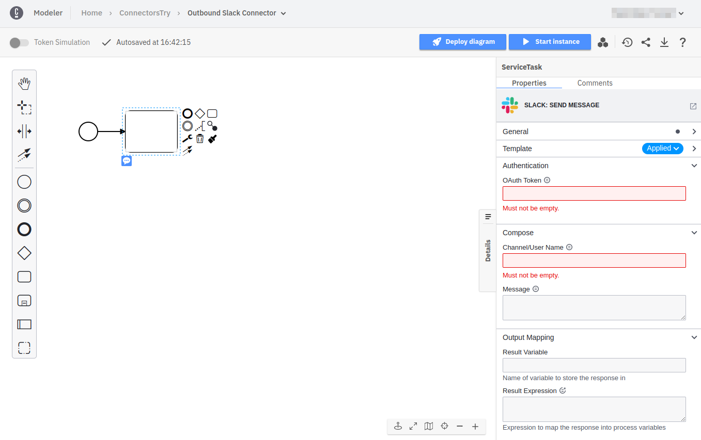

The **Slack connector** allows you to send messages to channels or users in your [Slack](https://slack.com) workspace from your BPMN process.

## Prerequisites

To use the Slack connector, a Slack app must be registered with the Slack workspace you would like to send messages to. A respective OAuth token needs to be configured as a secret in your cluster. Follow [these steps in the appendix](#appendix) to learn how to set this up.

## Create a Slack connector task

To use a **Slack connector** in your process, either change the type of an existing task using the **change type** context menu, or create a new connector task by using the **append** context menu. Follow [our guide on using connectors](../use-connectors.md) to learn more.

## Make your Slack connector executable

To make the **Slack connector** executable, fill out the mandatory fields highlighted in red in the properties panel:



1. Set **Authentication** to your Slack OAuth token, which is stored as a secret. For example 'secrets.SLACK_OAUTH_TOKEN`
2. Set **Channel/User Name** to either the **channel** or **user** you want to send the message to
   1. A **channel** is specified by a unique identifier starting with an `#` (example: `#myChannel`)
   2. A **user** is specified by a user name starting with an `@` (example: `@myUser`)
3. Set **Message** to the message string you would like to send (example: `Hello World!`)

The **Channel/User Name** and **Message** can either be given static values, or FEEL expressions. FEEL expressions can be used to [access process variables or dynamically create values](../../../../concepts/expressions.md). This can be handy if for example a process variable is used to store the relevant channel or if the message needs to be composed dynamically:


## Slack API response

The **Slack connector** exposes the Slack API response as [local variable](https://docs.camunda.io/docs/components/concepts/variables/#variable-scopes) called `response`.

The following fields are available in the `response` variable. Notice that all fields describe state in the Slack workspace:

- **ts**: timestamp ID
- **channel**: channel ID
- **message**:
  - **type**: message type
  - **type**: team ID
  - **user**: user ID
  - **text**: message text
  - **ts**: timestamp ID
  - **appID**: Slack App ID
  - **botID**: Slack Bot ID

You can use an Output Mapping to map the response:

1. Use **Result Variable** to store the reponse in a process variable. For example `myResultVariable`
2. Use **Result Expression** to map fields from the response into process variables. For example:

```
= {
    messageText: response.message.text
}
```


## Appendix

To use the **Slack connector** the following prerequisites need to be set-up.

1. [Slack workspace](#use-a-well-known-slack-workspace) - this is the workspace the **Slack connector** will communicate with
2. [Slack basic app with bot token configured](#configure-a-basic-slack-app) - the **Slack connector** will communicate through this Slack app with the workspace - you can consider the Slack app as _Slack bot representing the Camunda platform_
3. [Slack bot token stored as secret](#store-slack-bot-token-as-secret) - the secret will store the Slack bot token and can be used to reference it from BPMN processes without revealing it in the BPMN `xml`

### Use a well-known Slack workspace

A Slack workspace consists of channels in which workspace members can communicate and collaborate. A workspace is identified by a unique name, for example `https://myWorkspace.slack.com/`. In most cases you will know which workspace you want to connect with already. If you want to set-up a new workspace, please refer to the [official Slack documentation](https://slack.com/help/articles/115001344007-Create-a-workspace-on-Enterprise-Grid).

### Configure a basic Slack app

The **Slack connector** communicates through a Slack app with a concrete Slack workspace. For example, when sending a Slack message, the message will be posted by the Slack app. For the **Slack connector** to work, you need to perform the following steps:

1. [Create a Slack app](https://api.slack.com/apps)
2. [Request required scopes](https://api.slack.com/scopes) - the scopes represent what your app can and cannot do (for example posting messages). For the Slack connector to work, at a minimum you need to grant the [`chat:write`](https://api.slack.com/scopes/chat:write) scope.
3. [Install the Slack app to your workspace](https://api.slack.com/authentication/basics#installing)

Once the app is set-up, copy the [bot token](https://api.slack.com/authentication/token-types) of the app. It is represented as a string and begins with `xoxb-`. This is the OAuth Bearer token, which the **Slack connector** will use to authenticate with the Slack API.

### Store Slack bot token as secret

The **Slack connector** uses an OAuth bearer token (ie. the Slack app bot token) to authentication with the Slack API.

We advise you to keep your Slack bot token safe and avoid exposing it in the BPMN `xml` file by creating a Secret:

1. Follow our [guide for creating Secrets](../../../../console/manage-clusters/manage-secrets.md).
2. Name your Secret `SLACK_OAUTH_TOKEN` so you can easily reference it later in our connector.
