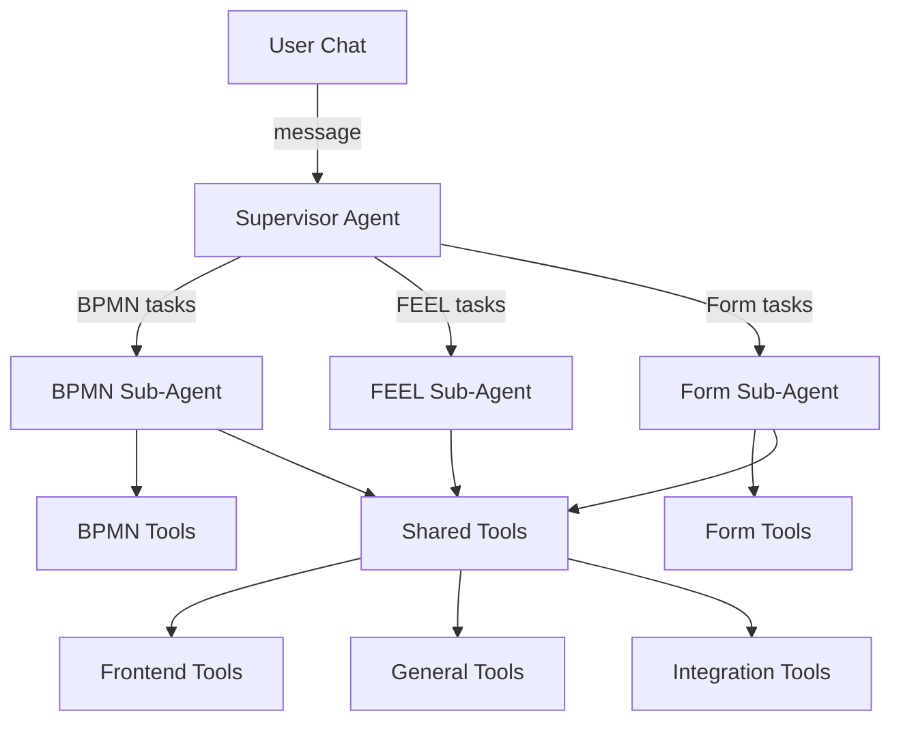

import CopilotBpmnGeneration from './img/copilot-bpmn-generation.png';
import CopilotConversationHistory from './img/copilot-conversation-history.png';

Camunda Copilot is an AI assistant that helps you with BPMN process modeling, FEEL expressions, and form building. It is available in both SaaS and Self-Managed deployments of Web Modeler, and can be used only in the BPMN diagram and form editors.

:::note
Camunda Copilot is an [**alpha feature**](/components/early-access/alpha/alpha-features.md) that must be enabled by an organization admin before use.
:::

## Get started

1. Log in to [Web Modeler](/components/modeler/web-modeler/launch-web-modeler.md).
2. Open an existing BPMN diagram or form, or create a new one via New project > Create new > BPMN diagram or Form.
3. Click the Camunda Copilot icon in the top-right corner of the editor header to open the Copilot panel.
4. In the chat box, enter a simple, clear, and concise prompt describing what you need.
5. Wait for Copilot to respond; response times may vary depending on the complexity of your request.

:::tip
To avoid timeouts and get better results, break long or complex prompts into smaller, focused requests and send them one at a time.
:::

## How it works

Camunda Copilot uses a multi-agent architecture to handle different types of tasks:

- **Supervisor Agent**: Routes your requests to the appropriate specialized sub-agent based on the task type.
- **BPMN Sub-Agent**: Creates, modifies, and explains BPMN process diagrams.
- **FEEL Sub-Agent**: Generates, translates, debugs, and explains FEEL expressions.
- **Form Sub-Agent**: Creates, modifies, and validates Camunda Forms.

Each sub-agent has access to specialized [built-in tools](built-in-tools.md) that allow it to interact with your diagrams and forms.

## Review and undo changes

Camunda Copilot can both answer questions and generate or update BPMN diagrams and forms. When Copilot applies a change on the canvas, Web Modeler automatically creates a new version so your previous work is preserved. If you are not satisfied with the result, you can roll back to a previous version from the version history, or continue iterating with Copilot until the result meets your needs.

## Context awareness

Camunda Copilot automatically detects and uses context from your current work to provide more relevant responses:

- **No element selected**: Copilot uses the file context.
- **Element selected**: A context tag appears above the chat input, showing which element or expression Copilot will reference.
- **Context removal**: Removing a context tag clears that context and, for BPMN elements, deselects the element on the canvas.

This context allows Camunda Copilot to:

- Understand which element you're referencing
- Apply changes to the correct element
- Generate FEEL expressions for the appropriate field
- Link forms to the current process

## Chat history

Camunda Copilot automatically saves your conversations so you can pick up where you left off. Conversations are retained for 90 days before being automatically deleted. You can click on any past conversation to continue the discussion, rename conversations to give them meaningful titles for easy reference, or delete conversations you no longer need.

## Example prompts

You can ask Copilot to create, modify, or explain processes and forms. Use clear, specific prompts to get the best results. For complex workflows, break your request into smaller steps.

#### Build processes and forms

<table>
  <colgroup>
    <col style={{width: "55%"}} />
    <col style={{width: "45%"}} />
  </colgroup>
  <thead>
    <tr>
      <th style={{textAlign: "left"}}>Prompt</th>
      <th style={{textAlign: "left"}}>What it does</th>
    </tr>
  </thead>
  <tbody>
    <tr>
      <td>"Create an employee onboarding process"</td>
      <td>Generates a BPMN workflow from a description</td>
    </tr>
    <tr>
      <td>"Create a leave request workflow with an approval form"</td>
      <td>Builds a process with a linked form</td>
    </tr>
    <tr>
      <td>"Add error handling to this process"</td>
      <td>Modifies an existing diagram</td>
    </tr>
    <tr>
      <td><em>Paste existing documentation or code</em></td>
      <td>Converts requirements, BPEL, Java, or Python into BPMN</td>
    </tr>
  </tbody>
</table>

#### Work with FEEL expressions

<table>
  <colgroup>
    <col style={{width: "55%"}} />
    <col style={{width: "45%"}} />
  </colgroup>
  <thead>
    <tr>
      <th style={{textAlign: "left"}}>Prompt</th>
      <th style={{textAlign: "left"}}>What it does</th>
    </tr>
  </thead>
  <tbody>
    <tr>
      <td>"Calculate the total price from quantity and unit price"</td>
      <td>Generates a FEEL expression</td>
    </tr>
    <tr>
      <td>"Translate this Java to FEEL: input.trim().toUpperCase()"</td>
      <td>Converts code from other languages</td>
    </tr>
    <tr>
      <td>"Fix this expression" <em>(with FEEL editor open)</em></td>
      <td>Debugs and corrects syntax errors</td>
    </tr>
  </tbody>
</table>

:::note
Modifications may affect sections beyond your specific request. Review the full diagram after changes.
:::

## Permissions

Copilot respects your project permissions:

<table>
  <colgroup>
    <col style={{width: "50%"}} />
    <col style={{width: "25%"}} />
    <col style={{width: "25%"}} />
  </colgroup>
  <thead>
    <tr>
      <th style={{textAlign: "left"}}>Feature</th>
      <th style={{textAlign: "left"}}>Write access</th>
      <th style={{textAlign: "left"}}>Read-only access</th>
    </tr>
  </thead>
  <tbody>
    <tr>
      <td>Ask questions</td>
      <td>✓</td>
      <td>✓</td>
    </tr>
    <tr>
      <td>Get explanations</td>
      <td>✓</td>
      <td>✓</td>
    </tr>
    <tr>
      <td>Generate BPMN elements</td>
      <td>✓</td>
      <td>✗</td>
    </tr>
    <tr>
      <td>Modify diagrams</td>
      <td>✓</td>
      <td>✗</td>
    </tr>
    <tr>
      <td>Create/edit forms</td>
      <td>✓</td>
      <td>✗</td>
    </tr>
    <tr>
      <td>Generate FEEL expressions</td>
      <td>✓</td>
      <td>✓</td>
    </tr>
    <tr>
      <td>Apply FEEL expressions</td>
      <td>✓</td>
      <td>✗</td>
    </tr>
  </tbody>
</table>

## Limitations

- Camunda Copilot does not support pools, lanes, and collaborations.
- Camunda Docs AI is available only in SaaS deployments. Self-Managed users can configure their own LLM provider but do not have access to the Camunda documentation knowledge base.

## Self-Managed configuration

For Self-Managed deployments, see [Copilot configuration](/self-managed/components/modeler/web-modeler/configuration/copilot.md) to configure LLM providers and agent settings.

## Related resources

- [Built-in tools reference](built-in-tools.md)
- [Self-Managed Copilot configuration](/self-managed/components/modeler/web-modeler/configuration/copilot.md)
