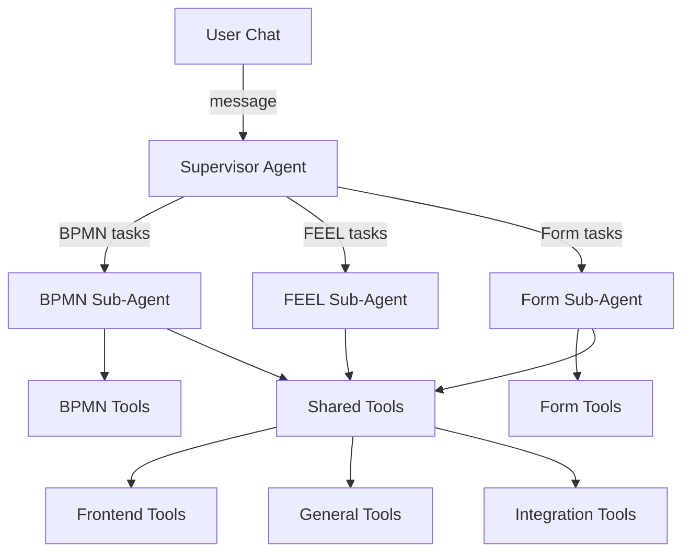

import CopilotEmptyState from './img/copilot-empty-state.png';
import CopilotBpmnGeneration from './img/copilot-bpmn-generation.png';
import CopilotConversationHistory from './img/copilot-conversation-history.png';
import CopilotHistoryActions from './img/copilot-history-actions.png';
import CopilotFormCreation from './img/copilot-form-creation.png';
import CopilotOutputMapping from './img/copilot-output-mapping.png';

Camunda Copilot is an AI assistant that helps you with BPMN process modeling, FEEL expressions, and form building. It is available in both SaaS and Self-Managed deployments of Web Modeler, and can be used only in the BPMN diagram and form editors.

## Get started

1. Log in to [Web Modeler](/components/modeler/web-modeler/launch-web-modeler.md).
2. Open an existing BPMN diagram or form, or create a new one via New project > Create new > BPMN diagram or Form.
3. Click the Camunda Copilot icon in the top-right corner of the editor header to open the Copilot panel.
4. In the chat box, enter a simple, clear, and concise prompt describing what you need.
5. Wait for Copilot to respond; response times may vary depending on the complexity of your request.

:::tip
To avoid timeouts and get better results, break long or complex prompts into smaller, focused requests and send them one at a time.
:::

## Review and undo changes

Camunda Copilot can both answer questions and generate or update BPMN diagrams and forms. When Copilot applies a change on the canvas, Web Modeler automatically creates a new version so your previous work is preserved. If you are not satisfied with the result, you can roll back to a previous version from the version history, or continue iterating with Copilot until the result meets your needs.

## Context awareness

Camunda Copilot automatically detects and uses context from your current work to provide more relevant responses:

- When no element is selected, Copilot uses only the file context.
- When a specific context is active (for example, a selected BPMN element or FEEL expression), it is shown as a context tag above the chat input.
- Removing a context tag clears that context and, for BPMN elements, also unselects the element in the canavs.

This context allows Camunda Copilot to:

- Understand which element you're asking about
- Apply changes to the correct element
- Generate FEEL expressions for the right field
- Create forms linked to the current process

### What context is used

| Context type    | When active                         | Description                                        |
| --------------- | ----------------------------------- | -------------------------------------------------- |
| File            | When a BPMN diagram or form is open | The current BPMN diagram or Form you're editing    |
| BPMN element    | When a BPMN element is selected     | The specific element you've selected on the canvas |
| Form content    | When editing a Form                 | The current Form JSON structure                    |
| FEEL expression | When FEEL editor is open            | The FEEL expression you're working on              |

## Chat history

Camunda Copilot automatically saves your conversations so you can pick up where you left off. Conversations are retained for 90 days before being automatically deleted. You can click on any past conversation to continue the discussion, rename conversations to give them meaningful titles for easy reference, or delete conversations you no longer need.

### Managing conversations

Click the history icon in the Copilot header to view your past conversations:

Hover over a conversation to see the rename and delete options:

To start a new conversation, click the **+** button in the header.

## Example prompts

### BPMN prompts

#### Process creation

- "Create an employee onboarding process"
- "Design a loan approval workflow with credit check and conditional routing"
- "Build an order processing system with parallel approval tasks"
- "Create a customer support ticket workflow with escalation paths"
- Paste existing text documentation of a process or requirements
- Paste a process hard-coded in any language (BPEL, Java, COBOL, Python)

#### Process explanation

- "Describe this process in plain language"
- "What KPIs would you recommend for this process?"
- "What does this symbol do?" (after selecting a BPMN element)
- "Give me a list of test cases for this process"
- "Summarize this process for a new employee"

#### Process modification

- "Add error handling to this process"
- "Consider unhappy paths as well"
- "Improve the user experience"
- "Add a notification step after approval"

:::note
Requesting specific modifications to one or several sections of the BPMN diagram may impact unrelated sections.
:::

### FEEL prompts

#### Generate FEEL expressions

- "Find the difference between two dates"
- "Check if a number is greater than 10"
- "Calculate the total price from quantity and unit price"
- "Validate an email address format"

#### Translate code to FEEL

- "Translate this Java to FEEL: input.trim().toUpperCase()"
- "Convert this JavaScript condition to FEEL"
- "Translate from JUEL"

#### Debug and refactor FEEL

- "Fix this expression"
- "Why am I getting a null response?"
- "Make it more compact"

### Form prompts

- "Create a form for collecting customer feedback"
- "Add a date picker field to this form"
- "Validate that the email field contains a valid email address"
- "Create a form for this user task"

### Multi-agent prompts

Copilot can handle complex requests that span multiple sub-agents. For example:

**Creating a complete workflow with forms:**

- "Create an employee onboarding process with a form for collecting employee information"
- "Build a leave request workflow with an approval form"

**Adding data mappings:**

- "Take the output from the form and add it as input mapping for this task"
- "Add an output mapping that checks if employeeName is not empty and maps it to name"

## Permissions

Copilot respects your project permissions:

- **Users with write access** can use all Copilot features, including tools that modify diagrams and forms.
- **Users with read-only access** (READ or COMMENT permissions) can still ask questions and get explanations, but tools that modify artifacts are automatically hidden.

## Camunda Docs AI (SaaS only)

Camunda 8 SaaS only

Camunda Copilot includes an integrated AI-powered documentation assistant that helps you find answers to technical and non-technical questions about Camunda directly within Web Modeler.

:::note
Camunda Docs AI is available only in SaaS deployments. Self-Managed users can configure their own LLM provider but do not have access to the Camunda documentation knowledge base.
:::

### Features

- **Contextual help**: Ask questions about Camunda concepts, BPMN elements, FEEL syntax, and more without leaving Web Modeler
- **Documentation search**: Get answers sourced from Camunda documentation, forums, and blog posts
- **Natural language queries**: Ask questions in plain language like "How do I design a process?" or "What is BPMN?"

### How to use

The Camunda Docs AI functionality is built into Copilot. Simply ask documentation-related questions in the Copilot chat, and it will provide answers based on Camunda's knowledge base.

Example questions:

- "How do I configure a service task?"
- "What are the best practices for error handling in BPMN?"
- "Explain the difference between user tasks and service tasks"
- "How do I use the HTTP connector?"

## Limitations

### BPMN limitations

- Copilot does not support pools, lanes, and collaborations.

### General limitations

- As Copilot can produce errors, you **must** check its output before saving the results to your diagram or form.
- Clicking **Use Expression** or accepting Copilot changes will overwrite your existing work.
- Conversation history is retained for 90 days.

## Configuration

For Self-Managed deployments, see [Copilot configuration](/self-managed/components/modeler/web-modeler/configuration/copilot.md) to configure LLM providers and agent settings.

## How it works

Camunda Copilot uses a multi-agent architecture to handle different types of tasks:

- **Supervisor Agent**: Routes your requests to the appropriate specialized sub-agent based on the task type.
- **BPMN Sub-Agent**: Creates, modifies, and explains BPMN process diagrams.
- **FEEL Sub-Agent**: Generates, translates, debugs, and explains FEEL expressions.
- **Form Sub-Agent**: Creates, modifies, and validates Camunda Forms.

Each sub-agent has access to specialized [built-in tools](built-in-tools.md) that allow it to interact with your diagrams and forms.

## Related resources

- [Built-in tools reference](built-in-tools.md)
- [Self-Managed Copilot configuration](/self-managed/components/modeler/web-modeler/configuration/copilot.md)
