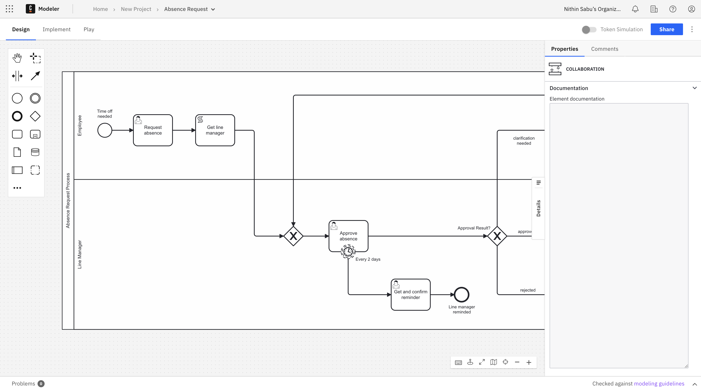

Camunda Platform 8 only

In the **Design** mode view, business users have access to a different workspace of Web Modeler with a reduced properties panel. Only comments are shown, which provides a decluttered user interface.

All the technicalities, such as triggers to deploy the diagram or start the instance, are hidden. Linting is disabled, and problem annotations are discarded.

The comments panel is collapsed when switching to the design mode, and if a user expands it, the state is persisted even when switching to another diagram.

As a business user, you can **link decision models** and **process models** via [call activities](/components/modeler/bpmn/call-activities/call-activities.md), and you can still be a **project owner**, even if you don't execute implementation.

With the **Design** mode view, users can model a process without need for a complex development tool that does not speak their language. This provides a clear journey for the user, all while incorporating modeling, sharing, and collaborating in a user-friendly way.
