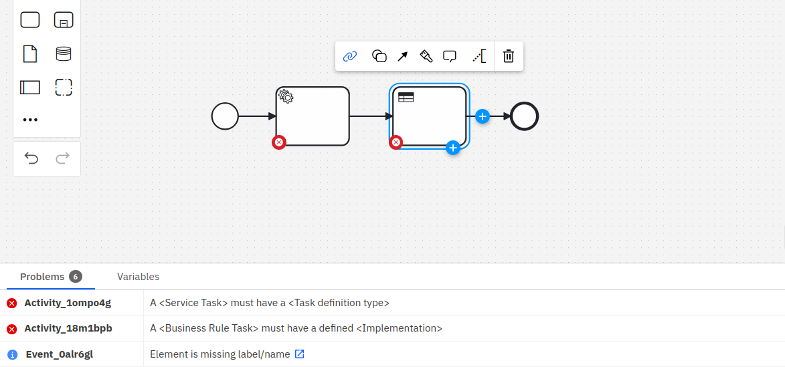
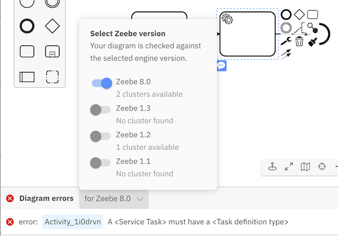
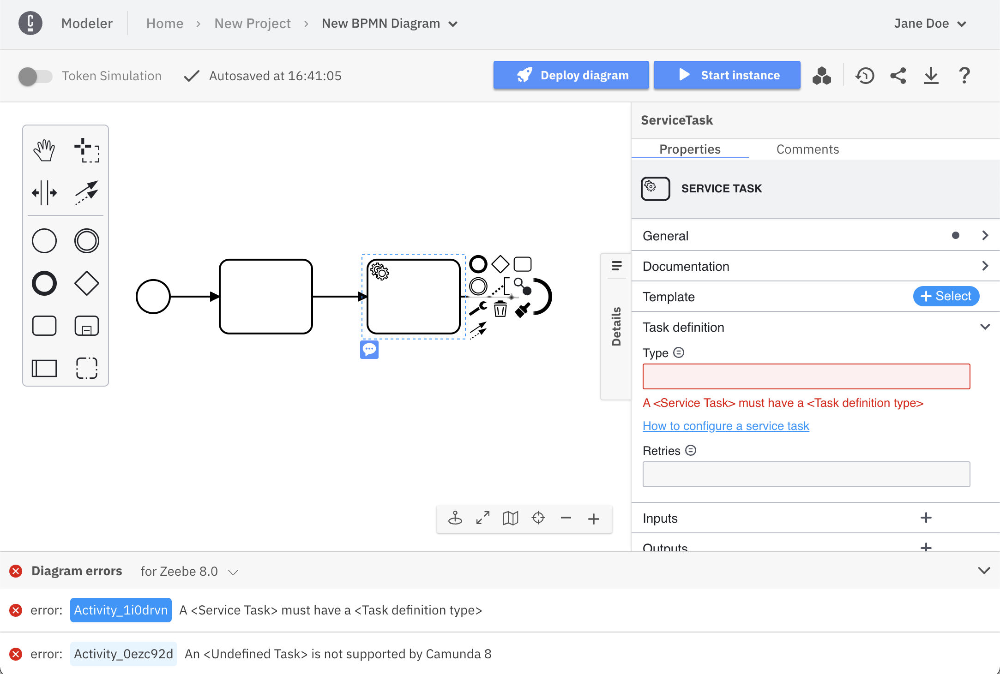
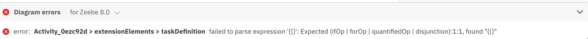

### Lint errors

Based on a set of debug rules, Web Modeler continuously validates implementation properties for a process diagram while the user is modeling. The debug rules are added to the debug panel at the bottom of Web Modeler. Expand the debug panel to view the errors.

### Expand and collapse

The debug panel can be expanded or collapsed by clicking anywhere on the header. The panel is collapsed by default and the latest state (expanded or collapsed) is remembered for the next time you open Web Modeler.

### Version selection

The version selector can be used to choose the Zeebe version the diagram is validated against. The version chosen should match the Zeebe version of the cluster the diagram is going to be deployed in to get the correct set of debug errors. The version selector also provides information about the number of clusters available for each Zeebe version within the current organization.

### Interactivity

The debug errors are interactive. Clicking on the element ID in the error line highlights the corresponding element in the canvas and points to the specific property in the properties panel where you can resolve the issue.

### Engine errors

Not all errors are currently covered by the debug rules. Engine errors which are shown when you deploy a process and shown in the same debug panel. Currently, we do not support interactivity for these errors.

