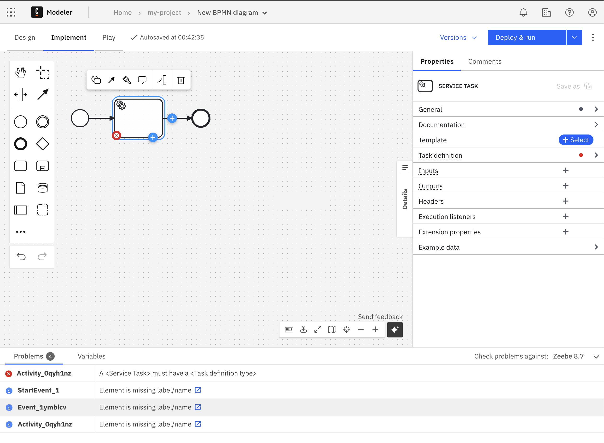
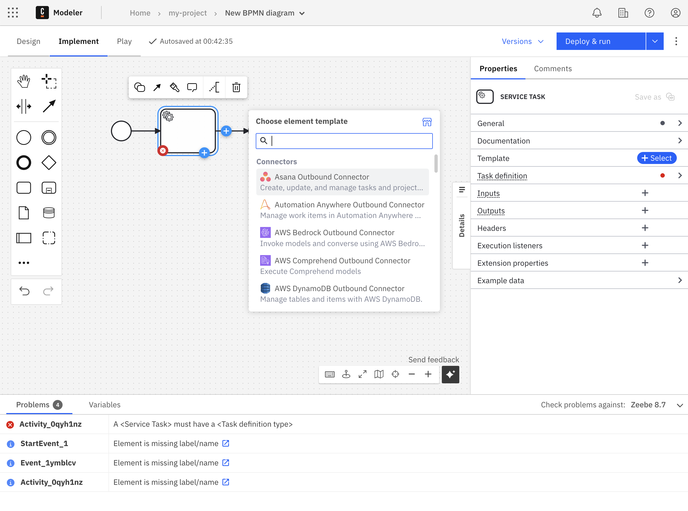
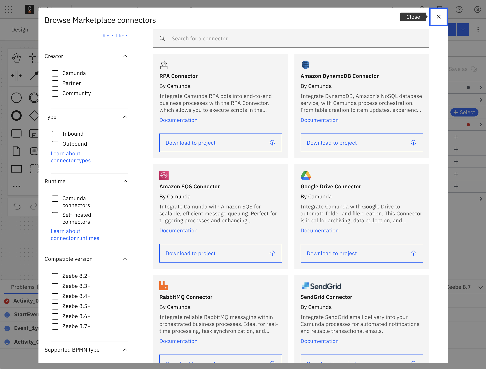
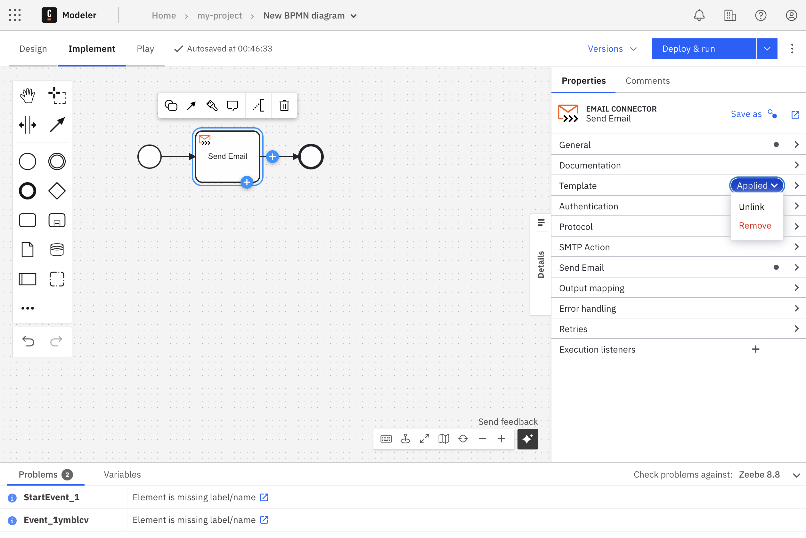
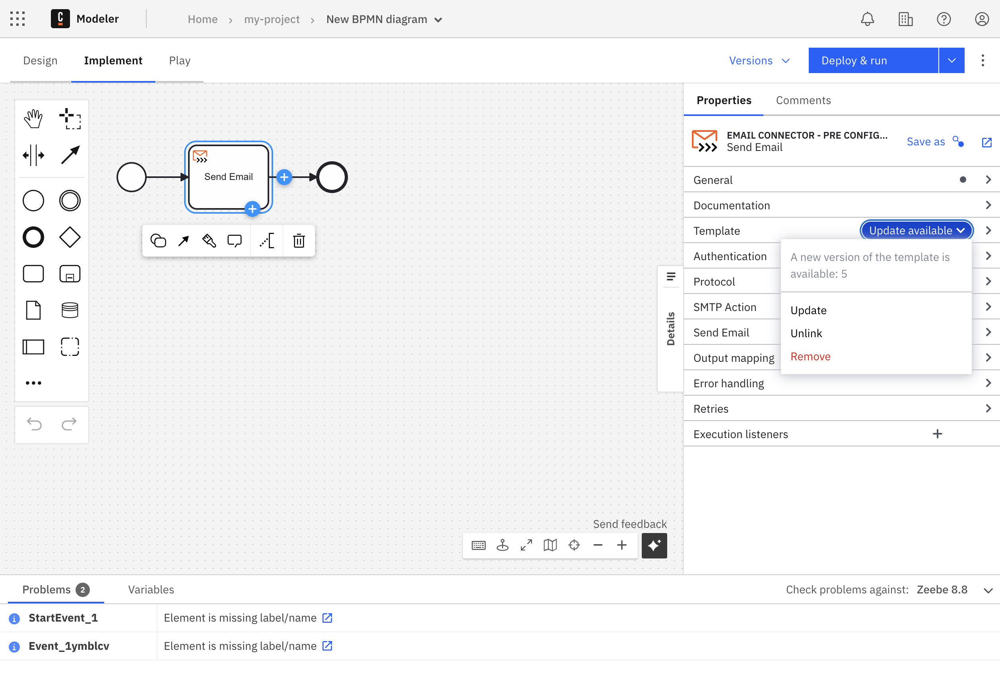
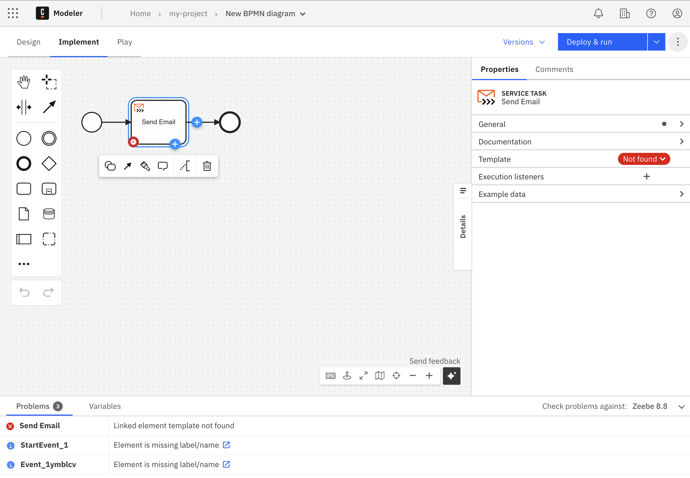
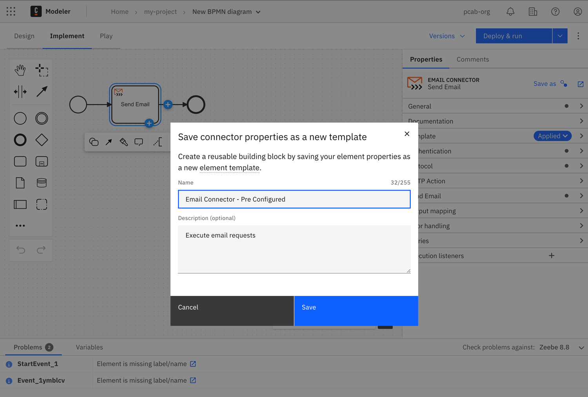

## Applying templates

If an [element template](/components/modeler/element-templates/about-templates.md) matches a selected diagram element, the blue template catalog button, **Select**, is shown in the properties panel on the right side of the screen.



Clicking **Select** opens a popup menu, allowing you to browse and search available templates for the
selected element.



You can also click the **blue shop icon** in the upper right of the popup to open the [Camunda Marketplace](/components/modeler/web-modeler/camunda-marketplace.md).



Applying a template stores it via the `modelerTemplate` property and the optional `modelerTemplateVersion` property
on the selected element:

```xml

<bpmn:serviceTask id="MailTask"
                  zeebe:modelerTemplate="com.mycompany.MailTask"
                  zeebe:modelerTemplateVersion="1"/>
```

It also sets up custom fields on the diagram element and makes these available for inspection and editing.
Properties which were not configured in the element template using custom fields will not be available for editing.

## Removing templates

To remove an applied template from an element, either the _Unlink_ or _Remove_ function can be used:

- **Unlink**: Remove the element template from the `modelerTemplate` property but keep the properties which were set.
- **Remove**: Remove the element template from the `modelerTemplate` property and reset all properties of the respective element.



## Updating templates

If a template is applied and a new version of the template is found you can _update_ the template.



Templates are updated according to the following rules:

- If the property is set in the new template, it will override the existing value — unless the value was originally set by the old template and has been manually changed since.
- If the property is not defined in the new template, it will unset.
- Sub-properties of complex properties (for example, `zeebe:input`, `zeebe:output`) are handled
  according to these rules if they can be identified.

### Replacing templates

If a template is deprecated with a new element template and you want to keep the same input values as in the
deprecated template, you can:

1. **Unlink**: Remove the current template that is deprecated from the `modelerTemplate` property, but keep the properties
   which
   were set.
2. **Select** and apply the new element template.

## Missing templates

If a template was applied to an element but cannot be found, editing of the element is disabled. To re-enable editing, either _unlink_ or _remove_ the template, or make it available by publishing a template with the same ID or creating a new one.



## Creating templates from existing elements

If a diagram element supports being used as a template, a _Save as_ link will be displayed next to the header. Once clicked, you will be able to select a name and description for the template. This allows you to easily reuse pre-configured elements.



The template can be further customized by [editing it](/components/connectors/manage-connector-templates.md).

To use the template, you first need to [publish it to the project or organization](/components/modeler/web-modeler/element-templates/manage-element-templates.md#publish-an-element-template).

Learn more about [saving elements as templates](./save-as-element-templates.md).
