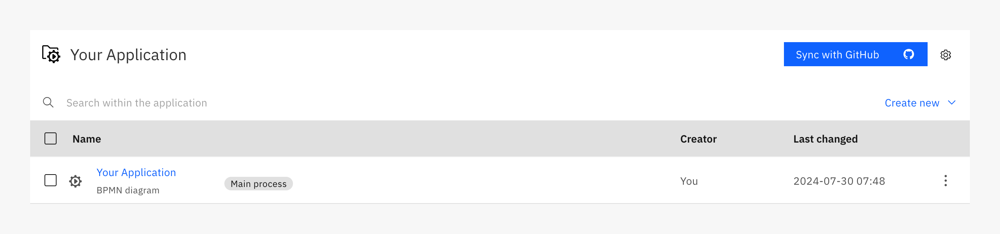

import Tabs from "@theme/Tabs";
import TabItem from "@theme/TabItem";

Organization owners and administrators can connect their Web Modeler process applications to GitHub, GitLab, and Azure DevOps, allowing users to keep their Web Modeler, Desktop Modeler, and official version control projects synced.

Once the connection is configured by an organization owner or organization administrator, project administrators and editors can use the built-in button to pull changes from the remote repository, integrate contributions from Desktop Modeler users, and merge their own work.

## Connect to a remote repository

Select your Git repository host:

<Tabs groupId="platform" defaultValue="github" queryString values={
[
{label: 'GitHub', value: 'github' },
{label: 'GitLab', value: 'gitlab' },
{label: 'Azure', value: 'azure' },
{label: 'Bitbucket', value: 'bitbucket' },
]}>

<TabItem value='github'>

<h3> Create a new GitHub App </h3>

Web Modeler requires a GitHub App to sync changes with your GitHub repository.

Follow the [GitHub documentation](https://docs.github.com/en/apps/creating-github-apps/registering-a-github-app/registering-a-github-app) to create a new GitHub App for your organization or account with the following configuration:

- Under **Webhooks**, deselect **Active**
- Under **Permissions > Repository permissions**, enable **Read and write** for the following options:
  - Commit statuses
  - Contents
  - Pull requests

Click **Create GitHub App** to finish.

<h3> Generate a private key </h3>

1. In your new application's setting page, navigate to **General > Private keys**.
2. Select **Generate a private key**. This key is automatically downloaded as a .pem file when created, and can be opened in a text editor to copy and paste the contents into Web Modeler.

<h3> Install the GitHub App </h3>

1. In your application's setting page, navigate to **Install app**.
2. Click on the **Install** button for your organization or account.
3. Select **Only select repositories**, and choose the repository to sync with Web Modeler.
4. Once redirected to your application's installation page, copy the **Installation ID** located at the end of the page's URL: `https://github.com/settings/installations/{installation_id}`.

<h3> Configure GitHub in Web Modeler </h3>

:::note
When using a self-hosted GitHub instance, ensure the environment variable `CAMUNDA_MODELER_GITSYNC_GITHUB_BASEURL` is set to the API URL of your self-hosted GitHub instance. It usually looks like `http(s)://HOSTNAME/api/v3`. Refer to [GitHub documentation](https://docs.github.com/en/enterprise-server@3.15/rest/enterprise-admin?apiVersion=2022-11-28#endpoint-urls) and choose the correct enterprise server version.
:::

1. Within Web Modeler, navigate to the process application you would like to connect to GitHub, and click **Connect repository**.

2. Select the **GitHub** tile (if not already selected), located at the top of the modal.

3. Provide the following information in the **Configure GitHub** modal:

   - **Installation ID:** Found in the URL of your GitHub App's installation page.
   - **Client ID:** Found in your GitHub App's settings page. You can also use Application ID as an alternative. (If you are using GitHub Enterprise Server 3.13 or prior, Application ID is required.)
   - **Private Key:** The contents of the .pem file downloaded from your GitHub App's settings page.
   - **GitHub repository URL:** The base URL of the repository you want to sync with, for example `https://github.com/camunda/example-repo`. The URL cannot contain the `.git` extension or a folder path.
   - **Branch name:** The branch name to use for merging and managing changes.
   - **Path:** (optional) The path to the folder containing your process application files. If left empty, Web Modeler syncs with the root of the repository. This path is automatically created if it does not exist.

4. Click **Open repository** to test your configuration. The repository for the provided branch and optional path opens in a new tab.

5. Click **Save Configuration**.

:::note
When synchronizing for the first time with a remote repository that already contains commits, ensure Web Modeler has assigned the correct main process.
:::

When successful, your project will display a new **Sync with GitHub** button.

</TabItem>
<TabItem value='gitlab'>

<h3> Create a new access token </h3>

Web Modeler requires an access token to sync changes with your GitLab repository. You can use the following options:

- **Project access token** (Recommended)
- Group access token
- Personal access token

Follow the [GitLab documentation](https://docs.gitlab.com/ee/user/project/settings/project_access_tokens.html#create-a-project-access-token) to generate a new project access token for your repository with the following configuration:

- Enable the following [**scopes**](https://docs.gitlab.com/ee/user/project/settings/project_access_tokens.html#scopes-for-a-project-access-token) for either the `developer` or `maintainer` role:
  - `api`
  - `read_api`
  - `read_repository`
  - `write_repository`

<h3> Get the project ID </h3>

1. Navigate to your GitLab project.
2. Click the menu icon in the top right corner and select **Copy project ID**.

<h3> Configure GitLab in Web Modeler </h3>

:::note
When using a self-hosted GitLab instance, ensure the environment variable `CAMUNDA_MODELER_GITSYNC_GITLAB_BASEURL` is set to the API URL of your self-hosted GitLab instance. It usually looks like `http(s)://HOSTNAME/api/v4`.
:::

1. Within Web Modeler, navigate to the process application you would like to connect to GitLab, and click **Connect repository**.

2. Select the **GitLab** tile, located at the top of the modal.

3. Provide the following information in the **Configure GitLab** modal:

   - **Access token:** The generated project, group or personal access token.
   - **Project ID:** The ID copied from the GitLab project settings.
   - **GitLab repository URL:** The base URL of the repository you want to sync with, for example `https://gilab.com/camunda/example-repo`. The URL cannot contain the `.git` extension or a folder path.
   - **Branch name:** The branch name to use for merging and managing changes.
   - **Path:** (optional) The path to the folder containing your process application files. If left empty, Web Modeler syncs with the root of the repository. This path is automatically created if it does not exist.

4. Click **Open repository** to test your configuration. The repository for the provided branch and optional path opens in a new tab.

5. Click **Save Configuration**.

:::note
When synchronizing for the first time with a remote repository that already contains commits, ensure Web Modeler has assigned the correct main process.
:::

When successful, your project will display a new **Sync with GitLab** button.

</TabItem>
<TabItem value='azure'>

<h3> Register an App in Microsoft Entra </h3>

:::note
Web Modeler SaaS supports authenticating against `Microsoft Entra ID (global service)`. Other [national clouds](https://learn.microsoft.com/en-us/entra/identity-platform/authentication-national-cloud#microsoft-entra-authentication-endpoints) can be used in Self-Managed by setting the environment variable `CAMUNDA_MODELER_GITSYNC_AZURE_AUTHORITY_BASE_PATH`.
:::

Web Modeler requires an application to be registered with Microsoft Entra ID to sync changes with your Azure repository.

1. Follow the [Microsoft Entra ID](https://learn.microsoft.com/en-us/entra/identity-platform/quickstart-register-app) documentation to register an application. Be sure to save your `Application (client) ID` and `Directory (tenant) ID`.

2. Configure your application to use [client-certificate credentials](https://learn.microsoft.com/en-us/entra/identity-platform/how-to-add-credentials?tabs=certificate). You need a PEM-encoded, RSA-encrypted private key and a PEM-encoded certificate in `X509` format generated from that key. You will need both later when configuring the connection in Web Modeler.

3. Configure [scoped permissions](https://learn.microsoft.com/en-us/entra/identity-platform/quickstart-configure-app-access-web-apis) for your app so it can update the content of your Azure repositories. Ensure `Azure DevOps > vso.code_write` is configured, and `Admin consent required` is set to `No`.

<h3> Grant access to the App in the desired Azure projects</h3>

Follow the [documentation on how to add users](https://learn.microsoft.com/en-us/azure/devops/organizations/accounts/add-organization-users?view=azure-devops&tabs=browser#add-users-to-your-organization) to add the created application to your Azure organization.

Ensure the following:

- _Access level_ is set to `Basic`.
- Add this to all projects that will be using this integration.
- _Azure DevOps Groups_ is set to `Project Contributors`.

<h3> Configure Azure in Web Modeler </h3>

:::note
When using a self-hosted Azure DevOps Server instance, ensure the environment variable `CAMUNDA_MODELER_GITSYNC_AZURE_BASEURL` is set to the API URL of your self-hosted Azure DevOps Server instance.
:::

1. Within Web Modeler, navigate to the process application you would like to connect to Azure, and select **Connect repository**.

2. Select the **Azure** tile, located at the top of the modal.

3. Provide the following information in the **Configure Azure** modal:

   - **Application (client) ID:** Can be found on the applications registration page.
   - **Directory (tenant) ID:** Your Microsoft Entra tenant unique identifier. Can also be found on the applications registration page.
   - **Private Key:** The private key used to generate the certificate in PEM format.
   - **Certificate:** The certificate used to register the application in PEM format.
   - **Repository URL:** The base URL of the repository you want to sync with, for example `https://dev.azure.com/camunda/my-project/_git/example-repo`. The URL cannot contain the `.git` extension or a folder path. By default, the first repository you create will have the same name as the project and the URL won't explicitly have the project name in it, for example `https://dev.azure.com/camunda/_git/example-repo`.
   - **Branch name:** The branch name to use for merging and managing changes.
   - **Path:** (optional) The path to the folder containing your process application files. If left empty, Web Modeler syncs with the root of the repository. This path is automatically created if it does not exist.

4. Click **Open repository** to test your configuration. The repository for the provided branch and optional path opens in a new tab.

5. Click **Save Configuration**.

:::note
When synchronizing for the first time with a remote repository that already contains commits, ensure Web Modeler has assigned the correct main process.
:::

When successful, your project will display a new **Sync with Azure** button.

</TabItem>
<TabItem value='bitbucket'>

<h3>Create a new access token</h3>

Web Modeler requires an access token to sync changes with your Bitbucket Cloud repository. You can use one of the following token types:

- **Repository access token** (recommended)
- Project access token
- Workspace access token

Follow the [Bitbucket documentation](https://support.atlassian.com/bitbucket-cloud/docs/create-a-repository-access-token/) to generate a new repository access token for your repository with the following configuration:

- Enable the following [**scopes**](https://support.atlassian.com/bitbucket-cloud/docs/repository-access-token-permissions/) for your token:
  - `repositories:read`
  - `repositories:write`

<h3>Configure Bitbucket in Web Modeler</h3>

:::note
Web Modeler currently only supports Bitbucket Cloud.
:::

1. In Web Modeler, navigate to the process application you want to connect to Bitbucket, and click **Connect repository**.

2. Select the **Bitbucket** tile at the top of the modal.

3. Fill in the **Configure Bitbucket** modal with the following information:

   - **Access token:** The repository, project, or workspace access token you generated.
   - **Bitbucket repository URL:** The base URL of the repository you want to sync with, e.g., `https://bitbucket.org/camunda-worksapce/my-repository`. The URL must not include the `.git` extension or any folder path.
   - **Branch name:** The branch to use for merging and managing changes.
   - **Path:** (optional) The folder path containing your process application files. If left empty, Web Modeler syncs with the repository root. This path will be created automatically if it does not exist.

4. Click **Open repository** to test your configuration. The repository for the specified branch and optional path will open in a new tab.

5. Click **Save Configuration**.

:::note
When synchronizing for the first time with a remote repository that already contains commits, ensure Web Modeler has assigned the correct main process.
:::

Once successful, your project will display a new **Sync with Bitbucket** button.

</TabItem>
</Tabs>

## Sync with remote repository

Organization owners/administrators, project administrators, and project editors can sync their version of Web Modeler with the connected repository at any time.

1. In your connected process application, click **Sync with _GitProvider_** button.
2. Enter a [version number](./process-applications.md#versioning) to create a new milestone for your process application. The new milestone will be created prior to pushing your changes to the central repository.
3. Click **Synchronize**.

In the case of a merge conflict, select between your local Web Modeler changes and the changes in the remote repository to continue.

Once the pull is complete and any merge conflicts are resolved, Web Modeler will push its changes. The newly created milestone is now accessible via the **View milestone** button in the success notification.

## Manage existing configurations

Existing Git configurations can be edited from the gear icon beside the **Sync with _GitProvider_** button. Permission to update these settings are limited to **project administrators**.

## Change Git provider

To switch between Git providers, update your configuration with the following steps:

1. Disconnect your current Git provider by clicking the gear icon beside the **Sync with _GitProvider_** button, and clicking the **Delete provider connection** button at the bottom of the modal.
2. After confirming the operation, open the **Connect repository** modal and provide the necessary information for the new Git provider, following the steps outlined for [GitHub](./git-sync.md?platform=github#connect-to-a-remote-repository), [GitLab](./git-sync.md?platform=gitlab#connect-to-a-remote-repository), [Azure](./git-sync.md?platform=azure#connect-to-a-remote-repository), or [Bitbucket Cloud](./git-sync.md?platform=bitbucket#connect-to-a-remote-repository).

## Advanced use cases

Git sync supports a variety of development workflows, including the following advanced use cases.

### Monorepos

A monorepo is a single repository containing multiple logical projects that each have disparate workflows and release cadences.

To set up Git sync with a monorepo, you can specify the **path** to your project during the configuration. This allows you to keep multiple projects in one repository, each with its own sync configuration.

:::note
If you are using Git sync to work with monorepos, you should pull changes regularly, as the GitHub API is limited to a fixed amount of files and commits per synchronization action. See [troubleshooting](#troubleshooting) for more information.
:::

### Parallel feature development

Git sync supports parallel feature development by allowing multiple process applications to be connected to different feature branches. This allows teams to work on multiple features simultaneously without interfering with each other's work.

To use Git sync for parallel feature development:

1. Create a new [process application](./create-a-process-application.md) in Modeler for each active feature branch you want to develop.
2. Configure Git sync for each instance by connecting it to the corresponding feature branch in your repository.
3. Work on your feature in Modeler, using **Sync with _GitProvider_** to pull and push changes as needed.
4. Once the feature is complete and merged into the main branch, you can delete the process application associated with the feature branch.

To perform hotfixes or patches of production or production-bound processes, sync a copy of the process application to the `main` branch.

:::caution
Creating multiple copies of a process application can complicate navigation and deployment if you have multiple files with the same ID in a project. To avoid this, you can create copies of the process application in different projects.
:::

## Self-Managed environment variables

Refer to [Configuration of the restapi component](../../../self-managed/modeler/web-modeler/configuration/configuration.md#git-sync) for details on configuring environment variables.

## Troubleshooting

- Duplicate file names are not allowed for the same file type.
- Characters with special meaning to Git (for example, `/`), or characters disallowed by Git, are not allowed in either branch or file names.
- Any `.json` file is treated as a connector template, and the operation will fail if it is not. If the remote repository stores any `.json` files that are not connector templates, place them in a subfolder to be automatically ignored by the synchronization process.
- Git sync only supports `.md` files that are named exactly `README.md` (case sensitive). Git sync supports multiple `README.md` in a repository (including in subfolders).
- When synchronizing for the first time with a remote repository that already contains commits, Web Modeler will attempt to select a main process with a file name that matches its own main process. If there is no matching process, Web Modeler will select a process at random from the available `.bpmn` files. In the event that no `.bpmn` files exist in the remote repository, Web Modeler will not proceed, and will instead display an error message. Ensure the main process is correctly assigned, especially in cases where a random process has been selected.
- Actions which alter the SHA of the commit to which Web Modeler is synced (for example, squash) may cause synchronization errors.
- Timeouts may occur during a sync. In the event of a timeout, close the modal and retry the synchronization.
- Using self-hosted instances of Git providers may require additional configuration. Refer to the Web Modeler configuration part for your [git host](#connect-to-a-remote-repository) and available [environment variables](#self-managed-environment-variables) for more details.
- **(GitHub specific)** A single synchronization action is limited to incorporating a maximum of 250 commits or making changes to up to 300 files, regardless of whether these changes affect the Web Modeler files directly. Web Modeler does not provide a notification when these thresholds are exceeded. Should you encounter this limitation, it may be necessary to initiate a fresh synchronization. A fresh synchronization fetches all the files in the repository without relying on the incremental changes, thus bypassing the limitations. This can be achieved by either changing the branch or modifying the GitHub repository URL.
