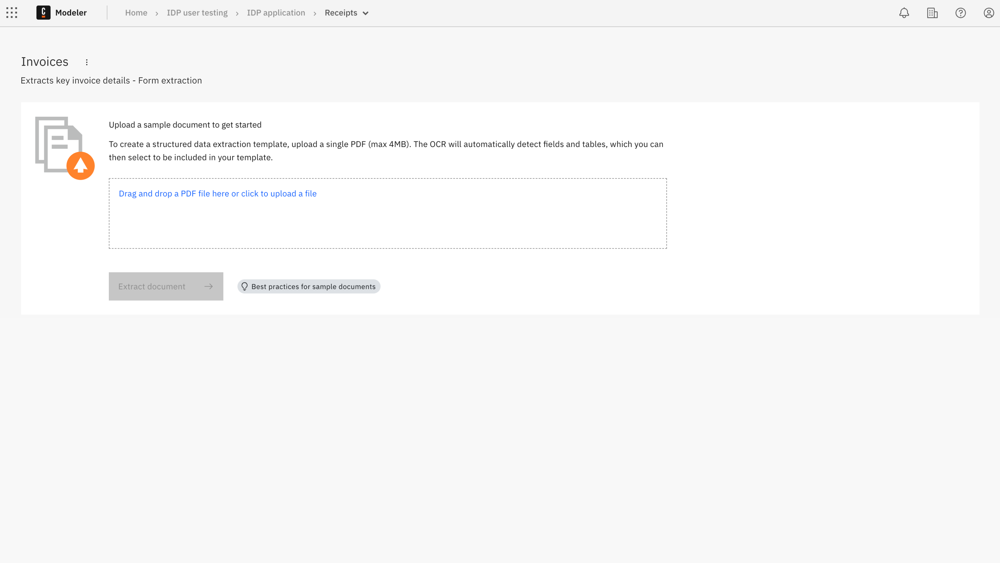
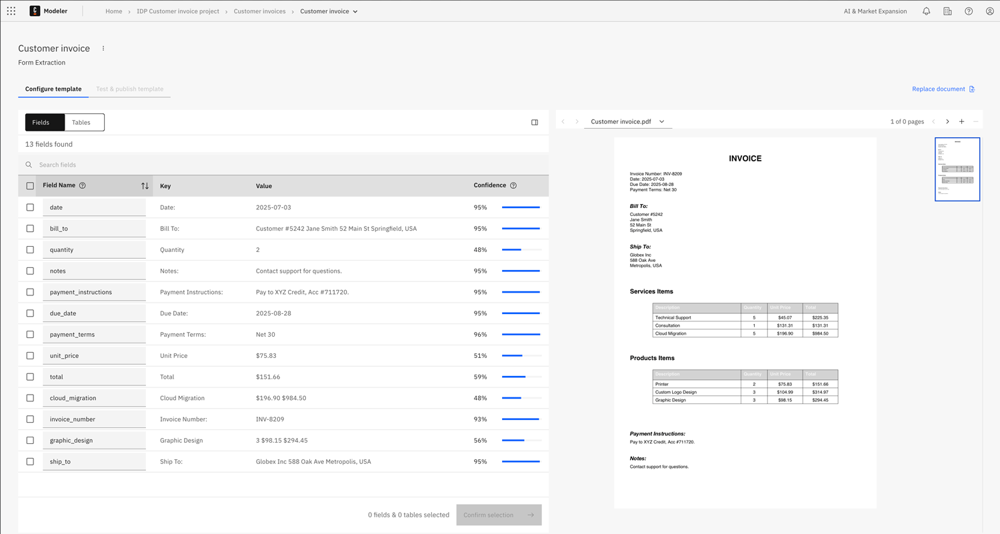
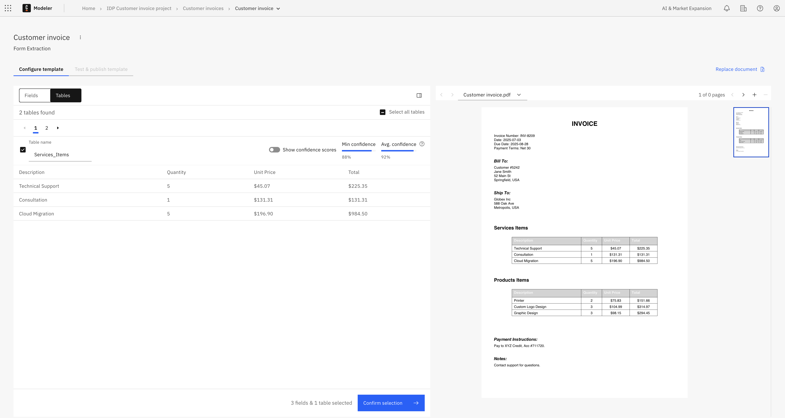
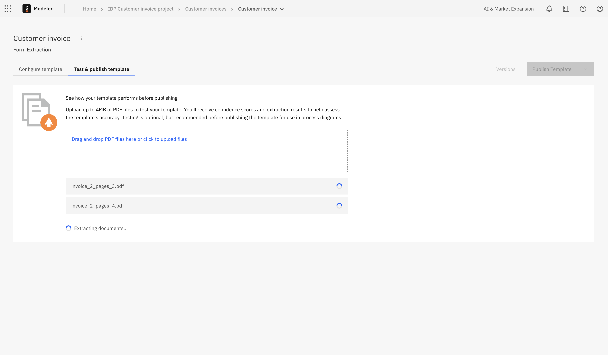
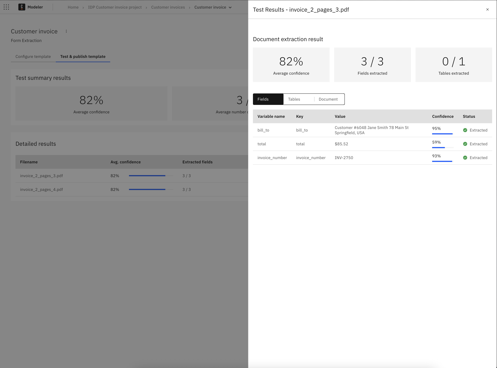

import IdpPublishProjectModalImg from './img/idp-publish-structured.png';
import IdpVersionsImg from './img/idp-versions.png';

Use this extraction method to extract data from [structured documents](idp-key-concepts.md#structured-documents).

## About structured data extraction

Use this extraction method for documents with a consistent layout, such as invoices, tax forms (for example, W-2s, VAT declarations), and loan or insurance applications.

Structured extraction allows you to:

- Upload a sample document.
- Automatically discover fields and tables.
- Configure the fields and tables you want included in your template.
- Receive confidence scores to each extracted value.
- Build reusable templates.
- Integrate extracted data into BPMN processes via variables.

## About OCR

Optical Character Recognition (OCR) technology is used to detect and extract text and layout from scanned or digital documents.

Structured data extraction currently uses Amazon Textract:

- Extracts text, layout, and key-value pairs.
- Supports horizontal text only.
- Supports English handwriting.
- Supported languages for typed characters: Spanish, German, French, Italian, Portuguese.

Limitations to consider:

- No language detection.
- No vertical text support.
- Limited support for complex custom fields.
- No detection of table headers.

## Data extraction steps

Complete the following steps to configure and publish a structured data extraction template:

1. [Upload sample document and run extraction](#upload): Upload a sample document and run an extraction of document fields and tables.
1. [Configure template](#configure): Select the fields and tables you want to include in your template.
1. [Test data extraction](#test): (Optional) Upload documents to test your selection before publishing it as a template.
1. [Publish](#publish): Publish the project to make it available for use in your BPMN diagrams, processes, and [document automation](idp-document-automation.md) projects.

## Upload a sample document and run extraction {#upload}

Start by uploading a sample PDF document that represent the default document template you want to extract data from. You will use this document throughout the data extraction process.

To upload your sample document:

1. Drag your sample document in the box or click **Drag and drop a PDF file here or click to upload a file** to browse and upload your sample document.
2. Once you have finished uploading your sample document, the extraction process starts automatically.
   - The extraction process retrieves the fields and tables from the document.
   - The extracted fields and tables are displayed in the **Fields** and **Tables** tabs.

## Step 1: Configure template {#configure}

After the extraction process of the sample document is complete, you can configure the template to include only the fields and tables you want to include in your template.

- Select the fields you want to include in your template by clicking the checkbox next to each field.

- Select the tables you want to include in your template by clicking the checkbox next to each table.

Click on **Confirm selection** to save your selection.

### Extracted Fields

- **Field name:** Arbitrary name of the field, which is used to identify the field in your template, you can change it to anything you like.
- **Key:** The key of the field, which matches the key of the extracted field from the PDF.
- **Value:** The extracted value.
- **Confidence score:** How confident the model is in the extracted value.

### Extracted Tables

- **Table name:** Arbitrary name of the table, which is used to identify the table in your template, you can change it to anything you like.
- **Min confidence score:** The minimum confidence score of a field in the table.
- **Average confidence score:** The average confidence score of all fields in the table.

## Step 2: Test data extraction (optional) {#test}

After you have configured your template, you can test the data extraction by uploading documents that match the template you have created.

To test the data extraction:

1. Drag your test document in the box or click **Drag and drop a PDF file here or click to upload a file** to browse and upload your test document.
2. Once you have finished uploading your test document, click on **Test extraction template**.
3. The extraction process starts looking for the fields and tables you have selected in your template.

### Test summary results

After the extraction is complete, you'll see a summary of the test results:

- **Average confidence**: Shows the overall confidence score (as a percentage) for all extracted data
- **Average number of fields extracted**: Displays how many fields were successfully extracted compared to the total expected (e.g., "3 / 3")
- **Average number of tables extracted**: Shows how many tables were successfully extracted compared to the total expected (e.g., "0 / 1")

### Detailed results

The detailed results section provides a comprehensive view of each tested document:

- **Filename**: The name of the uploaded test document
- **Avg. confidence**: A visual confidence bar showing the extraction confidence percentage
- **Extracted fields**: Number of successfully extracted fields out of the total
- **Extracted tables**: Number of successfully extracted tables out of the total
- **Actions**:
  - **View Extraction**: Click to see the detailed extraction results for each field and table

  
  - **Remove**: Delete the test document from the results

You can test multiple documents by:

- Clicking **Rerun tests** to test additional documents
- Clicking **Upload documents** to add more test files

\*\*\*\*

## Publish {#publish}

Publish the document extraction template to make it available for [integration into your processes](idp-integrate.md)<!-- and [document automation](idp-document-automation.md) projects -->.

1. Click **Publish** and select either:
   - **Publish to project**: Only users in the Web Modeler project can access the document extraction template.
   - **Publish to organization**: The document extraction template is made available as a shared resource within your organization. This option is only available for organization owners or users with the Admin role.

1. On the **Publish Extraction Project** dialog, configure the publish settings.
   
   - **Version name**: Enter a version for the published document extraction template.
   - **Version description**: Enter a description for the published document extraction template version.

1. Click **Publish** to make the document extraction template available for [integration into your processes](idp-integrate.md)<!--  and [document automation](idp-document-automation.md) projects -->.

## Versions {#versions}

Click **Versions** to view and manage your published document extraction template versions.

### Compare versions

You can compare the change history between two template versions as JSON code in the diff layout.

1. Ensure that the sidebar **Show changes** toggle is turned on.
1. Select the version that you want to compare. The previous version is automatically selected for comparison.

The JSON for the previous version is shown on the left, with the currently selected version shown on the right.

- Differences between the versions are highlighted in the JSON.
- For example, if an extraction field was added, this change is highlighted in green.

### Restore a version

You can restore a version to revert to a previous snapshot of a document extraction template.

1. In the sidebar **Versions** list, hover over the version you want to restore.
1. Select the three vertical dots to open the actions menu.
1. Select **Restore as latest**.

### Update a version

You can update a version name and description at any time.

1. In the sidebar **Versions** list, hover over the version you want to rename.
1. Select the three vertical dots to open the actions menu.
1. Select **Edit** and enter a new name and/or description for the version.

### Delete a version

You can permanently delete a document extraction template version.

1. In the sidebar **Versions** list, hover over the version you want to rename.
1. Select the three vertical dots to open the actions menu.
1. Select **Delete**.
1. You are prompted to confirm the deletion.
   - Select **Delete version** to permanently delete the version.
   - Select **Cancel** to cancel the deletion and return to the versions list.

:::caution
Deleting a document extraction template version is permanent.
:::
