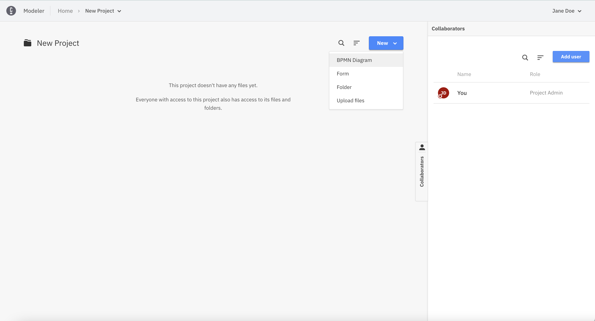

Since Web Modeler is embedded in the Camunda Cloud Console, it does not need to be started separately.

To launch Web Modeler, follow the steps below:

1. Go to the **Modeler** tab.

2. Click **New Project** to create a new project to store all your diagrams

:::note
You can name your project now or simply continue your journey
:::

3. Click **New** and choose **BPMN Diagram**

:::note
You can name your diagram now or simply continue your journey
:::

4. Choose an existing template (i.e. Absence Request) or **Create blank**

5. Congrats! You just created your first Diagram

