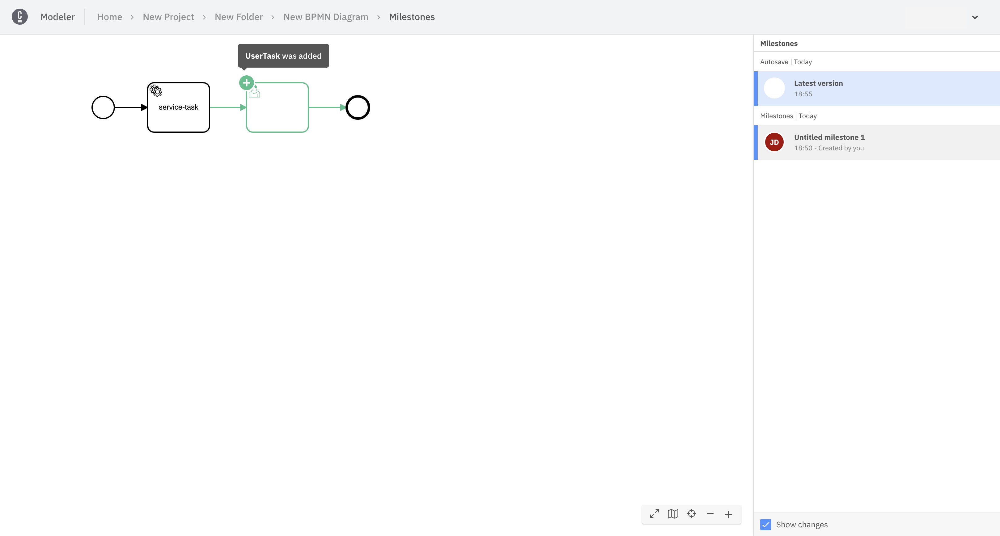

Camunda 8 only

## Milestones

You can save a snapshot of your diagram as a milestone at any time.

You can restore a previous milestone, and also compare changes between two milestones.

### Milestone history

To view your diagram milestone history, either:

- Select **History** from the actions menu.
- Select **Show milestone history** from the breadcrumb menu.

For example:

### Create a milestone

You can create a new milestone directly from your diagram or the milestone history.

#### Create a milestone from your diagram

Select **Create milestone** from the breadcrumb menu.

#### Create a milestone from the milestone history

Hover over the the latest version in the **Milestones** panel and select **Create a new version**.

:::note

A new milestone is automatically created when dragging and dropping a file into the diagram view, or when using the breadcrumb menu **Replace via upload** option.

:::

#### Bulk milestone creation

A [process application](/components/modeler/web-modeler/process-applications.md) is a special type of Web Modeler folder that allows you to work on a set of related files and
[deploy](/components/modeler/web-modeler/process-applications.md#deploy-and-run-a-process-application) them as a single bundle with just one click. This reduces the risk of having a broken deployment at runtime, and makes it more convenient to deploy related files.

When creating a milestone on a main process of a process application, milestones are created for all other assets in the application to make it easier to track or roll back changes.

:::note
Milestones of resources belonging to a process application are tied to the main process and cannot be modified.
:::

### Compare milestones

#### Visual or Code view

When viewing and comparing milestones, you can choose to view changes either visually or as the underlying XML.

#### Milestones panel

#### Changes list

Milestones can be compared visually. By enabling the diffing feature, the currently selected milestone is compared to its predecessor.

The differences that are highlighted are only those that affect the execution of the BPMN process. Pure visual changes like position changes are not highlighted.

### Restore a milestone

You can restore a milestone if you want to revert to a previous version of your diagram.

:::note

After you restore a milestone, the name of the newly restored milstone is appended with "(restored)".

:::

Hover over a milestone, click on the three vertical dots, and expand for more options.

### Copy a milestone to another folder

### Rename a milestone

### Delete a milestone
