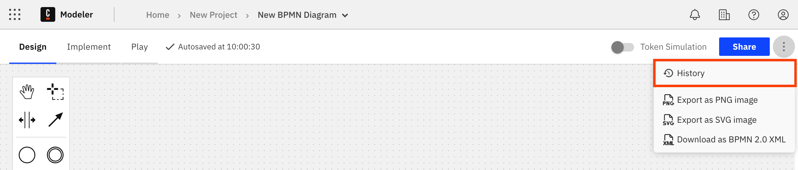
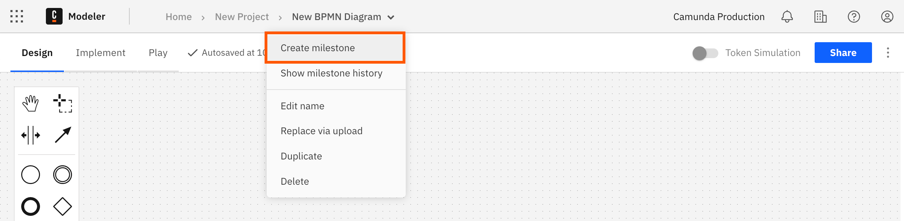
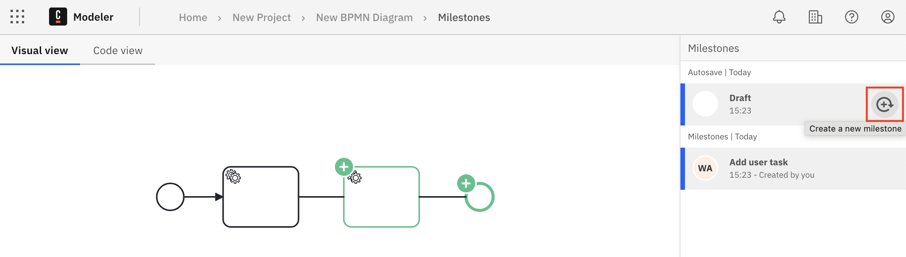
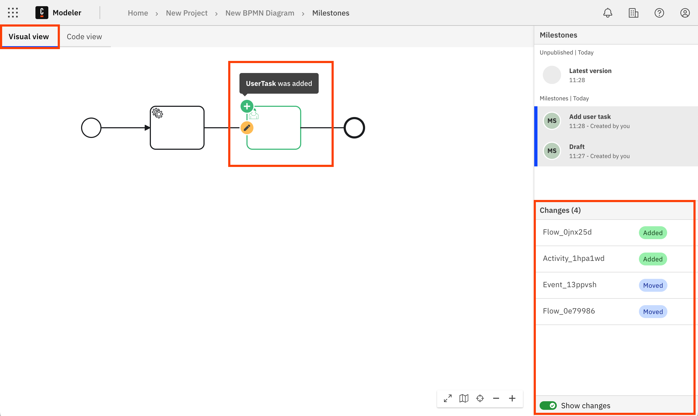

Camunda 8 only

You can create a milestone at any time to save a snapshot of your BPMN or DMN diagram.

You can restore a milestone to revert to a previous snapshot of your diagram, for example if you make a mistake while modeling. You can also compare two milestones to see the differences between them.

## Milestone history

You can use the milestone history to view, compare, and manage your diagram milestones.

To view the milestone history, either:

- Select **History** from the actions menu.

  

- Select **Show milestone history** from the breadcrumb menu.

  

## Create a milestone

You can create a new milestone either from your diagram or the milestone history.

- From your diagram, select **Create milestone** from the breadcrumb menu.

  

- From the milestone history, hover over the the latest version in the **Milestones** panel and select **Create a new milestone**.

  

:::note

A new milestone is also automatically created when dragging and dropping a file into the diagram view, or when you select the **Replace via upload** option from the breadcrumb menu.

:::

### Bulk milestone creation

A [process application](/components/modeler/web-modeler/process-applications.md) is a special type of Web Modeler folder that allows you to work on a set of related files and
[deploy](/components/modeler/web-modeler/process-applications.md#deploy-and-run-a-process-application) them as a single bundle with just one click. This reduces the risk of having a broken deployment at runtime, and makes it more convenient to deploy related files.

If you create a milestone on the main process of a process application, milestones are created for all other assets in the application, to make it easier to track or revert changes. See [create a bulk milestone](process-applications.md#create-a-bulk-milestone).

:::note
Milestones of resources belonging to a process application are tied to the main process and cannot be modified.
:::

## Compare milestones

You can compare the change history between two milestones, either visually as a diagram or as code in an XML diff layout.

1. Open the milestone history for your diagram.
1. Ensure that the sidebar **Show changes** toggle is turned on.
1. Select the milestone that you want to compare. The previous milestone is automatically selected for comparison.

:::note

Turn off the sidebar **Show changes** toggle to view individual milestones without comparison to the previous milestone.

:::

### Compare milestones in visual view

To view BPMN diagram changes visually, select the **Visual view** tab.

- Differences between the milestones are highlighted visually on the diagram. For example, if an element was added, this change is highlighted in green with a plus symbol. Hover over a change to view more details.
- Only differences that affect the execution of the BPMN process are highlighted.
- The sidebar **Changes** list shows the details of each change, including the type and identifier. Select a change to highlight it.

:::note

You can only use the **Code view** to compare changes in a DMN diagram. The **Visual view** only shows a view of the milestone.

:::

### Compare milestones in code view

To view BPMN and DMN diagram changes as code in an XML diff layout, select the **Code view** tab.

- The XML for the previous milestone is shown on the left, with the currently selected milestone shown on the right.
- Differences between the milestones are highlighted in the XML. For example, if an element was added, this change is highlighted in green.

## Restore a milestone

You can restore a milestone to revert to a previous snapshot of your diagram.

1. In the sidebar **Milestones** list, hover over the milestone you want to restore.
1. Select the three vertical dots to open the actions menu.
1. Select **Restore as latest**.

The diagram reverts to the restored milestone. A new milestone is created with "(restored)" appended to the name.

## Copy a diagram milestone

You can create a new diagram by copying a specific milestone.

1. In the sidebar **Milestones** list, hover over the diagram milestone you want to copy.
1. Select the three vertical dots to open the actions menu.
1. Select **Copy to...**.
1. Choose a project/folder and select **Copy here** to create the new diagram in the chosen folder.

## Rename a milestone

You can rename a milestone at any time.

1. In the sidebar **Milestones** list, hover over the milestone you want to rename.
1. Select the three vertical dots to open the actions menu.
1. Select **Edit name** and enter a new name for the milestone.

## Delete a milestone

You can _permanently_ delete a milestone.

1. In the sidebar **Milestones** list, hover over the milestone you want to rename.
1. Select the three vertical dots to open the actions menu.
1. Select **Delete**.
1. You are prompted to confirm the deletion.
   - Select **Delete milestone** to permanently delete the milestone.
   - Select **Cancel** to cancel the deletion and return to the milestone history.

:::caution

Deleting a milestone is permanent. You cannot access a deleted milestone, and it is removed from the milestone history.

:::
