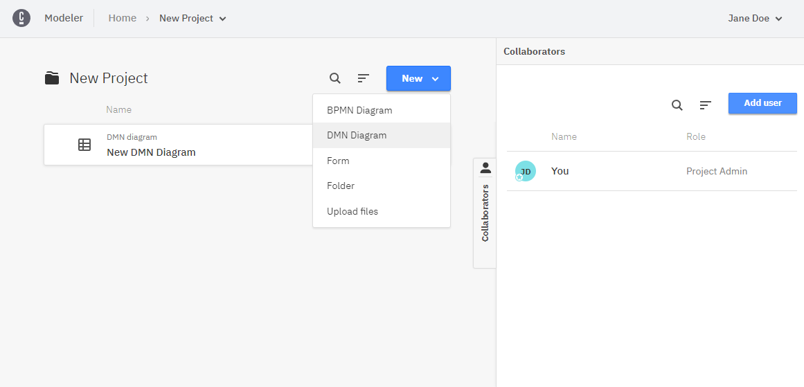
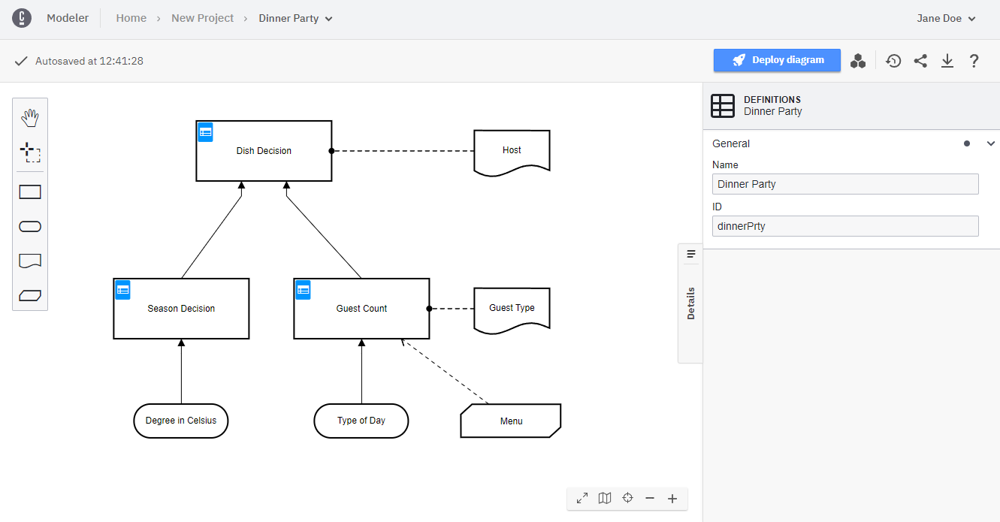
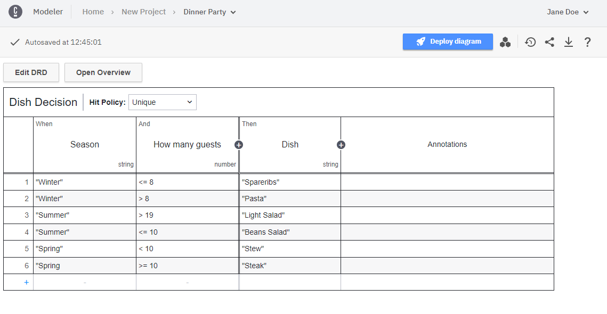
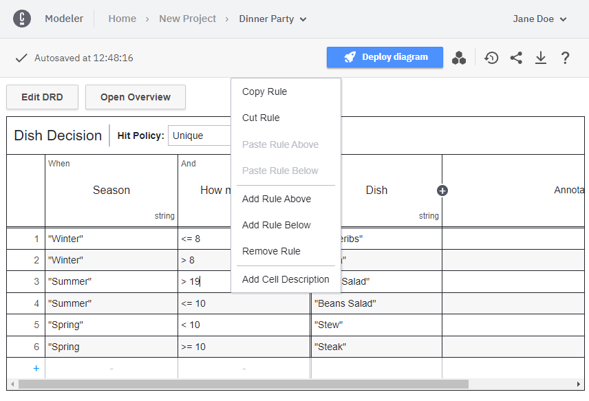
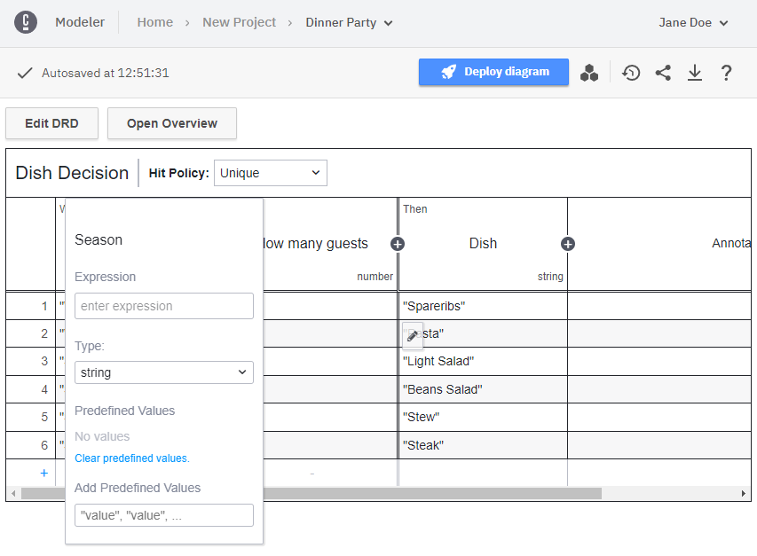
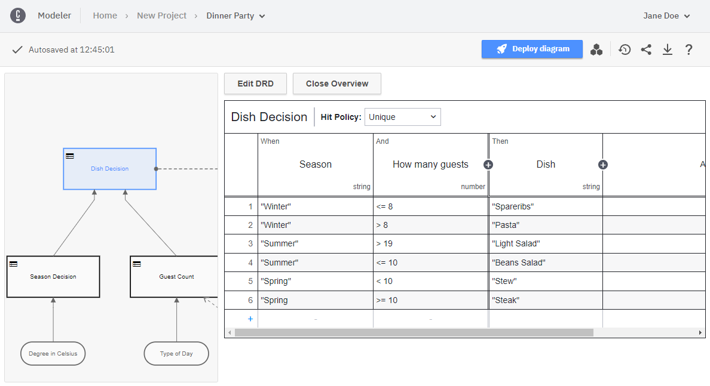
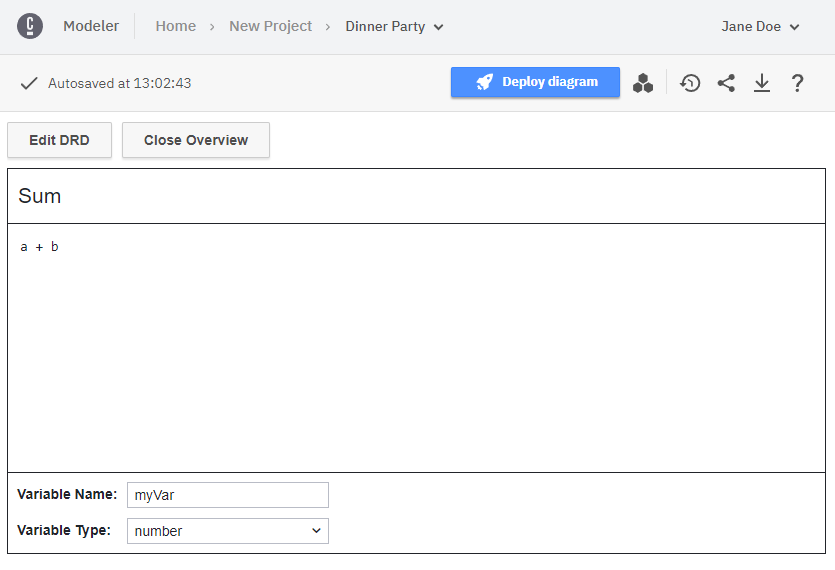

## Create new DMN decision requirement diagram

To start modeling, create a new DMN diagram by selecting **New > DMN Diagram** in your project.

## Start modeling

Now you can start to create a DMN model. Add the desired elements from the palette on the left side by dragging and dropping them onto the diagram canvas.

Alternatively, you can add new elements by using the context menu that appears when you select an element in the diagram. Using the wrench icon in the context menu, you can change the type of an element in place. Use the properties panel on the right side to change the name or id of the DMN diagram.

## Decision tables

By clicking the blue icon on a decision table, you can open the decision table view and start to edit it. Add **Input**, **Output**, and **Rule** elements by clicking the plus signs. Edit a table cell by clicking on it. Alternatively, the tabulator and enter keys can be used to walk through the table cells.

Delete a rule or a column, copy, or insert a new rule by right clicking in the cell:

Adjust the details of an input or output column (e.g., name, expression, and type) by double clicking in the header row:

Jump between decision tables or literal expressions in your decision requirement diagram by opening and using the `Overview` on the left side:

## Literal expressions

You can also edit literal expressions. Just as with decision tables, in the decision requirement diagram view, click the blue icon to *drill-down* into the literal expression view and start editing.

## Next steps

- [Deploying your diagram](./save-and-deploy.md) - Learn how to make your DMN diagram available on your cluster.
- [Collaboration](./collaboration.md) - Learn how to share your diagram with others and interact with collaborators.
- [Milestones](./milestones.md) - Learn how to save a snapshot of your diagram as a milestone.