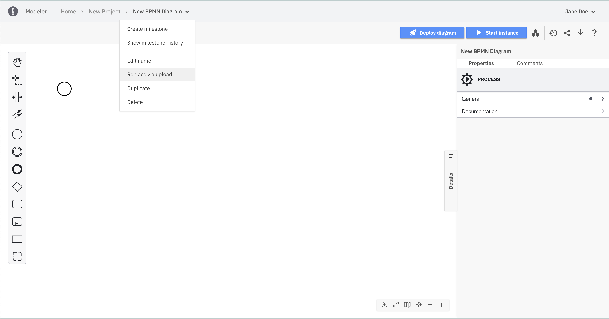
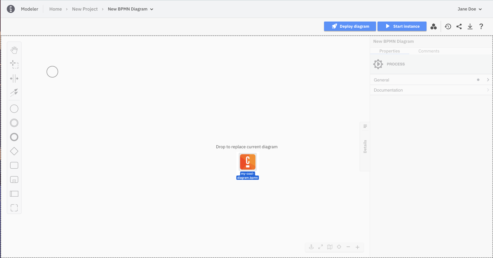

Camunda 8 only

You can upload a BPMN diagram, DMN diagram, or other supported file into Web Modeler using several methods:

- In a project, click **New > Upload files** and select the files from your computer.

  

  

  

- In a project, drag one file from your computer and drop it.

  

:::note
For the two options below, the content of the Web Modeler resource is replaced with the content of the file.
:::

- In a Web Modeler resource editor, open the breadcrumb menu and choose **Replace via upload**. Then, select a file from your computer.

  

  

- In a Web Modeler resource editor, drag one file from your computer and drop it onto the canvas.

  

### Undo/redo management limitations

You cannot undo or redo any actions taken before an upload as the undo/redo history is cleared when a diagram is uploaded. This prevents inconsistencies between the uploaded diagram and any actions taken before the upload.
