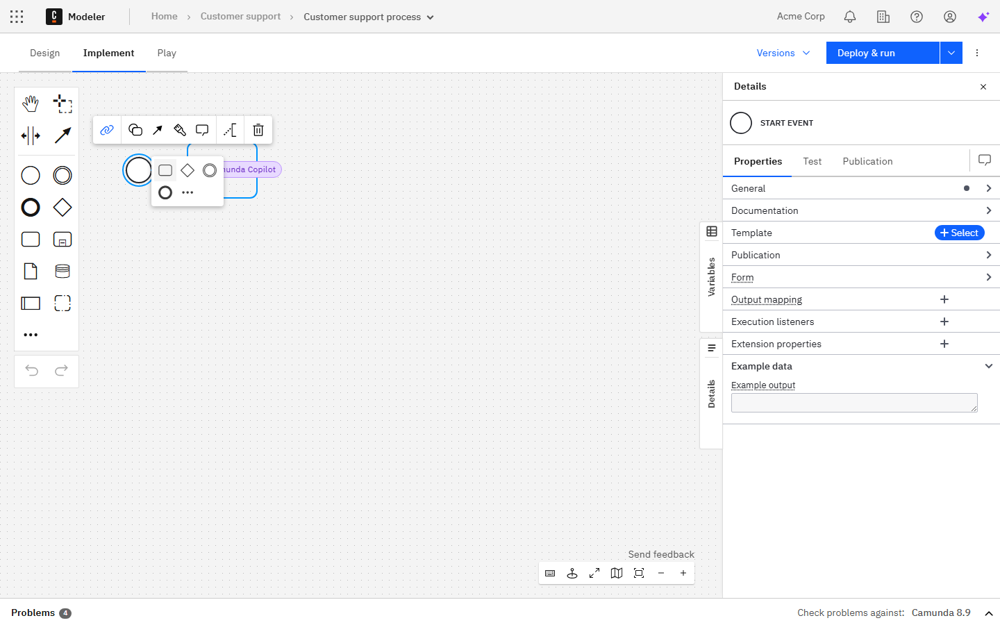
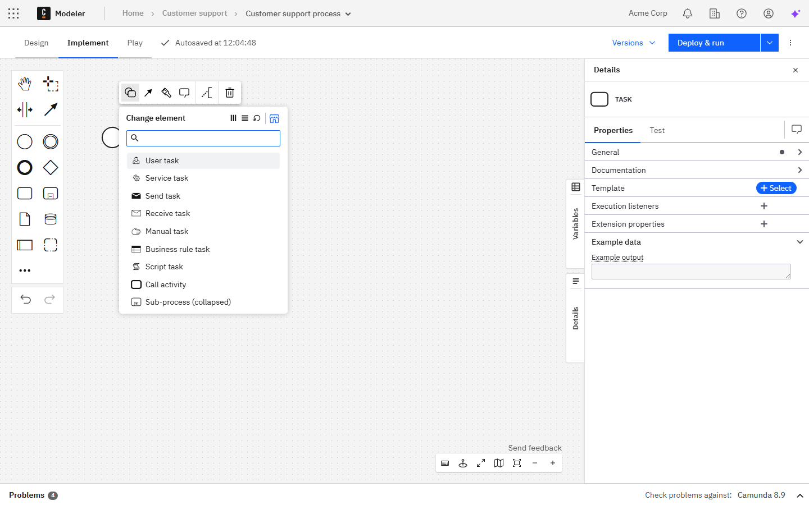
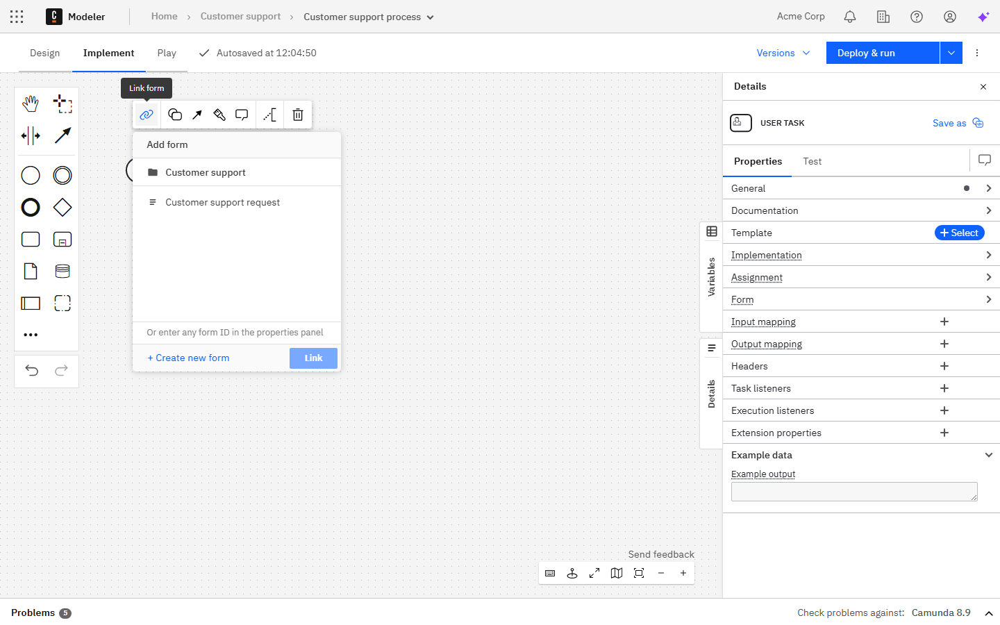
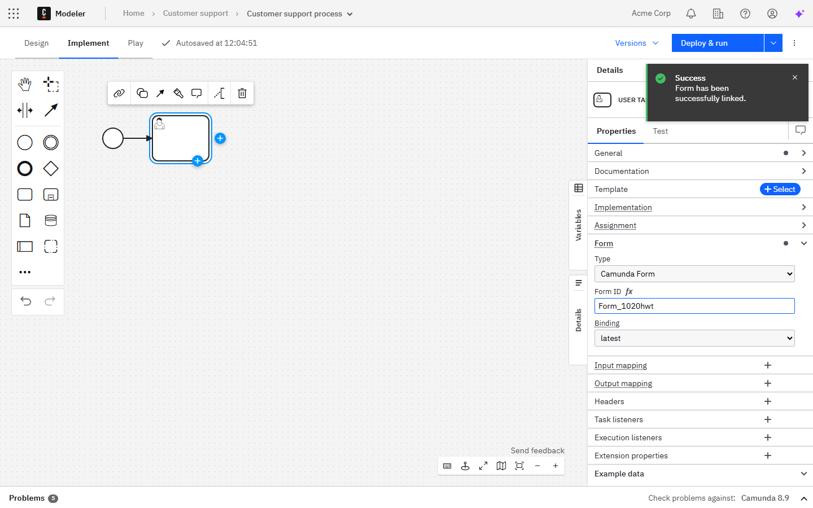

Camunda 8 only

After you've created a BPMN diagram, you can start modeling it.

A new diagram contains a single start event, the starting point of every process. From here, you can add elements to build out your process.

Use the plus icon in the **context pad** to append your first element, such as a task.

To change the type of an element, use the replace icon in the **context pad**. For example, you can turn a generic task into a user task.

You can also use the **context pad** to link resources, such as forms, to an element.

Use the **properties panel** on the right side to inspect and edit the technical properties of each element.

To revert or reapply changes, use the **Undo** and **Redo** buttons on the canvas.

:::note
Undo and redo behavior has limitations when collaborating and [importing a diagram](import-diagram.md#undoredo-management-limitations).
:::

## Additional resources

- [Camunda Academy: Camunda 8 Web Modeler Overview](https://academy.camunda.com/c8-web-modeler-overview)
