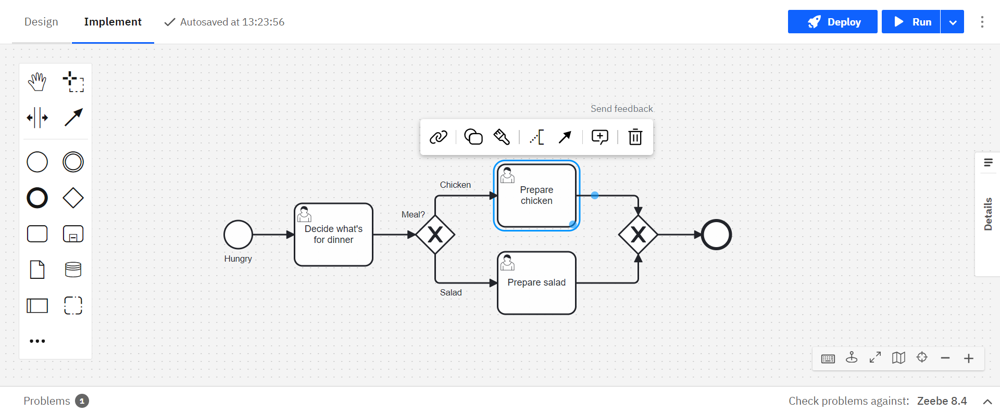
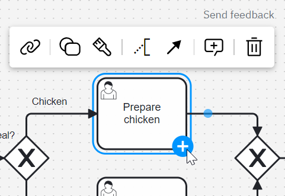
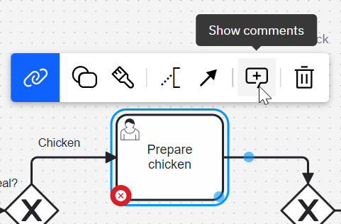
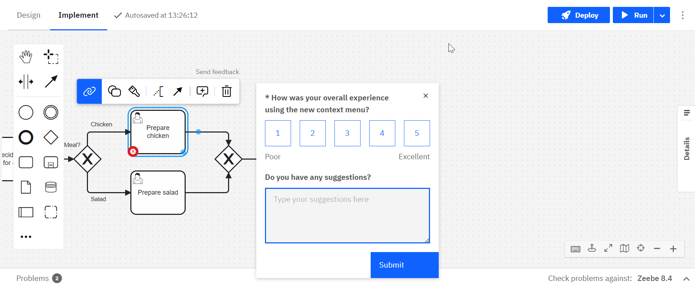

Camunda 8 only
Alpha

:::note
The context pad is an alpha feature. Since it has a significant impact on the user experience, it's not enabled by default for enterprise customers. It can be enabled through the [alpha features](/components/console/manage-organization/enable-alpha-features.md) menu.
:::

The context pad is one of the main ways to interact with the diagram, and therefore is designed to be more intuitive than the old context pad. Actions that change the selected element are now separated from actions that add elements to the diagram. This makes it easier to find the action you are looking for.

The **append feature** is separated from the context pad and allows you to append any element directly without having to change the type of the element you just appended:

The **attach feature** lets you attach boundary events with one click:

**Linking resources** like BPMN elements, DMN elements, and forms have moved to the context pad:

This also applies to the **commenting feature**:

Provide feedback on the context pad by clicking **Send feedback**:

