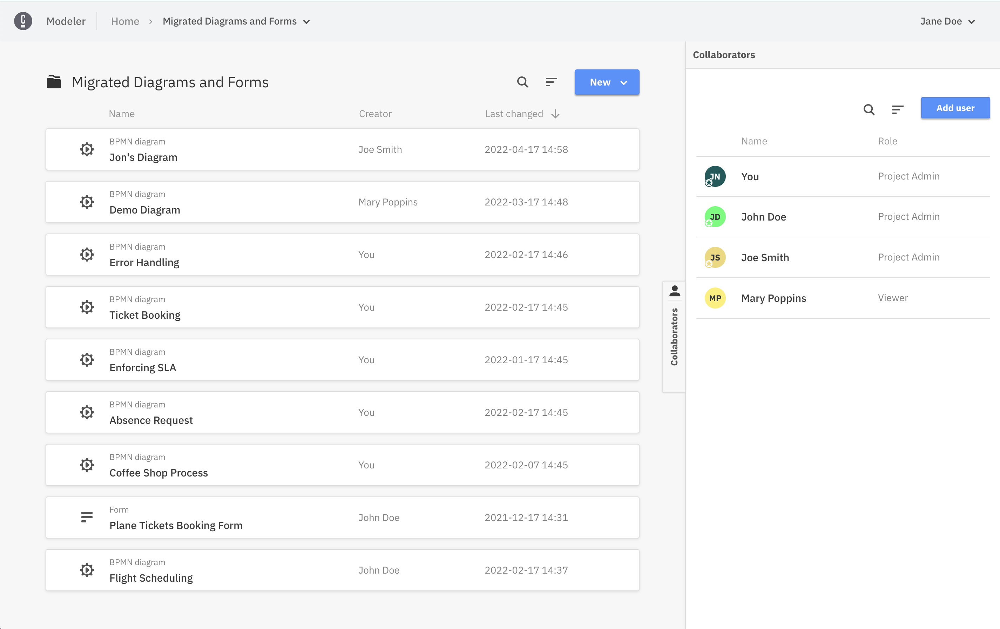

If you used our old Cloud Modeler (before March 2022), no worries, all your data has been migrated.

You will find all your Diagrams and Forms under the new **Modeler** entry in the top navigation bar.

After you open the Web Modeler, you will find all your Diagrams and Forms in a new project **Migrated Diagrams and Forms**.

You can simply click on the **Migrated Diagrams and Forms** text to open the project and access all Diagrams and Forms you had in Cloud Modeler.

To learn how to use and discover more Web Modeler features, follow our Next Steps.

## Next steps

- [Launch Web Modeler](launch-cloud-modeler.md)
- [Model your first diagram](model-your-first-diagram.md)
- [Import diagram](import-diagram.md)
- [Save and deploy your diagram](save-and-deploy.md)
- [Start a new process instance](start-instance.md)
- [Learn about Collaboration features](collaboration.md)
- [Learn about Milestones features](milestones.md)
