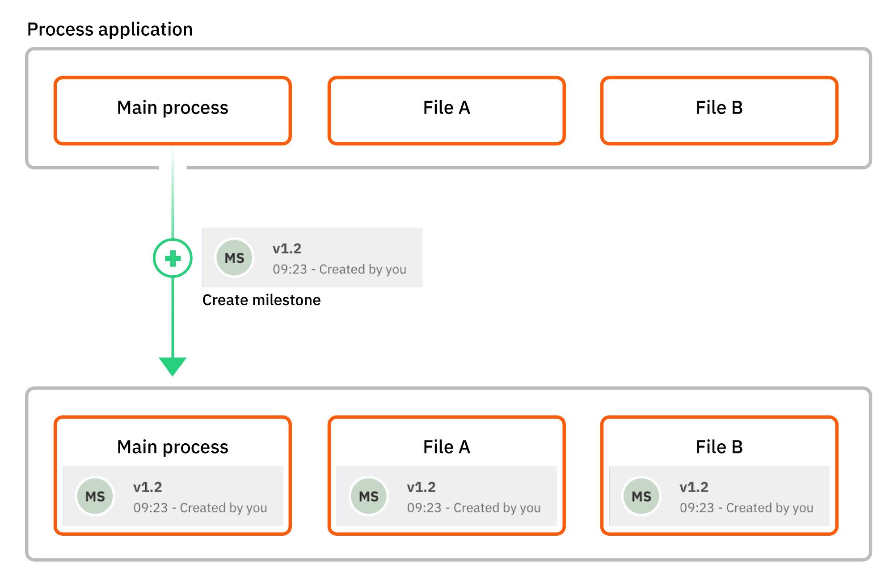

import EmptyProjectImg from './img/process-applications/empty-project.png'
import ReassignMainProcessImg from './img/process-applications/reassign-main-process.png'
import FileListImg from './img/process-applications/file-list.png'
import DeployProcessApplicationImg from './img/process-applications/deploy-process-application.png'
import RunProcessApplicationImg from './img/process-applications/run-process-application.png'
import DeployErrorImg from './img/process-applications/deploy-error.png'

## Idea and purpose

A process application is a special type of folder in Web Modeler that allows you to work on a set of related files and
[deploy](#deploy-and-run-a-process-application) them together in a single bundle with just one click.
This reduces the risk of having a broken deployment at runtime and makes it more convenient to deploy related files.

We advise using a process application for all non-trivial automation projects.
These projects tend to have one main BPMN process that represents your end-to-end use case and additional files the
main process depends on, such as called supporting processes, DMN decisions, or forms.

## Create a process application

Create a new process application by clicking the **Create process application** button in an empty project or via
**New project > Create process application** if you have not yet created a project.

### Select a default cluster

Camunda 8 SaaS only

After selecting **Create process application**, you may select a cluster to use for deployment during development.

If you have not yet [created a cluster](/guides/create-cluster.md), or see **No Cluster has been created yet** in the modal, select **Create new dev cluster**. This will automatically take you to the **Clusters** tab in Console to create a new cluster.

If you have already created a cluster, select the toggle next to the cluster's name under **Select a development cluster**.

:::note
A warning message reading `Cluster creation is not available on this modeling plan` means your modeling plan does not permit you to create more clusters. Contact the admin or owner of your organization to **upgrade your plan**.

Alternatively, `Missing permissions` means you may not have the proper permissions to create a cluster. Contact your organization's admin to **create a cluster**.
:::

### Main process

The new process application will contain an empty BPMN diagram with the same name as the process application itself, labeled as the main process. You can rename the main process diagram any time.

:::note
A process application must always have a main process.
That is why the main process diagram cannot be deleted or moved out of the process application.
However, you can assign another BPMN diagram as the new main process with the **Reassign main process** option in the
diagram's action menu:

:::

### Add files to a process application

Add more files to the process application via the **Create new** dropdown on the process application page, drag and drop
from your local computer, or move from a different location in the Web Modeler.

To make it easily discoverable, the main process will always be displayed at the top of the file list, regardless of the sort order.

:::note
Within the same process application, process IDs, decision IDs, and form IDs must be unique across all files.
This is to avoid ambiguity and conflicts when you link resources and deploy the process application later on.
:::

## Deploy and run a process application

### Deploy a process application

Open the process application's [main process](#main-process) and use the **Deploy** button to deploy the process application to a Zeebe cluster.

All BPMN, DMN, and form files contained in the process application folder will be deployed in a single bundle.

:::note
If any resource fails to deploy, the whole deployment will [fail](#deployment-errors) and the cluster state will remain unchanged.
This ensures that a process application cannot be deployed incompletely or in an inconsistent state, making it safer to use.
:::

Note that when you select **Deploy**, you may also select **Define stages** to set up a pipeline for development, and the promotion from one stage to another of a given process application version:

Here, you can select the applicable cluster for development, testing, staging, and production:

If no cluster is selected for at least one stage, a warning may appear reading **Undefined stages**. To deploy, you must define clusters for your stages.

### Run a process application

Open the process application's [main process](#main-process) and use the **Run** button to start a new instance.
Before the actual process instance is started, all resources will be re-deployed if required so the new instance
will always use their latest state.

After the process instance is started, you will receive a notification with a link to the process instance view in
[Operate](../../operate/operate-introduction.md).
Follow this link to monitor the process instance and interact with it as needed.

:::info
Single-file deployment is not supported in a process application.
If you click the **Deploy** or **Run** button for any diagram other than the main process, you will be asked to open the
main process instead to deploy the whole process application from there.
:::

### Deployment errors

If the deployment of a process application fails (for example, because one or more of the contained resources have invalid
implementation properties), a modal containing the error message thrown by the Zeebe engine will be displayed.
The message usually comprises the name of the affected resource, the ID of the invalid diagram element, and the actual error.

### Deployment of external resources

You can link BPMN processes, DMN decisions, or forms that are not part of the process application itself (external
resources) from any process inside a process application.

Note that when you deploy the process application:

- Linked external forms will be deployed together with the process application.
- Linked external BPMN and DMN diagrams are _not_ deployed together. They must be deployed separately.

## Versioning

Although you cannot version a process application itself, you can use [bulk milestone creation](milestones.md#bulk-milestone-creation) and version tags to save a single 'versioned' snapshot of all the process application files in one action, instead of having to create separate milestones for every file.

When you create a milestone in any process application file, a milestone is also created with the same name (version tag) for all files currently available in the process application.

This allows you to track a process application through the development lifecycle and ensure the correct version is called.

### A worked example

In this example, you have a process application that contains multiple files as well as the main process.

- You create a new milestone for the main process and enter "1.2" as the version tag.
- When you create this new milestone, a milestone is also created for every other file and named with the same "1.2" version tag.
- All files in the process application now have a "version 1.2" milestone.

### Create a bulk milestone

To create a bulk milestone for a process application:

1. Open any file in a process application and [create a milestone](milestones.md#create-a-milestone).
1. Enter a **Version tag**.
1. Select **Create** to create the milestone and matching version milestones for every file in the process application.

Now when you open the milestone history for any file in the process application, you can use the file navigation header buttons to switch between files, and view their individual milestone history.

:::note

When naming your milestone with a version tag, you cannot edit or delete the created versions.

:::

## Limitations

Be aware of the following limitations when working with process applications:

- You cannot create subfolders inside a process application.
- Process applications can only be deployed to a Zeebe cluster in version 8.4.0 or higher.
- It is not possible to deploy individual files that are part of a process application; the application will always be deployed as a whole.
- When you deploy a process application, only the main process is checked for missing [Connector secrets](../../console/manage-clusters/manage-secrets.md).
- The overall size of the deployment bundle is limited due to a maximum [record](../../zeebe/technical-concepts/internal-processing.md) size of 4 MB in Zeebe.
  Effectively, the limit is between 2 and 3 MB as Zeebe writes more data to the log stream than just the raw deployment.
  - If you exceed the limit, you are shown the following [error message](#deployment-errors):  
    `Command 'CREATE' rejected with code 'EXCEEDED_BATCH_RECORD_SIZE'`
