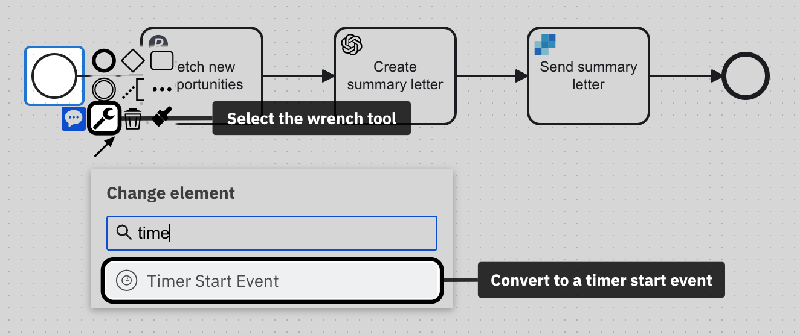
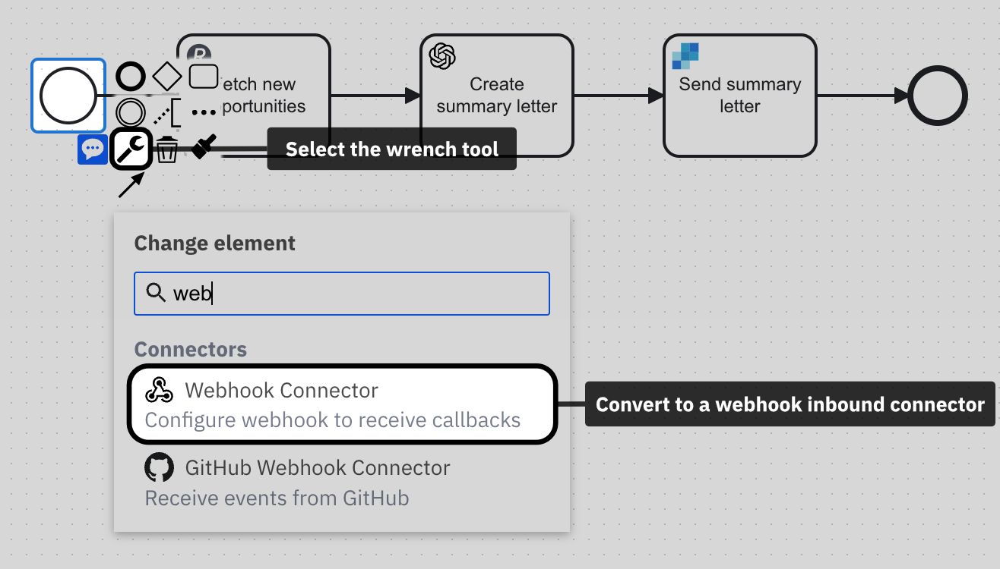
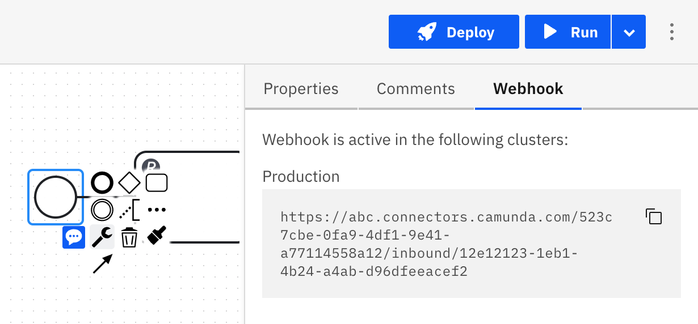

import Tabs from "@theme/Tabs";
import TabItem from "@theme/TabItem";

<span class="badge badge--cloud">Camunda Platform 8 only</span>

When you design a process in Camunda Modeler, you have multiple flexible options to either run or publish it on Camunda Platform 8. This page explains the differences between running and publishing a process, and outlines the various options to publish a process into any environment, and to any audience.

## Run a process

Running a process means that you execute the process as a process instance on Camunda Platform 8. It allows you to test and debug your process and see how it performs in a live environment.

- [Test run using Play mode](#test-run-using-play-mode)
- [Run programmatically](#deploy-to-run-programmatically)
- [Run manually from Modeler](#run-manually-from-modeler)
- [Schedule via timer](#schedule-via-timer)

### Test run using Play mode

Before you publish or run a process, you can test it manually using the Play mode. With the Play mode, you can build and test your process iteratively in small steps. To enter the Play mode, click the Play tab in the top left corner of the modeling screen. Refer to the [Play mode documentation](./play-your-process.md) for details of how the Play environment works.

### Run manually from Modeler

You can also test your process thoroughly on a development cluster to see how it behaves in Operate and Tasklist, in order to run your job workers, and to access your running process instances [programmatically](#deploy-to-run-programmatically). To start a process instance manually, take the following steps:

1. Click **Run** in the top right corner of the modeling screen.

  

2. Select the target cluster.

3. To test your process with data, you can also specify variables written to the process context at startup. The variables must be formatted in valid JSON. As an example, you can use the following JSON:

  ```json
  {
    "hello": "world"
  }
  ```

4. Click on **Run** to confirm. This will start a process instance on the selected cluster. 

5. After the process instance has been started, you will receive a notification with a link to the process instance view in [Operate](../../operate/operate-introduction.md). In Operate, you can see the progress of the process instance and interact with it if required.

### Schedule via timer

You can also schedule a process to run at a specific time or interval using timers. Timers can be added to one or multiple start events of your process.

To schedule a process using a timer, follow these steps:

1. Select the start event.
2. Change the start event type to a timer event using the **wrench tool**.

  

3. [Configure the timer start event](../bpmn/timer-events/timer-events.md#timer-start-events) using the **properties panel** to define when the process should be executed. You can set the timer to trigger at a specific date and time or to repeat at a certain interval.

4. Click on **Deploy** to [deploy](./save-and-deploy.md) the process.

Once the process is deployed, the timer will be activated and the process will be executed at the scheduled time or interval.

Read more in the [timers documentation](../bpmn/timer-events/timer-events.md).

### Best practices for running a process

- Use the [Play mode](#test-run-using-play-mode) to run a process instance with test data before running it with live data.
- Verify that the process is running as expected on a development cluster before running it with live data in your production environment.
- Use [Operate](../../operate/operate-introduction.md) to help you diagnose any problems with the process.

:::tip
You can also define the success of your processes by setting key performance indicators (KPIs) for your process using [Optimize]($optimize$/components/what-is-optimize).
:::

## Publishing a process

Publishing a process means that you make it available to other users inside and outside of Camunda Platform 8. Once published, other users can access and start instances of the process.

You have the following options to publish a process:

- [Deploy to run programmatically](#deploy-to-run-programmatically)
- [Publish via webhook](#publish-via-webhook)
- [Publish to Tasklist](#publish-to-tasklist)
- [Listen to message or signal events](#listen-to-message-or-signal-events)

### Deploy to run programmatically

In order to be able to call a process programmatically from or inside another application or service, you simply have to [deploy](./save-and-deploy.md) it. Once deployed, you can run a process via our APIs, using an API client, or via one the various community SDKs. Read the [documentation on APIs & clients](../../../apis-tools/working-with-apis-tools) to learn more.

### Publish via webhook

You can publish a process via webhook, which allows you to integrate it easily with any system or service that can make an HTTP request. When a webhook is triggered in another system, it sends a HTTP request to a specified URL, which starts a process instance with the payload of the request.

Follow these steps to publish a process via a webhook: 

1. Select the start event.
2. Switch your start event to a [HTTP webhook connector](../../connectors/out-of-the-box-connectors/http-webhook.md) using the **wrench tool**. 
  

3. Define the webhook configuration in the properties panel of the start event. 
4. Finally, [deploy the process](./save-and-deploy.md) to activate the webhook connector. 

When the process is deployed, the webhook URL can be found in the properties panel, and called from any outside system.



You have multiple options to ensure that the webhook connection is safe for use by your target audience only. Please refer to the [full documentation](../../connectors/out-of-the-box-connectors/http-webhook.md) for configuration details.

### Publish to Tasklist

Publishing a process to Tasklist makes it available to users through the web-based [Tasklist application](../../tasklist/introduction-to-tasklist.md).

<Tabs groupId="tasklistPublishing" defaultValue="saas" values={[{label: 'SaaS', value: 'saas', }, {label: 'Self-Managed', value: 'sm', },]} >
<TabItem value="saas">

To publish a process to Tasklist, you first need to [deploy](./save-and-deploy.md) it. Once the process is deployed, it will automatically appear in the Tasklist application, where users can start new instances of the process.

</TabItem>
<TabItem value="sm">

To publish a process to Tasklist, you first need to [deploy](./save-and-deploy.md) it. Once the process is deployed, you need to [set permissions in Identity](../../../self-managed/tasklist-deployment/tasklist-authentication.md#resource-based-permissions) in order to make it accessible in the Tasklist application.

</TabItem>
</Tabs>


To learn more about publishing processes to Tasklist, refer to our [documentation on Tasklist](../../tasklist/userguide/using-tasklist.md#processes).

### Listen to message or signal events

Camunda Platform 8 supports message and signal events, which can be used to trigger a process instance when a specific event occurs. Everyone on the platform that knows the message or signal correlation keys can call such a process. To listen to a message or signal event, you need to define a [message](../bpmn/message-events/message-events.md#message-start-events) or [signal start event](../bpmn/signal-events/signal-events.md#signal-start-events) in your process model and configure it to listen for the desired event. Follow these steps to configure a message or signal start event:

1. Select the start event.
2. Change the start event type to a message or signal start event using the **wrench tool**.
3. Configure the message or signal start event using the **properties panel** to define the message or signal to listen to. Using messages, you can create a 1:1 relationship between calling processes. With signals, you can create broadcast-like message distributions.
4. Click on **Deploy** to [deploy](./save-and-deploy.md) the process.

As soon as a matching event is received, a process instance will be started. To learn more about message and signal events, refer to our [documentation on events](../bpmn/events.md).

### Best practices for publishing a process

- Use the [problems panel](./fix-problems-in-your-diagram.md) to make sure that the process free of errors before publishing it.
- Ensure the process works by testing it interactively using the [Play mode](./play-your-process.md).
- Use meaningful names and descriptions for the process and its elements.
- Document the process with clear instructions and details on how it should be used.
- Make sure that the process is accessible to the appropriate users only.

:::note
When working on Camunda Platform 8 Self-Managed, you can define access permissions on a per-process level using [Identity Resource Authorizations](../../../self-managed/identity/user-guide/authorizations/managing-resource-authorizations.md).
:::


