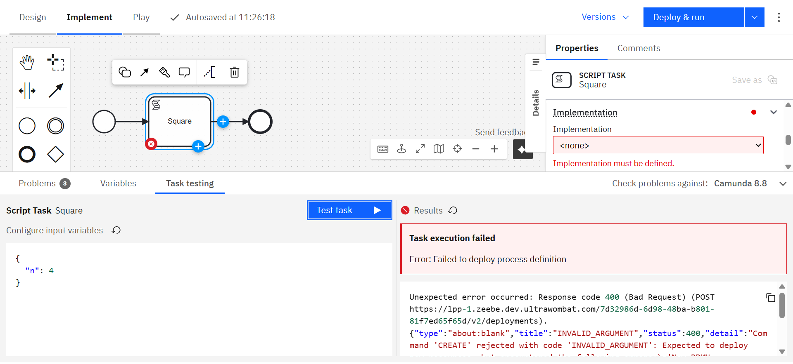

You can [test a single task](../../concepts/task-testing.md) directly within **Web Modeler** to validate its configuration and logic without executing the entire process.  
Task testing helps you debug mappings, inputs, and outputs quickly while staying in your implementation context.

## Task testing vs. Play

While both **task testing** and **Play** let you validate your BPMN models, they serve different purposes:

| Feature / Capability     | **Task testing** (Implement mode) | **Play** (Play mode)              |
| ------------------------ | --------------------------------- | --------------------------------- |
| **Test scope**           | Single task                       | Process segment or full diagram   |
| **Best for**             | Quick implementation checks       | End-to-end test validation        |
| **Data type**            | Live data only                    | Live or mocked data               |
| **Saves test scenarios** | No                                | Yes                               |
| **Mode required**        | Runs directly in _Implement_ mode | Requires switching to _Play_ mode |

Use **Task testing** during implementation for quick feedback.  
Use **Play** when performing structured testing with mock data or reusable scenarios.

## Prerequisites

Before running task testing, ensure you have:

- A connection to an **active Camunda 8.8 or later** orchestration cluster
- Permissions to **deploy and run** processes in the target environment

## Run a task test

To test a task in Web Modeler:

1. Select the BPMN task you want to test.
2. Open the **Test** tab in the bottom panel.
3. In the left pane, define the **process variables** in JSON format to simulate the process context.

### Tips for defining process variables

- Use the **Variables** tab to review available variables in your process.
- Confirm that **input mappings** for your task are configured correctly.
- Match **variable names and types** to those expected by the task.
- Provide **realistic sample data** to reflect actual execution conditions.

4. Click **Test task** to execute the task.

The process will deploy automatically before running the test.  
The task executes on the connected cluster using your defined input data.

## Viewing results

After the test completes, results appear in the output panel:

### ✅ Successful execution

If the task runs successfully, the output panel displays the resulting process variables and any updates.

### ⚠️ Incident during execution

If the task encounters an incident, details are shown along with the relevant variable context to help diagnose the issue.

### ❌ Execution error

If the task fails due to an error (for example, a network or configuration issue), the error message and response details are displayed.

## Related documentation

- [Task testing overview](../../concepts/task-testing.md)
- [Test a task in Desktop Modeler](/components/modeler/desktop-modeler/task-testing.md)
- [Working with variables](../../concepts/variables.md)
- [Using Play mode](/components/modeler/web-modeler/play-your-process.md)
