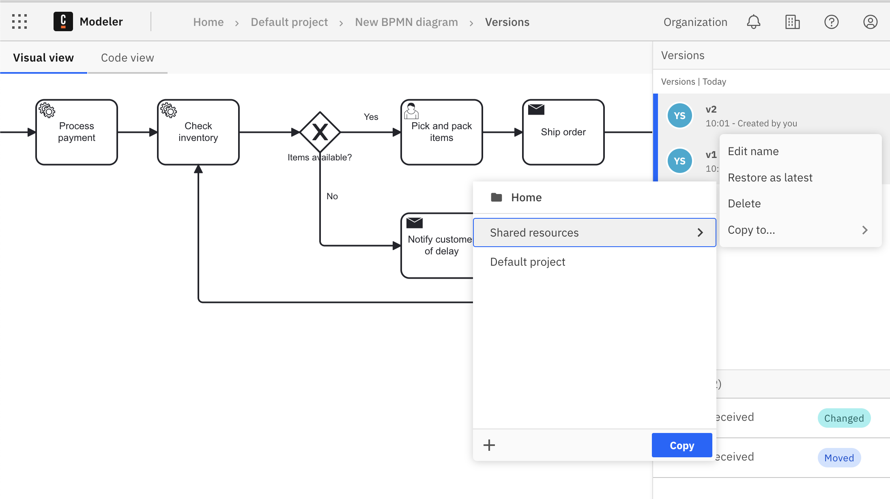
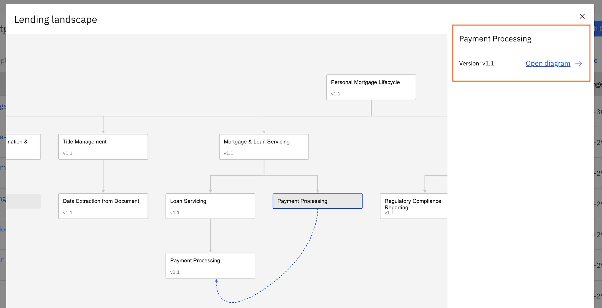
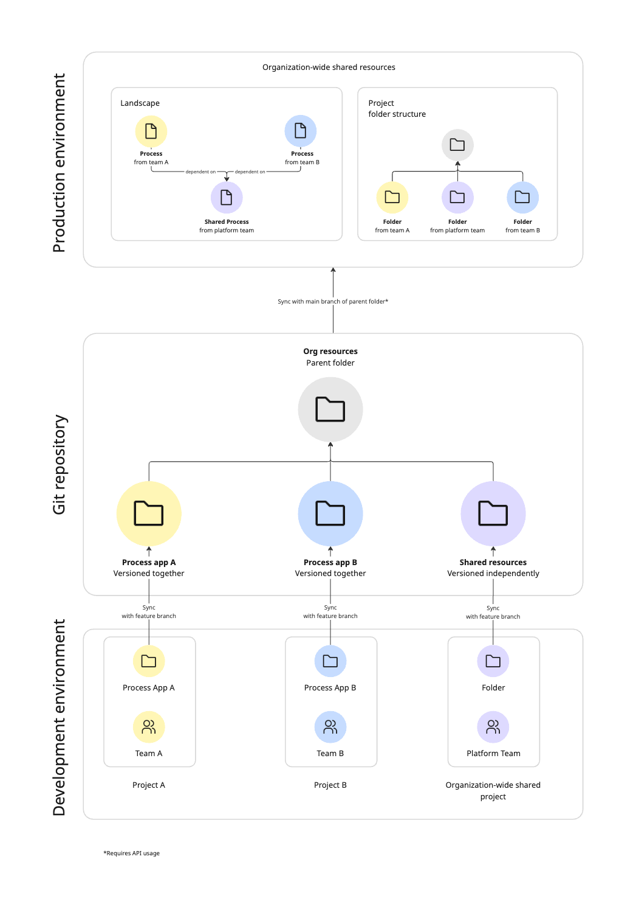

import AddUserImg from './img/invite-collaborators.png';
import BulkAddUserImg from './img/invite-all-organization-members.png';

Camunda 8 only

Organizations often manage process documentation across multiple layers, from high-level strategic models to detailed operational workflows. [Process landscape visualization](/components/modeler/web-modeler/process-landscape-visualization.md) streamlines this complexity by supporting different levels of abstraction, enabling seamless collaboration across teams, and providing tailored insights for various stakeholders.

## About this guide

This guide shows how you can consolidate these perspectives into a single shared project, ensuring clarity, reusability, and governance within your organization’s efforts.

Teams can use shared projects to:

- Prevent duplicate work
- Maintain a single source of truth
- Enable cross-project navigation and transparency
- Govern access to organization resources effectively

## Create a shared project and invite collaborators

If you have not yet already, [create a Camunda 8 account](/guides/create-account.md)

To create a shared project as a space for your organization's resources:

1. Open [Web Modeler](/components/modeler/web-modeler/launch-web-modeler.md) and select **Create new project** (if you do not have any existing projects) or **New project** (if you already have existing projects).
2. Name your project accordingly.
   
3. On the right side of the page under **Collaborators**, select **Add user**.
4. To add collaborators to your organization and project, enter the email address of the collaborator you would like to invite and select `Enter` or `Tab` between each entry. You may enter up to 20 email addresses. To add **all** existing organization members to your project, use the **All users in the organization** option to send a bulk invitation to all colleagues.
   
5. (optional) Enter an invitation message in the text box below your invites.
6. Select **Send invite**. This will invite the users to both the organization and project. Once your colleague clicks **Accept invitation**, they can access the shared project with the assigned role and permissions.

## Assign project and organization roles to collaborators

To understand what permissions each role has, review [access rights and permissions](/components/modeler/web-modeler/collaboration.md#access-rights-and-permissions). You can also [assign roles specific to the entire organization](/components/console/manage-organization/manage-users.md). For example, the **Developer** role is typically a good default option to provide the user with full access to Console, Operate, and Tasklist without deletion privileges.

If you previously invited collaborators to your organization _and_ project in the section prior, select the three vertical dots to the right of the users' name and select **Edit user**. Check which roles the user should be assigned and select **Confirm**.

## Share resources within a project

You can publish a specific [version](/components/modeler/web-modeler/versions.md) of a file or process application within the shared project.

1. From the BPMN diagram, select the **Versions** dropdown in the top right corner.
2. Select the three vertical dots on the right side of the version labeled **Browse version actions**.
3. Select **Copy to...**, choose the shared project you want to store the shared resource in, and select **Copy here** to make it available for all project members.
   

Users can also reuse published resources by copying them into their own projects:

1. Open the shared project and navigate to the file.
2. In the versions list, choose the version to reuse and select the three vertical dots to open the actions menu.
3. Select **Copy to...**.
4. Select the target project and click **Copy**.

## Browse the process landscape of shared organization resources

The [process landscape view](/components/modeler/web-modeler/process-landscape-visualization.md) offers a visual map of BPMN files and their interfile connections (such as call activities).

You can open the process landscape view by clicking **View landscape** from any of the following views:

- Project view
- Folder view
- [Process application](/components/modeler/web-modeler/process-applications.md) view

### Landscape view interaction

1. **Select a BPMN file:** Click on any node to see the BPMN file’s information including the latest version of the process on the sidebar.

   :::note
   For process applications, version tags represent a unified "versioned" snapshot of all process application files rather than separate versions for each file as with simple BPMN files.
   :::
   

2. **Search**: Press `Ctrl+F` or `⌘+F` to search. Enter the name or identifier of a BPMN file to quickly find, highlight, and jump to the corresponding node.
   
3. **Highlight paths:** Click on a node or connection to highlight the entire chain of related connections.
   

### README documentation

To access the associated README file for a process within the shared project:

1. Open the process landscape view.
2. Click on a node in the landscape.
3. The README file (if one is associated) is displayed in the sidebar, providing a high-level overview of the process.

## Next steps

Organization owners and administrators can connect their Web Modeler process applications to GitHub and GitLab, allowing users to keep their Web Modeler, Desktop Modeler, and official version control projects synced:

To keep your process landscape up to date with all changes in production, take the following steps:

1. Sync the process application to the feature branch of a subfolder in a repository.
2. Merge the feature branch to main.
3. Begin the [CI/CD pipeline](/guides/devops-lifecycle/integrate-web-modeler-in-ci-cd.md).
4. Sync your main branch to the shared project as part of the CI/CD pipeline.

Alternatively, you can trigger a quick automation like a GitHub Action to keep your process landscape updated.

Once the basic integration is configured by an organization owner or organization administrator, project administrators and editors can use the built-in button to pull changes from GitHub, integrate contributions from Desktop Modeler users, and merge their own work.

Learn more in Camunda's [Git sync documentation](/components/modeler/web-modeler/git-sync.md).
