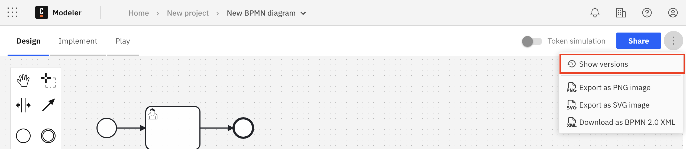
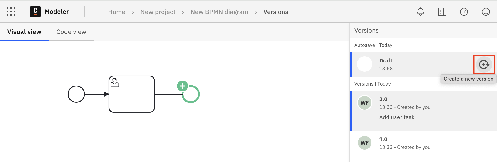
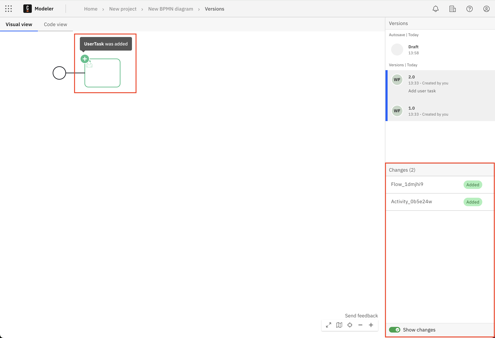
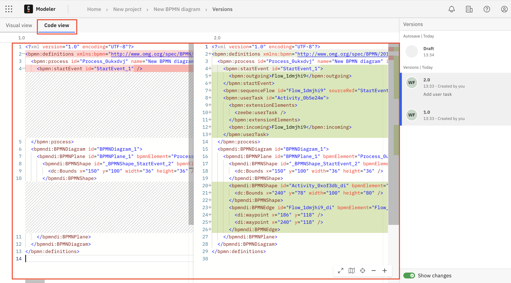
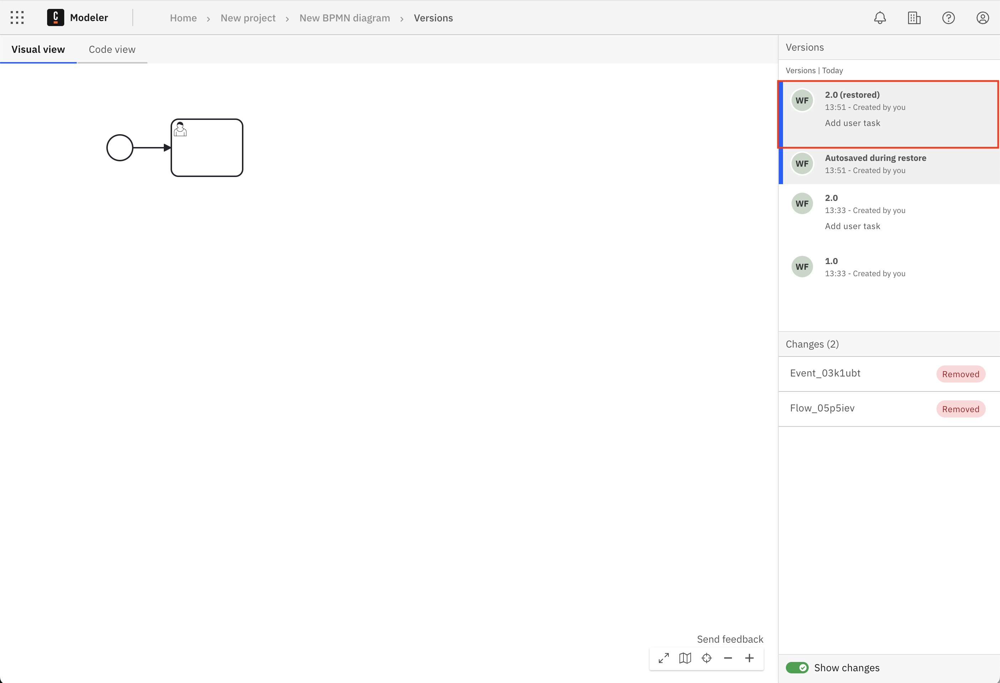

Camunda 8 only

:::note
With 8.7, "milestone" has been renamed to "version". To learn more about this change, see [the related announcement](/reference/announcements/870.md##web-modeler-milestones-renamed-to-versions).
:::

You can create a version at any time to save a snapshot of your BPMN or DMN diagram.

You can restore a version to revert to a previous snapshot of your diagram, for example if you make a mistake while modeling. You can also compare two versions to see the differences between them.

## Versions list

You can use the versions list to view, compare, and manage your diagram versions.

To view the versions list, either:

- Select **Show versions** from the action menu.

  

- Select **Show versions** from the breadcrumb menu.

  

## Create a version

You can create a new version either from your diagram or the versions list.

- From your diagram, select **Create version** from the breadcrumb menu.

  

- From the versions list, hover over the draft in the **Versions** panel and select **Create a new version**.

  

:::note

A new version is also automatically created when dragging and dropping a file into the diagram view, or when you select the **Replace via upload** option from the breadcrumb menu.

:::

### Bulk version creation

A [process application](/components/modeler/web-modeler/process-applications.md) is a special type of Web Modeler folder that allows you to work on a set of related files and
[deploy](/components/modeler/web-modeler/process-applications.md#deploy-and-run-a-process-application) them as a single bundle with just one click. This reduces the risk of having a broken deployment at runtime, and makes it more convenient to deploy related files.

If you create a version on the main process of a process application, versions are created for all other assets in the application, to make it easier to track or revert changes. See [create a bulk version](process-applications.md#create-a-bulk-version).

:::note
Versions of resources belonging to a process application are tied to the main process and cannot be modified.
:::

## Compare versions

You can compare the change history between two versions, either visually as a diagram or as code in an XML diff layout.

1. Open the versions list for your diagram.
1. Ensure that the sidebar **Show changes** toggle is turned on.
1. Select the version that you want to compare. The previous version is automatically selected for comparison.

:::note

Turn off the sidebar **Show changes** toggle to view individual versions without comparison to the previous version.

:::

### Compare versions in visual view

To view BPMN diagram changes visually, select the **Visual view** tab.

- Differences between the versions are highlighted visually on the diagram. For example, if an element was added, this change is highlighted in green with a plus symbol. Hover over a change to view more details.
- Only differences that affect the execution of the BPMN process are highlighted.
- The sidebar **Changes** list shows the details of each change, including the type and identifier. Select a change to highlight it.

:::note

You can only use the **Code view** to compare changes in a DMN diagram. The **Visual view** only shows a view of the version.

:::

### Compare versions in code view

To view BPMN and DMN diagram changes as code in an XML diff layout, select the **Code view** tab.

- The XML for the previous version is shown on the left, with the currently selected version shown on the right.
- Differences between the versions are highlighted in the XML. For example, if an element was added, this change is highlighted in green.

## Restore a version

You can restore a version to revert to a previous snapshot of your diagram.

1. In the sidebar **Versions** list, hover over the version you want to restore.
1. Select the three vertical dots to open the actions menu.
1. Select **Restore as latest**.

The diagram reverts to the restored version. A new version is created with "(restored)" appended to the name.

## Copy a diagram version

You can create a new diagram by copying a specific version.

1. In the sidebar **Versions** list, hover over the diagram version you want to copy.
1. Select the three vertical dots to open the actions menu.
1. Select **Copy to...**.
1. Choose a project/folder and select **Copy here** to create the new diagram in the chosen folder.

## Rename a version

You can rename a version at any time.

1. In the sidebar **Versions** list, hover over the version you want to rename.
1. Select the three vertical dots to open the actions menu.
1. Select **Edit name** and enter a new name for the version.

## Delete a version

You can _permanently_ delete a version.

1. In the sidebar **Versions** list, hover over the version you want to rename.
1. Select the three vertical dots to open the actions menu.
1. Select **Delete**.
1. You are prompted to confirm the deletion.
   - Select **Delete version** to permanently delete the version.
   - Select **Cancel** to cancel the deletion and return to the versions list.

:::caution

Deleting a version is permanent. You cannot access a deleted version, and it is removed from the versions list.

:::
