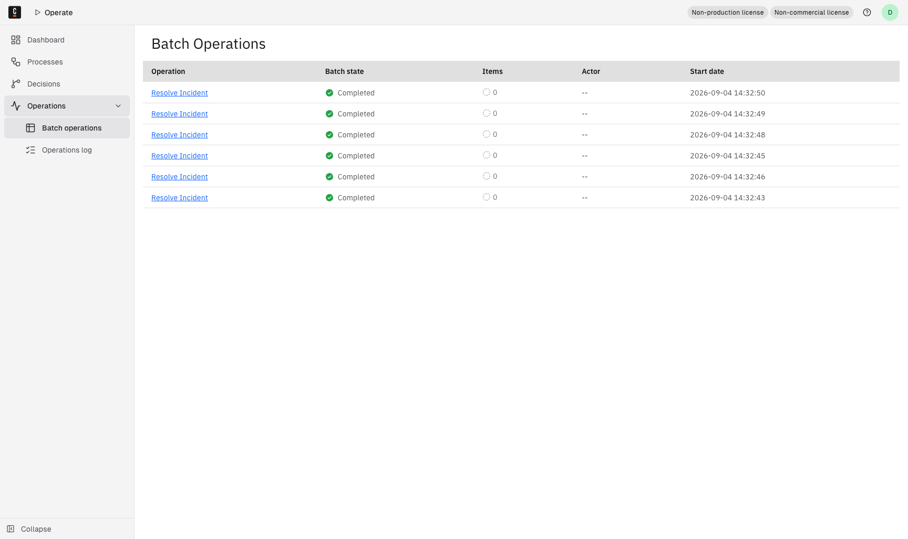

A high-level overview of the **Batch Operations** page in Camunda 8 Operate.

## About the Batch Operations page

Use the **Batch Operations** page to monitor all batch operations performed across any process instance.

## Batch operations table

In the table, you can review these details about each batch operation:

| Column      | Description                                                                          |
| ----------- | ------------------------------------------------------------------------------------ |
| Operation   | The type of operation performed.                                                     |
| Batch state | The current state of the batch operation.                                            |
| Items       | The number of successful, failed, and pending items included in the batch operation. |
| Actor       | The user or client responsible for initiating the operation.                         |
| Start date  | The operation's start date and time.                                                 |

Learn how to monitor batch operations in the [user guide](../userguide/monitor-batch-operations.md).
