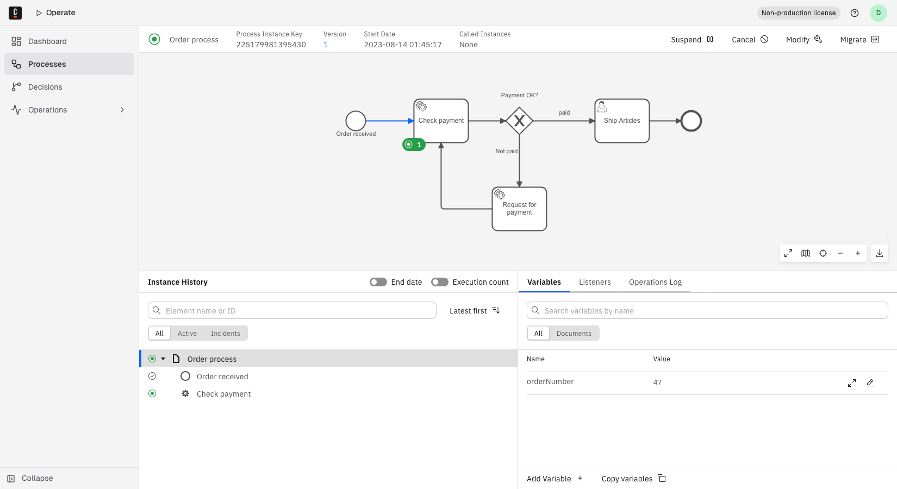

Learn how to navigate Camunda 8 Operate.

## Before you begin

This guide and [resolve incidents and update variables](./resolve-incidents-update-variables.md) assume you’ve deployed a process to Zeebe and created at least one process instance, using the [`order-process.bpmn`](/bpmn/operate/order-process.bpmn) process model. If you’re not sure how to deploy processes or create instances, visit our [guides section](/guides/introduction-to-camunda-8.md) to get started with Camunda.

## Open Operate

From Camunda Hub, you can open Operate in any [environment](/components/concepts/environments.md) you have access to:

1. Log in to Camunda Hub.
1. In the left navigation, click **Environments**, and then select an environment. Each environment has its own instance of Operate.
1. Under **Applications**, on the **Operate** card, click **Open**. This opens Operate for the environment in a new tab.

You can also expand an environment in the left navigation, and select Operate from its applications.

:::tip
If the environment is paused, you must [resume it](/components/hub/organization/manage-environments/index.md#resume-a-paused-environment) to access its applications.
:::

## Explore the Dashboard

Learn how to read the **Dashboard**, the default landing page in Operate that shows your running process instances and where incidents are occurring.

:::note
The redesigned Dashboard described here is available starting in 8.11.
:::

At the top of the page, the metric panel shows the total number of running process instances and a bar visualizing the split between active instances and instances with an incident. Click the total, **Process Instances with Incident**, or **Active Process Instances** to navigate to the **Processes** page pre-filtered to that set of instances.

Below the metric panel, two panels list your running work in more detail:

- **Process instances by name** lists each deployed process with running instances, and how many instances are running. If a process has multiple versions deployed, expand its row to see the breakdown per version.
- **Process incidents by error message** groups process instances with incidents by their error message, so you can spot recurring failures. Expand an error's row to see which process definition versions it affects. When no instances have incidents, this panel shows **Your processes are healthy** instead of a list.

Both panels load more rows as you scroll. They refresh every five seconds while only the first page of rows is loaded, and automatic refresh stops after you scroll to load more. Clicking a row, or an expanded version or error entry, navigates to the **Processes** page pre-filtered to match.

If a process definition version is scheduled for deletion, its row shows a **Draining** indicator. The version remains until its running instances finish, then is removed automatically.

If there are no running process instances at all, the Dashboard shows a single **No running process instances** empty state with a link to learn more about Operate and, if Modeler is available for your cluster, a **Go to Modeler** button.

## View a deployed process

To view a deployed process, take the following steps:

1. On the **Dashboard** page, in the **Process instances by name** panel, note the list of your deployed processes and running instances. The dashboard only displays processes with active instances, so processes without running or incident instances are not shown.
2. When you click on the name of a deployed process in the **Process instances by name** panel, you’ll navigate to a view of that process model and all running instances.
3. From this **Processes** page, you can cancel a single running process instance by clicking the cancel icon under the **Operations** column of the **Process Instances** table.

## Inspect a process instance

Running process instances appear in the **Process Instances** table below the process model. To inspect a specific instance, click the **Process Instance Key**.

The process instance page has four parts:

- A header showing the process instance's key, version, and state.
- A process diagram showing the instance's current progress.
- An **Instance History** panel listing the instance's elements, with search and status filter controls.
- A bottom panel with tabs: **Variables**, **Listeners**, and **Operations Log** are always available. **Incidents** appears when the instance has one. **Details**, **Input Mappings**, and **Output Mappings** appear once you select a specific element in the diagram.

Click an element in the diagram to select it, then use the tabs in the bottom panel to inspect its details, incidents, and variables. In earlier versions, an element's details and incidents appeared in a metadata popover when you clicked it; the popover is now replaced by the **Details** and **Incidents** tabs. To visualize process instance performance, use [Optimize](/components/optimize/what-is-optimize.md).

## Navigate to a called process instance

When a call activity in the diagram calls another process, double-click the call activity element to jump directly to the called process instance.

Double-click navigation only works when the process instance has called exactly one process instance in total. If it has called more than one — for example, through multiple call activities, or a call activity that ran more than once — double-clicking does nothing.

For a reliable way to find a called process instance, take the following steps:

1. Click the call activity element to select it.
2. Open the **Details** tab.
3. In the row labeled **Called Process Instance**, click the link — shown as the called process's name and instance key — to navigate to that instance.

If the call activity has called more than one process instance, the **Details** tab shows a **View all** link instead of a single link. This link filters the **Processes** page by the whole process instance, so it shows every instance it has called, including from other call activities — not only the one you selected.

## Business ID for decision instances

Starting in 8.10, a [business ID](/components/concepts/process-instance-creation.md#business-id) is shown for decision instances in Operate: as an optional filter field in the **Decisions** list, and in the header of a decision instance's details page, if one is defined for that instance. Filter decision instances by business ID the same way as [process instances](./filter-process-instances.md#business-id-filter) — using **Equals**, **Contains**, and **Is one of** in the filter UI, or the `$eq`/`$neq`/`$exists`/`$like`/`$in`/`$notIn` operators via the [search decision instances API](/apis-tools/orchestration-cluster-api-rest/specifications/search-decision-instances.api.mdx).

Decision instances evaluated before 8.10 do not carry a business ID, since the value is snapshotted from the owning process instance at the decision instance's own creation time. Standalone decision evaluations, which are not tied to a process instance, never carry a business ID.
