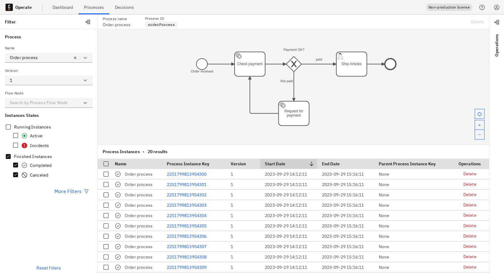
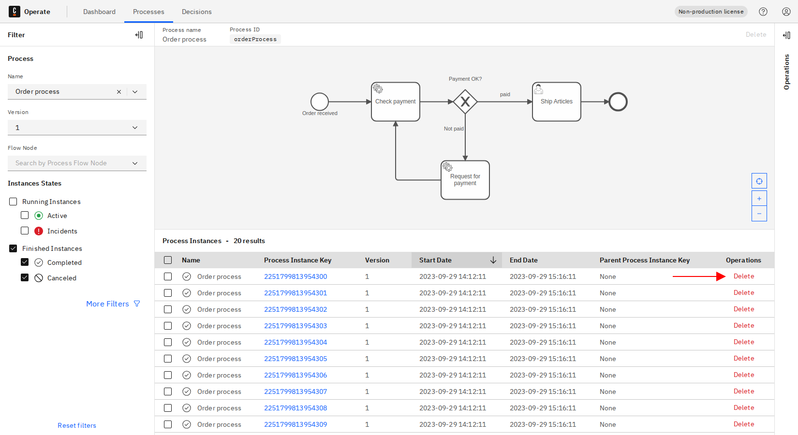
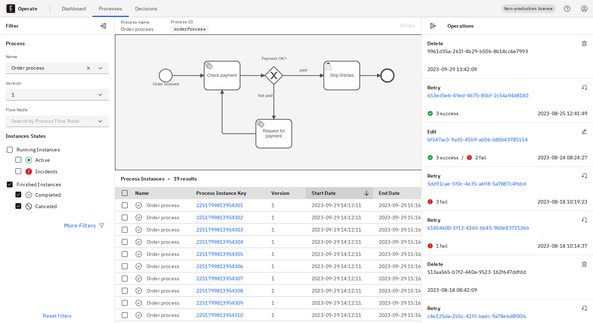
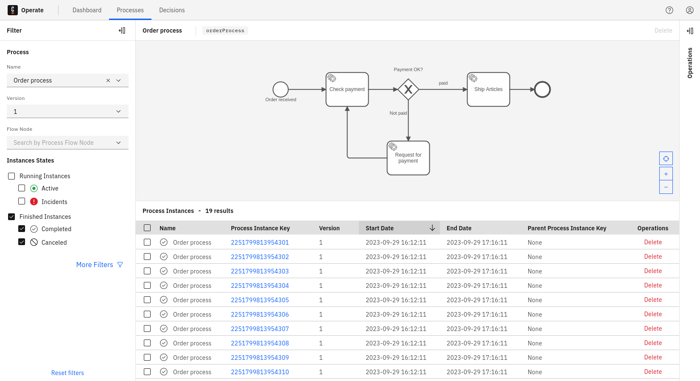
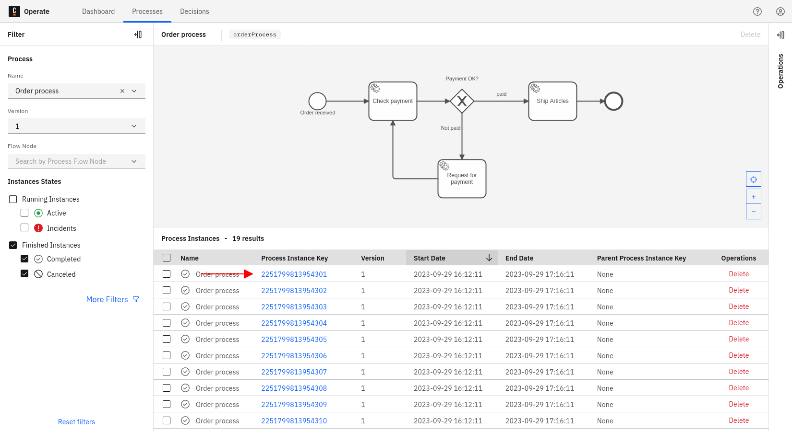
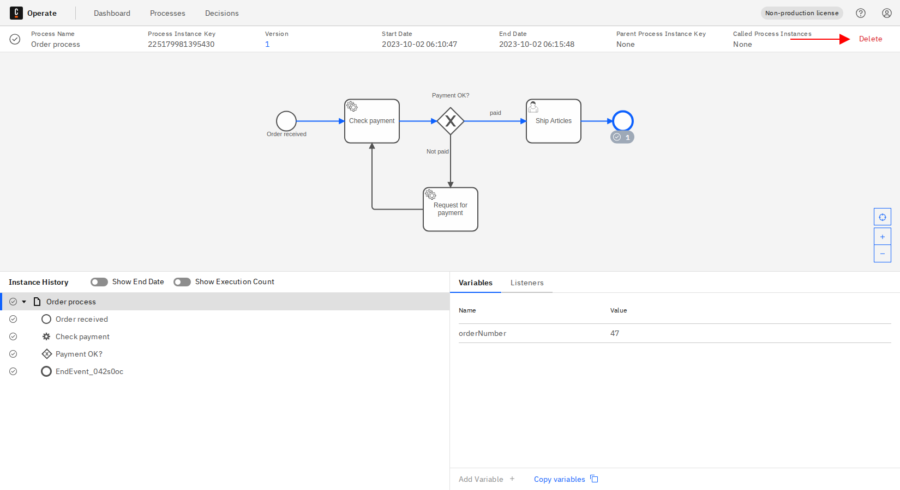
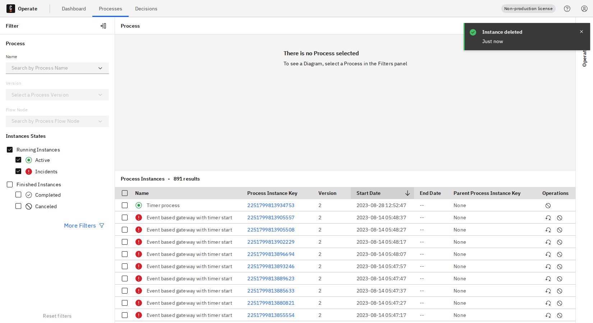

A finished process instance, meaning a canceled or a completed process instance, can be deleted from the **Processes** page or instance detail page.

## Delete process instance from Processes page

To delete a process instance from the **Processes** page, take the following steps:

1. On the **Processes** page, apply the **Finished Instances** filter by checking the appropriate box.

2. Click the **Delete** button on any process instance you want to delete.

3. Confirm the delete operation by clicking **Delete**.

4. In the **Operations** panel on the right side of the screen, view the deleted process instance.

## Delete process instance from instance detail page

1. On the **Processes** page, apply the **Finished Instances** filter.

2. Navigate to the instance detail page by clicking the **Process Instance Key** of the process instance you want to delete.

3. Click the **Delete** button.

4. Confirm the delete operation by clicking **Delete**.

:::note
Use caution as the process instance is now deleted and you may not access it again.
:::

