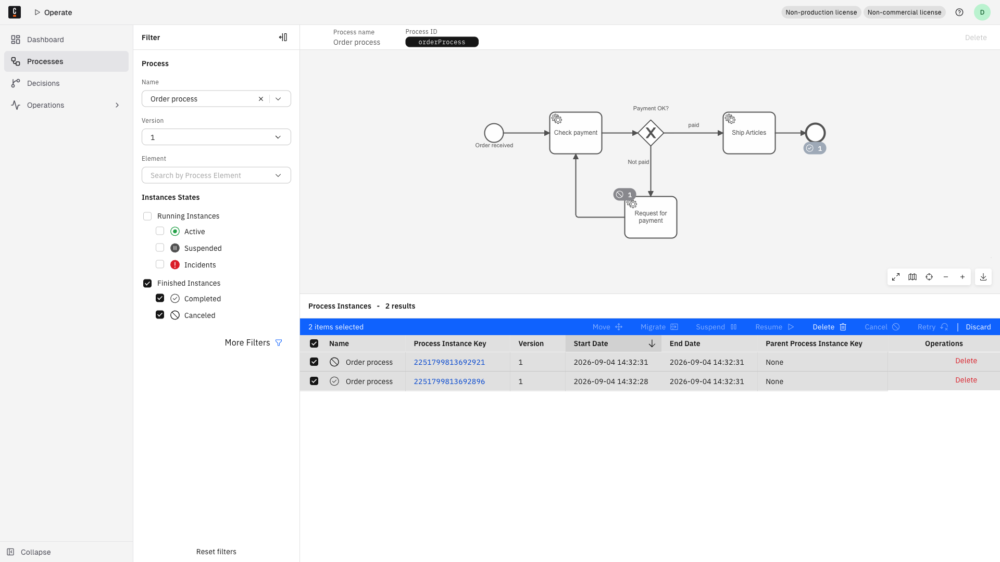
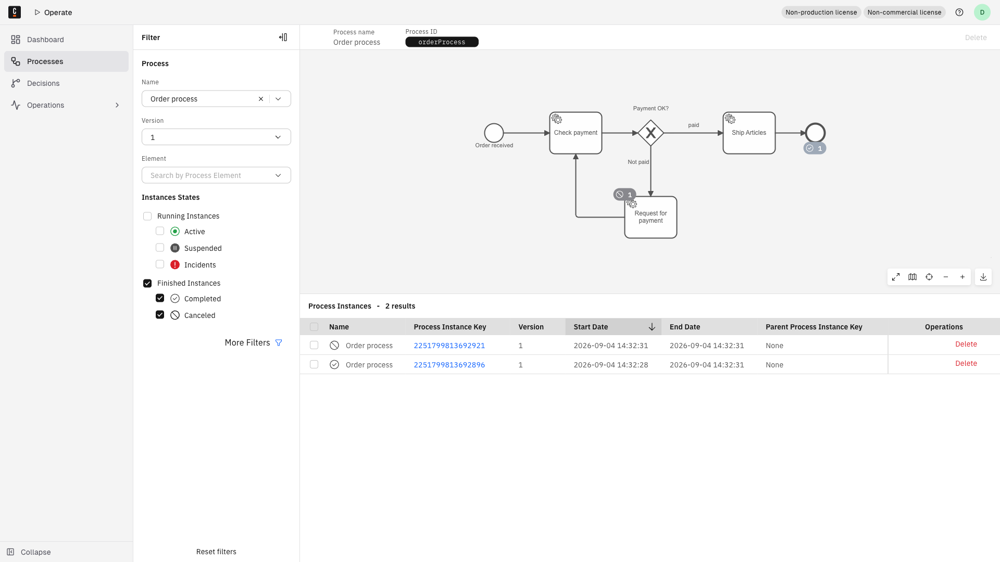
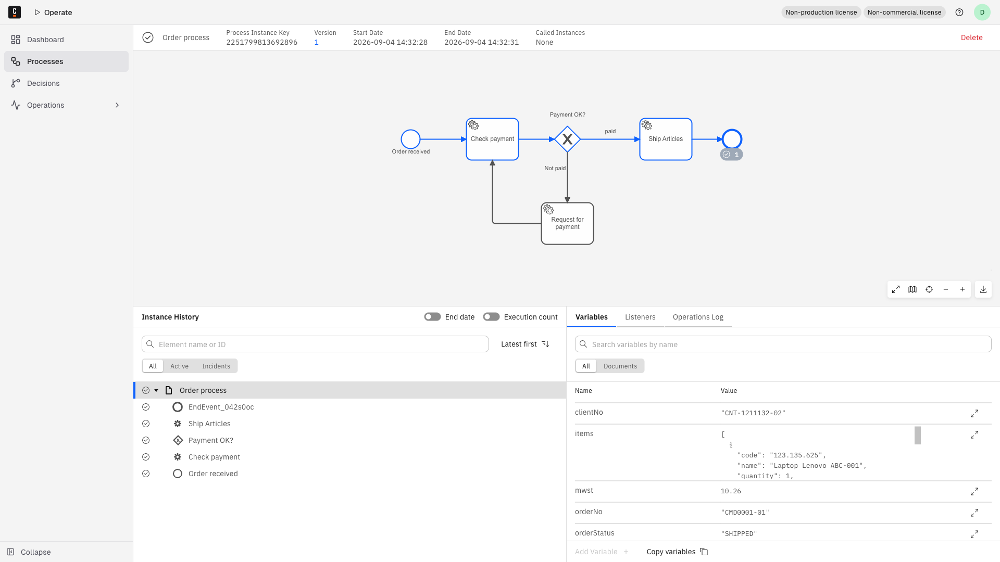
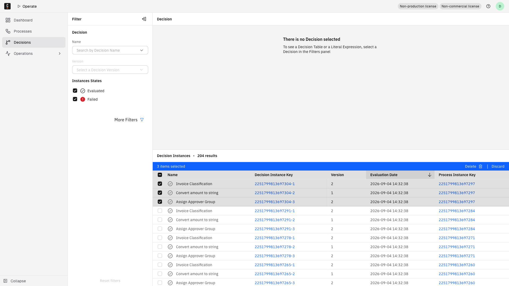

Learn how to delete finished process instances and decision instances in Camunda 8 Operate.

## Overview

A finished process instance, meaning a canceled or a completed process instance, can be deleted from the **Processes** page or instance detail page.

Evaluated and failed decision instances can be deleted from the **Decisions** page.

:::warning
You may not access process instances or decision instances after you've deleted them.
:::

## Delete process instances

### Batch delete from the Processes page

To delete multiple process instances at once from the **Processes** page, take the following steps:

1. On the **Processes** page, in the **Filter** panel, apply the **Finished Instances** filter by checking the appropriate box.
2. Optionally, narrow down the list using additional filters. For detailed guidance on filtering options (including process name, version, and multi-variable filters), see [filter process instances](./filter-process-instances.md).
3. Select the process instances you want to delete by checking the checkbox next to each one, or use the select-all checkbox to select all instances.
4. Click the **Delete** button in the toolbar.
5. Confirm the delete operation by clicking **Delete**.

### Delete a single process instance from the Processes page

To delete a single process instance from the **Processes** page, take the following steps:

1. On the **Processes** page, in the **Filter** panel, apply the **Finished Instances** filter by checking the appropriate box.
2. For detailed guidance on using the filter panel, see [filter process instances](./filter-process-instances.md).
3. Click the **Delete** button on any process instance you want to delete.
4. Confirm the delete operation by clicking **Delete**.

### Delete a process instance from the instance detail page

1. On the **Processes** page, in the **Filter** panel, apply the **Finished Instances** filter by checking the appropriate box. For detailed guidance on filtering, see [filter process instances](./filter-process-instances.md).
2. Navigate to the instance detail page by clicking the **Process Instance Key** of the process instance you want to delete.
3. In the page header, click the **Delete** button.
4. Confirm the delete operation by clicking **Delete**.

## Delete decision instances

Evaluated and failed decision instances can be batch deleted from the **Decisions** page.

### Batch delete from the Decisions page

1. On the **Decisions** page, in the **Filter** panel, select the decision instances you want to delete using the **Evaluated** or **Failed** filters, or both.
2. Optionally, narrow down the list using additional filters such as **Decision Name**, **Decision Version**, or other available filters.
3. Select the decision instances you want to delete by checking the checkbox next to each one, or use the select-all checkbox to select all visible instances.
4. Click the **Delete** button in the toolbar.
5. Confirm the delete operation by clicking **Delete**.

