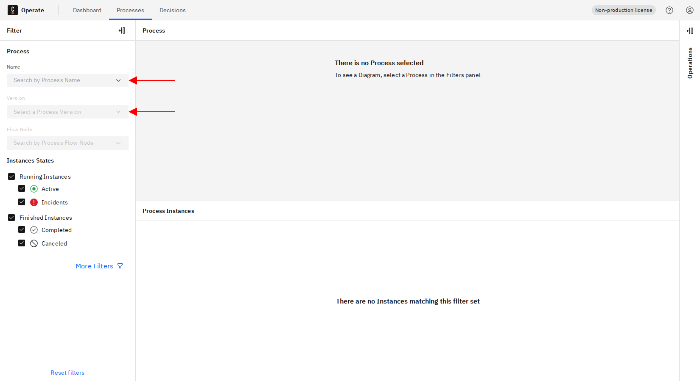
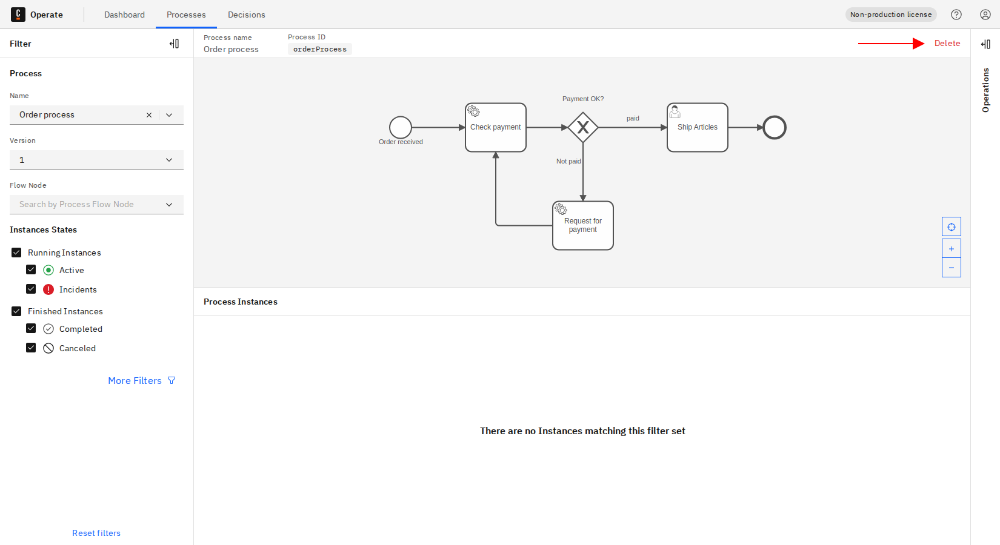
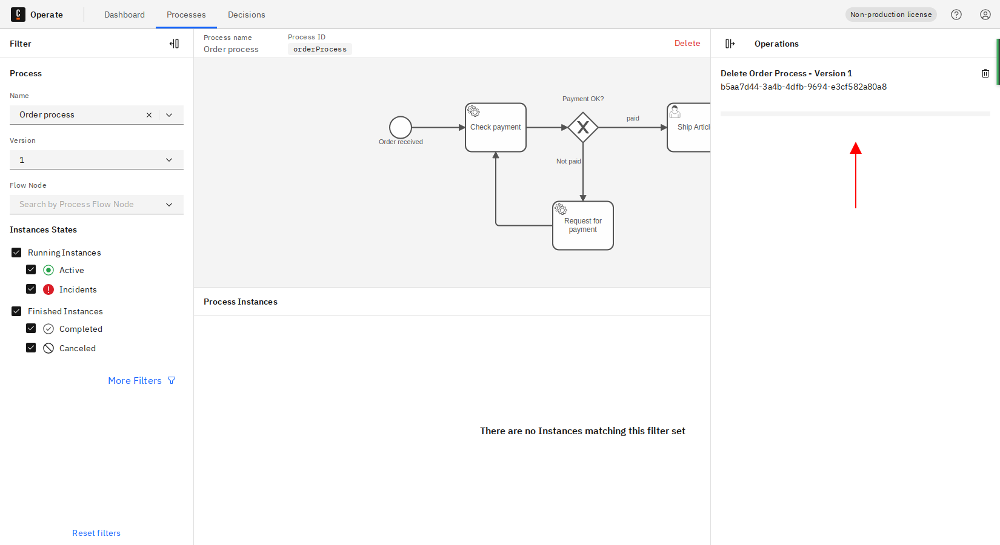
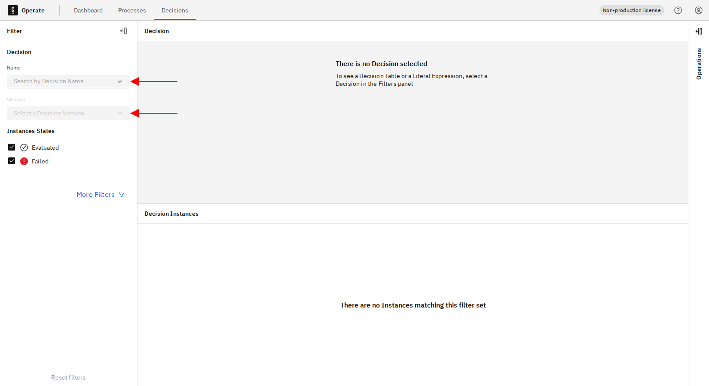
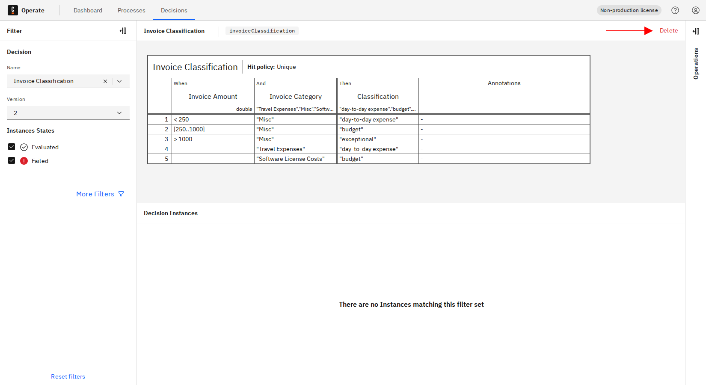
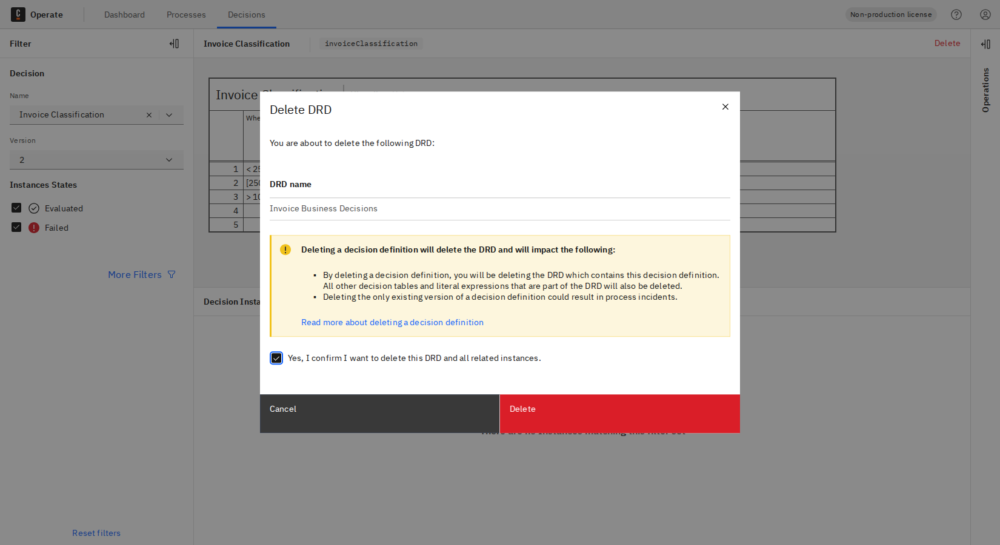
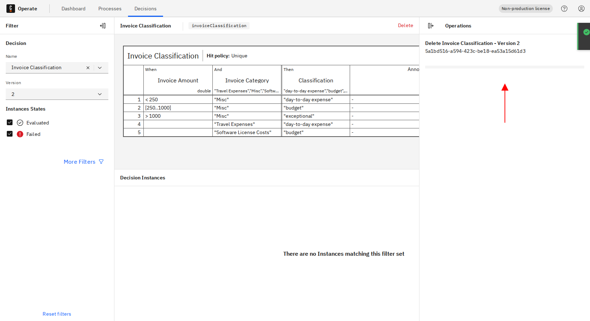

A specific version of a resource, meaning a process or decision definition, can be deleted from the **Processes** and **Decisions** pages.

## Delete process definition from Processes page

To delete a process definition from the **Processes** page, take the following steps:

1. On the **Processes** page, select a specific process version by filtering by process name and version.

:::note
Make sure the selected process definition version has no running instances, otherwise it is not possible to delete a process definition.
You can [cancel or resolve running process instances](/components/operate/userguide/basic-operate-navigation.md) from the process instances list or from the process instance detail page.
:::

2. Click the **Delete** button at the top right.

3. Confirm the delete operation by checking the checkbox and clicking **Delete**.

:::note
Deleting a process definition will permanently remove it and will impact the following:

- All the deleted process definition's finished process instances will be deleted from the application.
- All decision and process instances referenced by the deleted process instances will be deleted.
- If a process definition contains user tasks, they will be deleted from [Tasklist](/components/tasklist/introduction-to-tasklist.md).

:::

4. The progress of the delete operation can be seen in the **Operations** panel on the right side of the screen.

## Delete decision definition from Decisions Page

1. On the **Decisions** page, select a specific decision version by filtering by decision name and version.

2. Click the **Delete** button at the top right.

3. Confirm the delete operation by checking the checkbox and clicking **Delete**.

:::note
Deleting a decision definition will delete the DRD and will impact the following:

- By deleting a decision definition, you will be deleting the DRD which contains this decision definition. All other decision tables and literal expressions that are part of the DRD will also be deleted.
- Deleting the only existing version of a decision definition could result in process incidents.

:::

4. The progress of the delete operation can be seen in the **Operations** panel on the right side of the screen.

