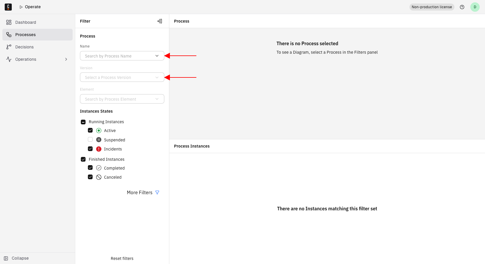
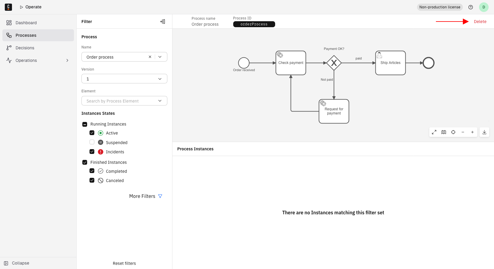
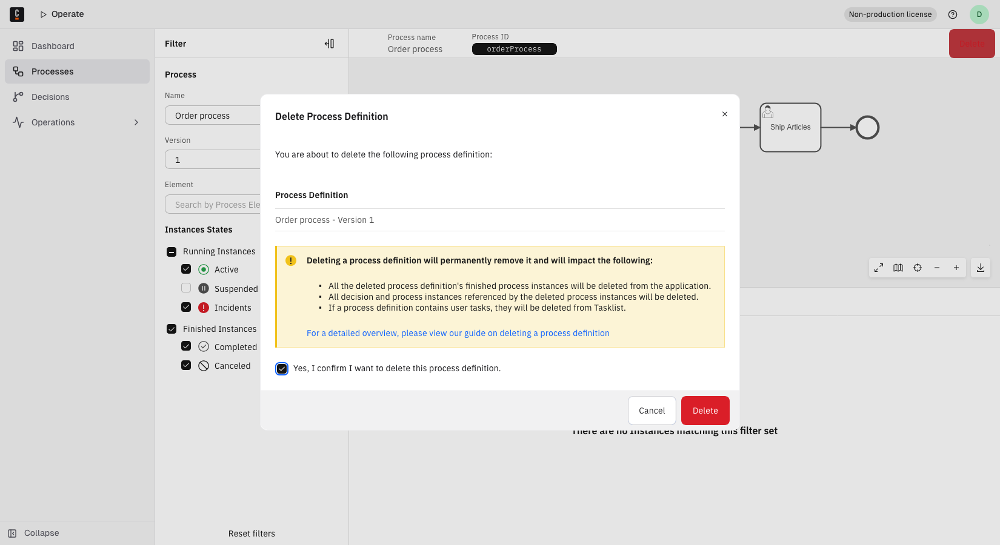
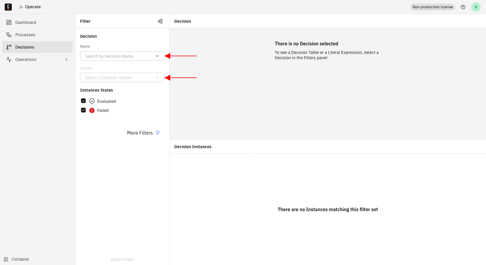
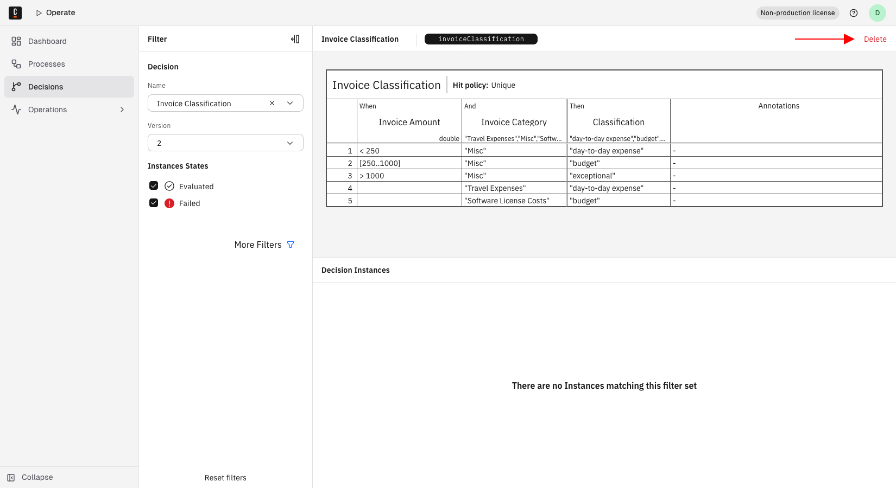
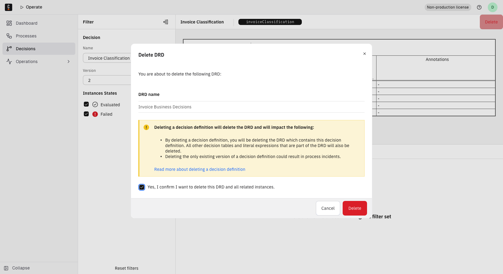

Learn how to delete a specific process or decision definition version in Camunda 8 Operate.

## Delete process definition

:::warning
Deleting a process definition permanently removes it and has the following effects:

- All the deleted process definition's finished process instances will be deleted from the application.
- All decision and process instances referenced by the deleted process instances will be deleted.
- If a process definition contains user tasks, they will be deleted from [Tasklist](/components/tasklist/introduction-to-tasklist.md).
  :::

To delete a process definition from the **Processes** page, take the following steps:

1. In the **Filter** panel, select a specific process version by filtering by process name and version. For detailed guidance on using filters, see [filter process instances](./filter-process-instances.md). Make sure the selected process definition version has no running instances, otherwise it is not possible to delete a process definition. You can [cancel or resolve running process instances](/components/operate/userguide/basic-operate-navigation.md) from the process instances list or from the process instance detail page.

2. Click the **Delete** button at the top right.

3. Confirm the delete operation by checking the checkbox and clicking **Delete**.

## Delete decision definition

:::warning
Deleting a decision definition will delete the DRD and will impact the following:

- Deleting a decision definition removes the DRD that contains it. All other decision tables and literal expressions that are part of the DRD will also be deleted.
- Deleting the only existing version of a decision definition could result in process incidents.
  :::

1. On the **Decisions** page, select a specific decision version by filtering by decision name and version. For detailed guidance on filtering, see [filter process instances](./filter-process-instances.md).

2. Click the **Delete** button at the top right.

3. Confirm the delete operation by checking the checkbox and clicking **Delete**.

