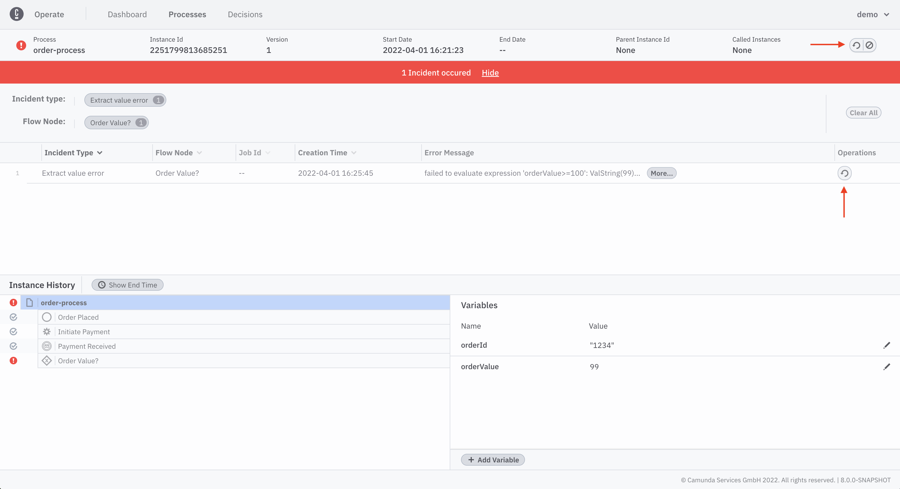

import Tabs from "@theme/Tabs";
import TabItem from "@theme/TabItem";

Every process instance created for the [`order-process.bpmn`](https://docs.camunda.io/assets/files/order-process-2ae29e9d889a3d640464be250206d550.bpmn/) process model requires an `orderValue` so the XOR gateway evaluation will happen properly.

Let’s look at a case where `orderValue` is present and was set as a string, but our `order-process.bpmn` model required an integer to properly evaluate the `orderValue` and route the instance.

<Tabs groupId="OS" defaultValue="linux" values={
[
{label: 'Linux', value: 'linux', },
{label: 'MacOS', value: 'macos', },
{label: 'Windows', value: 'windows', },
]
}>

<TabItem value='linux'>

```
./bin/zbctl --insecure create instance order-process --variables '{"orderId": "1234", "orderValue":"99"}'
```

</TabItem>

<TabItem value='macos'>

```
./bin/zbctl.darwin --insecure create instance order-process --variables '{"orderId": "1234", "orderValue":"99"}'
```

</TabItem>

<TabItem value='windows'>

```
./bin/zbctl.exe --insecure create instance order-process --variables '{\"orderId\": \"1234\", \
"orderValue\": \"99\"}'
```

</TabItem>
</Tabs>

## Advance an instance to an XOR gateway

To advance the instance to our XOR gateway, we’ll create a job worker to complete the `Initiate Payment` task:

<Tabs groupId="OS" defaultValue="linux" values={
[
{label: 'Linux', value: 'linux', },
{label: 'MacOS', value: 'macos', },
{label: 'Windows', value: 'windows', },
]
}>

<TabItem value='linux'>

```
./bin/zbctl --insecure create worker initiate-payment --handler cat
```

</TabItem>

<TabItem value='macos'>

```
./bin/zbctl.darwin --insecure create worker initiate-payment --handler cat
```

</TabItem>

<TabItem value='windows'>

```
./bin/zbctl.exe --insecure create worker initiate-payment --handler "findstr .*"
```

</TabItem>
</Tabs>

We’ll publish a message that will be correlated with the instance, so we can advance past the `Payment Received` intermediate message catch event:

<Tabs groupId="OS" defaultValue="linux" values={
[
{label: 'Linux', value: 'linux', },
{label: 'MacOS', value: 'macos', },
{label: 'Windows', value: 'windows', },
]
}>

<TabItem value='linux'>

```
./bin/zbctl --insecure publish message "payment-received" --correlationKey="1234"
```

</TabItem>

<TabItem value='macos'>

```
./bin/zbctl.darwin --insecure publish message "payment-received" --correlationKey="1234"
```

</TabItem>

<TabItem value='windows'>

```
./bin/zbctl.exe --insecure publish message "payment-received" --correlationKey="1234"
```

</TabItem>
</Tabs>

In the Operate interface, you should now see the process instance has an <!-- FIXME: [“Incident”](/reference/incidents.html) --> incident, which means there’s a problem with process execution that must be fixed before the process instance can progress to the next step.

[//]: # "What is the FIXME note referencing above?"


## Diagnosing and resolving incidents

Operate provides tools for diagnosing and resolving incidents. Let’s go through incident diagnosis and resolution step by step.

When we inspect the process instance, we can see exactly what our incident is: `Expected to evaluate condition 'orderValue>=100' successfully, but failed because: Cannot compare values of different types: STRING and INTEGER`


To resolve this incident, we must edit the `orderValue` variable so it’s an integer. To do so, take the following steps:

1. Click on the edit icon next to the variable you’d like to edit.


2. Edit the variable by removing the quotation marks from the `orderValue` value.
3. Click the checkmark icon to save the change.


We were able to solve this particular problem by _editing_ a variable, but it’s worth noting you can also _add_ a variable if a variable is missing from a process instance altogether.

There’s one last step: initiating a “retry” of the process instance. There are two places on the process instance page where you can initiate a retry:



You should now see the incident has been resolved, and the process instance has progressed to the next step.


## Complete a process instance

If you’d like to complete the process instance, create a worker for the `Ship Without Insurance` task:

<Tabs groupId="OS" defaultValue="linux" values={
[
{label: 'Linux', value: 'linux', },
{label: 'MacOS', value: 'macos', },
{label: 'Windows', value: 'windows', },
]
}>

<TabItem value='linux'>

```
./bin/zbctl --insecure create worker ship-without-insurance --handler cat
```

</TabItem>

<TabItem value='macos'>

```
./bin/zbctl.darwin --insecure create worker ship-without-insurance --handler cat
```

</TabItem>

<TabItem value='windows'>

```
./bin/zbctl.exe --insecure create worker ship-without-insurance --handler "findstr .*"
```

</TabItem>
</Tabs>

The completed process instance with the path taken:


