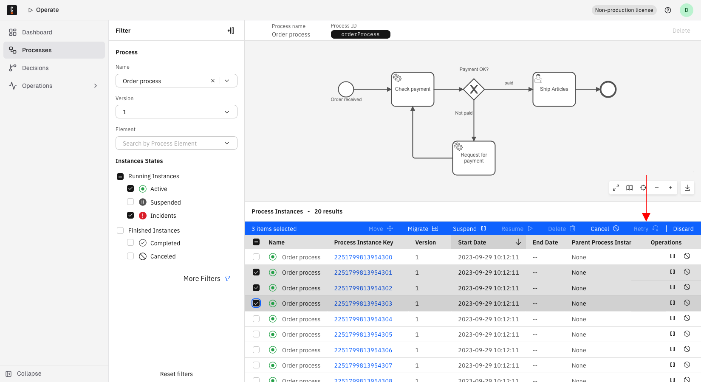

Learn how to initiate [batch operations](../../concepts/batch-operations.md) in Camunda 8 Operate.

## Overview

In some cases, you’ll need to retry or cancel many process instances at once. Operate also supports this type of operation.

Imagine a case where many process instances have an incident caused by the same issue. At some point, the underlying problem will have been resolved (for example, maybe a microservice was down for an extended period of time, then was brought back up.)

Though the underlying problem was resolved, the affected process instances are stuck until they are “retried."

## Initiate a batch operation

Let's create a **selection** in Operate. A selection is a set of process instances on which you can carry out a batch retry or batch cancellation.

To create a selection and apply an operation, take the following steps:

1. On the **Processes** page, in the **Process Instances** table, check the box next to the process instances you'd like to include.
2. In the table header, select the operation you want to apply.

:::note
A batch retry reports an item as completed once Camunda marks its incident as resolved and triggers the retry. This confirms that the retry operation ran, not that the underlying problem was fixed. For example, `12 of 12 completed` means all 12 retries were triggered successfully.

For [job incidents](/components/concepts/incidents.md#resolving), Camunda checks the underlying cause again only when a worker next activates each job. Keep a worker connected for the affected job types so Camunda can raise new incidents promptly if the problems remain unresolved.
:::

## Next steps

- [Monitor the batch operation](./monitor-batch-operations.md).
- [Learn how batch operations work](../../zeebe/technical-concepts/batch-operations.md).
