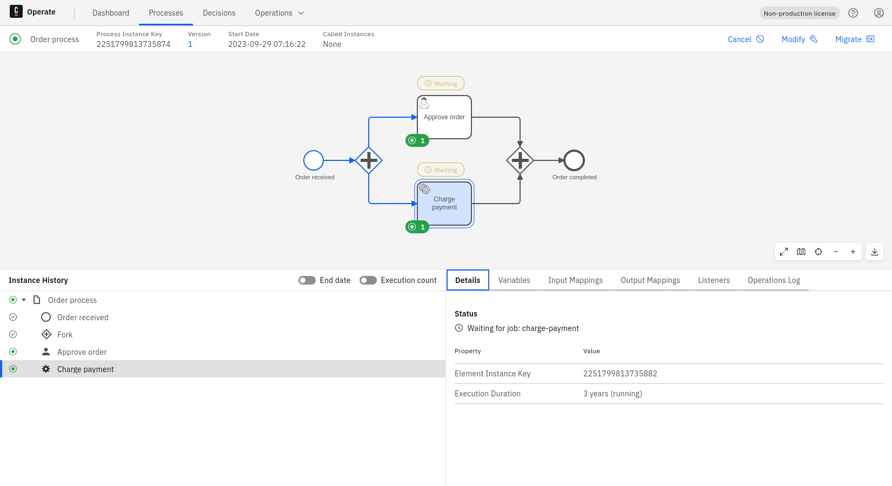

See what an active process instance is waiting for in Camunda 8 Operate.

## Prerequisites

To follow the steps in this guide, you must be [authorized to view wait states](../../wait-states/overview.md#access-control) for the relevant process definition.

## View wait states

When a process instance is active, you can inspect its active elements to see what each one is waiting for:

1. On the **Processes** page, in the **Process Instances** table, click the **Process Instance Key** of the instance you want to inspect.
2. In the process diagram, click an active element that has a **Waiting** label indicator on top.
3. Review the wait state details in the element **Details** tab — for example, the message name and correlation key for a receive task, or the due date for a timer.

An element shows a single wait state indicator even when multiple tokens are present on it. For timers, Operate shows the earliest due date.

## Supported wait state types

For the full list of wait state types and the details surfaced for each, see [supported wait state types](../../wait-states/overview.md#supported-wait-state-types).

## Next steps

- [Use the Camunda REST API to search wait states](/apis-tools/orchestration-cluster-api-rest/specifications/search-element-instance-wait-states.api.mdx).
