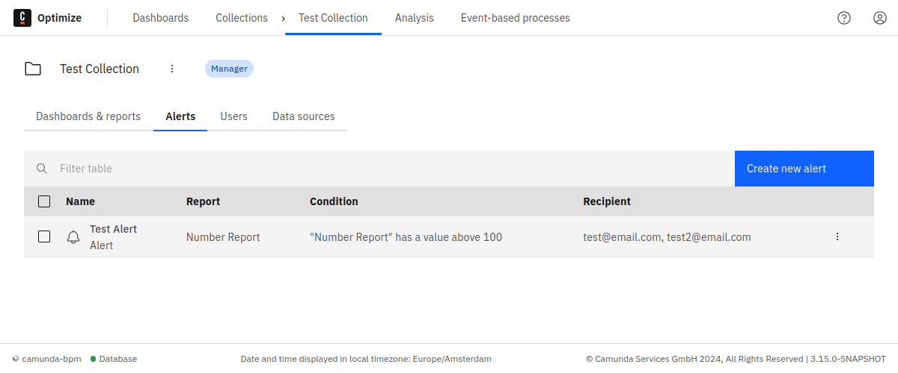
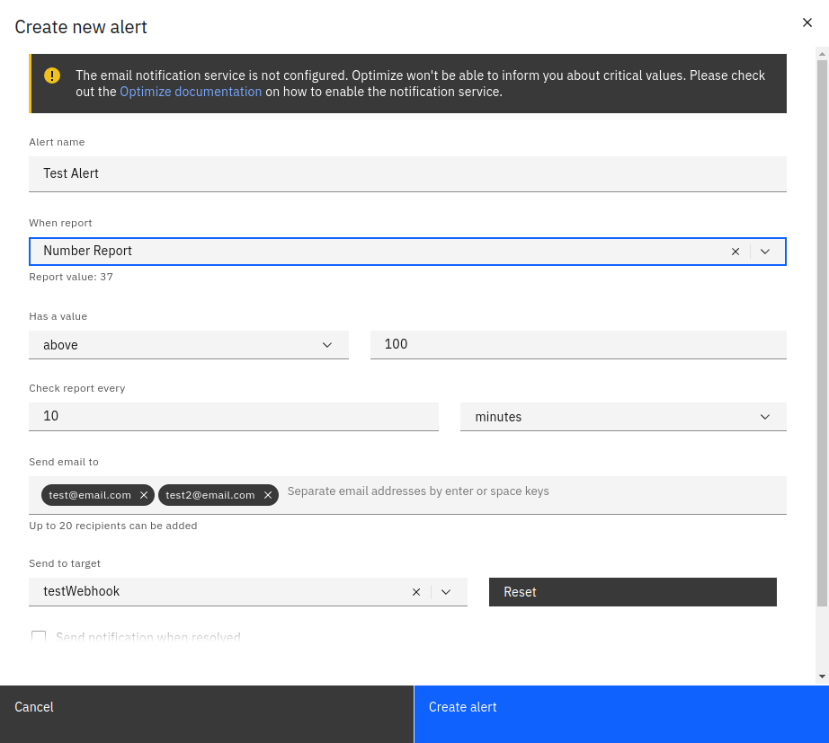
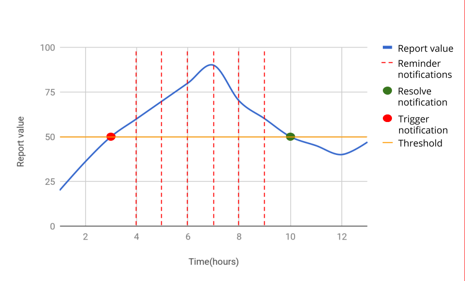

Platform only

:::note
You must configure the email service to receive notifications. See the technical guide for which properties need to be defined.
:::

Optimize's alerting functionality can be used to notify you when your report hits a predefined critical value. You can create alerts for any number reports that exist within a collection. Inside the collection, navigate to the **Alerts** tab to see all alerts defined for reports in this collection. You can manage an alert by moving the mouse over the alert entry and clicking the edit or delete buttons in the context menu on the right-hand side.

Click the **Create New Alert** to create a new alert. You will then see the following modal:

You need to give the alert a name, select the report and define a target webhook or email address of the person who will receive the alert. Please note that alerts can only be created for reports which are visualized as a single number and are in the same collection as the alert. Have a look at the [report section](../creating-reports.md) on how to define single number reports.

In addition, you need to set a threshold which defines when an alert should be triggered. A notification will be sent to the configured email address or webhook as soon as report value hits the threshold. If reminder notifications are enabled, the alert will continue to send notifications for as long as the value is above (or below, as defined) the threshold. Finally, you'll get a resolve notification as soon as the report value is back to normal range.

For example: you defined an alert which should be triggered when the report value becomes greater than 50.
You also enabled reminder notifications to be sent each hour. Here's what you get:

## Send alerts to external systems

It is possible to configure Optimize to send alerts to an external system when needed. The details on how configure and add target systems are explained in the technical guide. Once at least one target system is configured, alerts will have a new input option to select one of the configured systems.

