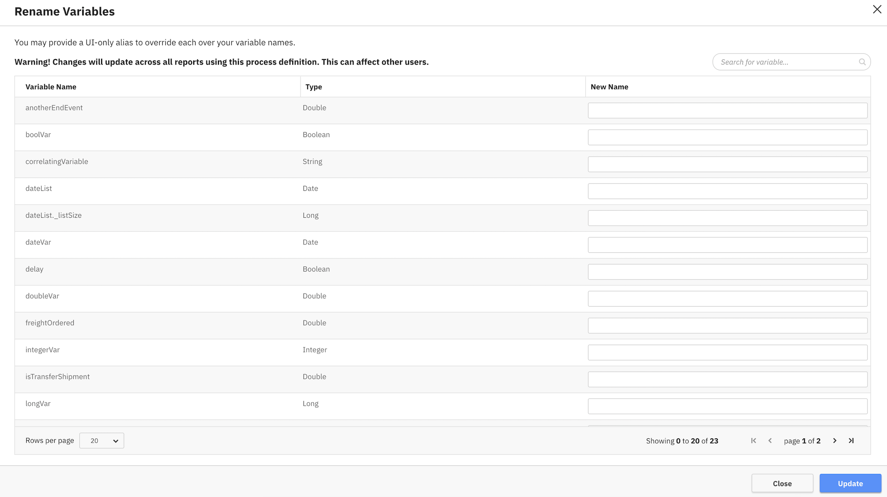

The variable labeling functionality allows users to add, update and delete batches of variable labels. This allows Optimize to display a variable's label instead of its original name, anywhere the given process definition is being used. Some examples of that would be
in reports, configuring filters, report grouping, dashboard filters and Event Based Processes.

In order to use this feature, go on the definition edit window from inside a report and click on **Edit Variables** to access the label edit panel. You will then see the following panel:

A label can be deleted by simply inputting an empty field for its value.

## Limitations

Please note that this feature is currently not supported in outlier analysis and csv export. This means that during Outlier Analysis, the original name of a variable will be displayed.

Additionally, keep in mind that when applying variable filters in multi definition reports and multi definition dashboards, the filters get applied to all variables across definitions which have the same name and type. This happens even in the case, that the variables are labeled differently across definitions.