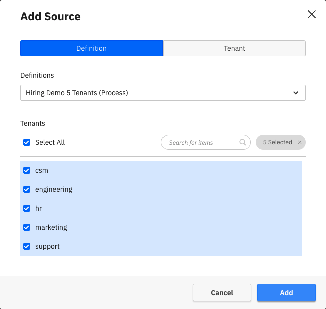
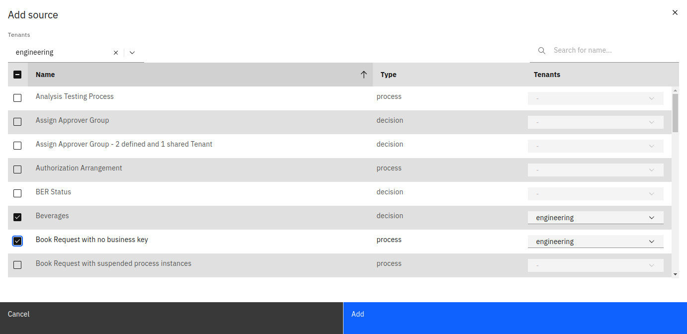

If you create a collection, you are asked to add Data sources that can be used for creating Reports. To see the added Data sources or add extra ones, go to the **Data Sources** tab of the Collection.

Using the **Add** button, a manager can add one or more sources to the collection by selecting the definitions that need to be added.

The added sources will appear in the process/decision selection list inside the report builder where they can be used to create reports.