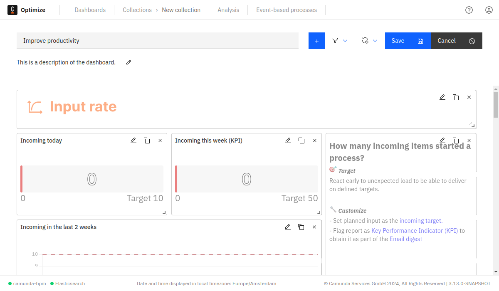
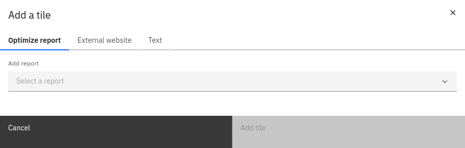
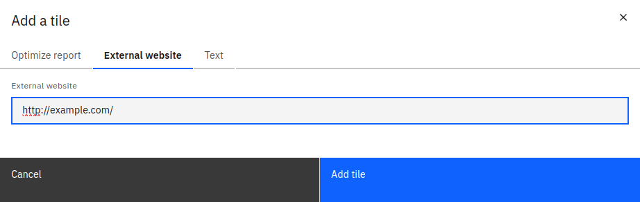
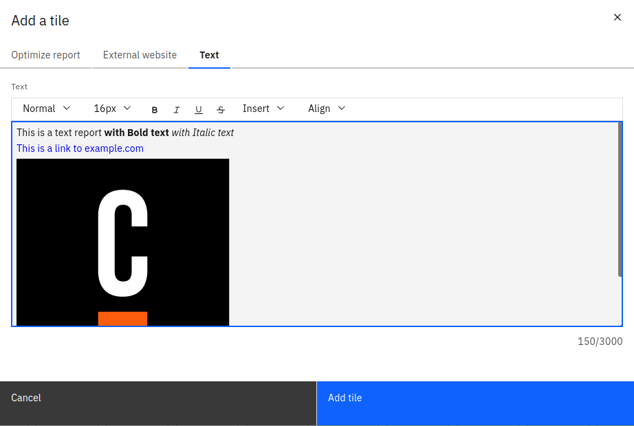
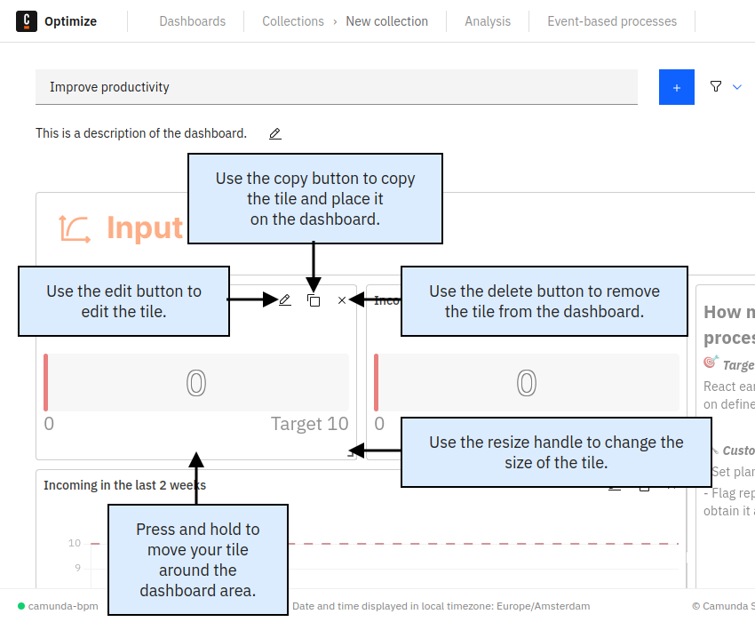
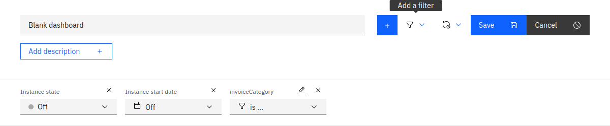
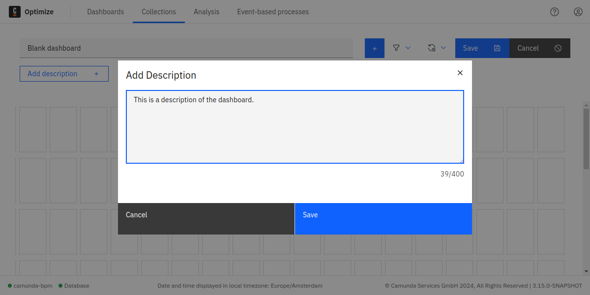

import TileEditButton from './img/tile-edit-button.png'
import TileCopyButton from './img/tile-copy-button.png'
import TileDeleteButton from './img/tile-delete-button.png'

Configure and customize your dashboard in edit mode, performing operations such as renaming, modifying or removing descriptions, adding, editing, copying or removing tiles, saving changes, canceling applied changes, setting dashboard filters, and defining a default auto-refresh rate for periodic updates in [view mode](./view-mode.md).

## Adding tiles

Assemble reports into a dashboard by clicking "Add a Tile" above the dashboard grid. In the modal, select Optimize reports or external website and text tiles, combining data from various sources as external website tiles and text tiles.

### Optimize reports

In the **Add a Tile** modal, use the **Optimize Report** tab to add reports to the dashboard. Use the **Select a Report** field to select one of the previously created reports or click **+ New Report from a template** to create a new report.

:::note
If the dashboard is inside a collection, only reports that are in the same collection can be added. If the dashboard is not in a collection, it can only contain reports that are also not in a collection.
:::

### External websites

In the **Add a Tile** modal, select **External Website** to input the URL of an external data source to be included in the dashboard. External websites are incorporated as iframes within the dashboard.

### Text tiles

In the **Add a Tile** modal, choose **Text** to access the text editor. This enables the creation of documents with formatted text, links, and images.

## Editing, copying, and removing tiles

Each tile features a set of buttons in its top-right corner, providing you with options to edit  and remove  the tile. The copy button  allows you to duplicate any tile, and the copied version can be conveniently placed anywhere on the dashboard. This duplicated tile is then customizable, enabling you to tailor it to your specific requirements.

## Placing tile on the dashboard

Move tiles within the dashboard by dragging them to your preferred location. Upon releasing the tile, it aligns with the nearest grid position. Resize tiles by dragging the handle in the lower right corner. Remove a tile by clicking the  button in the top right corner.

## Adding filters in edit mode

In dashboard edit mode, click **Add a Filter** to reveal the **Filters** panel. Specify filters for the dashboard, including start and end dates, process instance states (running, completed, or canceled), variable values, assignees, and candidate groups:

- Start date: Allows filtering by process instance start date
- End date: Allows filtering by process instance end date
- Instance state: Allows filtering by process instance state, such as running, completed, or canceled
- Variable: Allows filtering by process instance variable value
- Assignee: Allows filtering flow node data by their assignee
- Candidate Group: Allows filtering flow node data by their candidate group

For Variable Filters, define the variable and provide a list of values for filtering. Optionally, allow viewers to add their own filter values by checking the **Allow viewer to add filter values** box. Unlike report filters, adding a value here doesn't immediately apply; it only makes the value available for dashboard filtering.

For Assignee and Candidate Group filters, specify available options. Similarly, allow viewers to add their values.

The list of variable names, values, assignees, and candidate groups is compiled from all reports on the dashboard.

### Setting a default dashboard filter

After specifying filters in edit mode, dashboard editors can set a default filter, applied when a user first opens the dashboard. Viewers can remove filter values to see unfiltered reports, but if no manual changes are made, they will view reports with the defined default filter.

To set a default filter, use the added filter options in the filter area. The configuration set during dashboard save becomes the default filter.

## Adding or editing description

Under the **Dashboard** name, view or modify the description using the **Add/Edit** button. The text editor allows the addition of plain text descriptions, limited to 400 characters.

