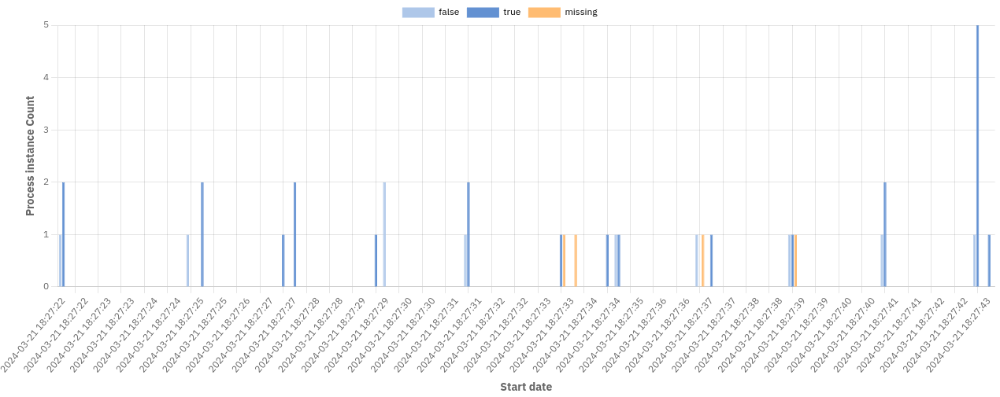

In this section of the report builder, you are characterizing the output of the report. Basically, you are defining "I want to view ... grouped by ... visualized as ...". To understand better what "View" and "Group by" mean, you can use the analogy of a graph, where "View" is the y-axis and "Group by" is the x-axis.

First, you need to select which part of the data you want to view. Optimize differentiates between the view (e.g. process instance or flow node) and the measure (e.g. count or duration):

1. Raw Data: View just a table with the actual data listed as rows. This can come in handy if you found interesting insights in certain process instances and need detailed information about those instances, or you are exploring a process definition with a limited number of instances. This report type also allows you to inspect raw [object variable values](/self-managed/optimize-deployment/configuration/object-variables.md).

2. Process instance

- Count: View how many process instances were executed.
- Duration: View how long the process instances took to complete.

3. Incident

- Count: View how many incidents occurred on the process.
- Resolution duration: View how long the incident took to get resolved.

4. Flow node

- Count: View how often the flow nodes (e.g. tasks) have been executed.
- Duration: View how long each flow node took to complete.

5. User task

- Count: View how often each user task has been executed.
- Duration: View how long each user task took to complete.

6. Variable: View an aggregation of values for a specific numeric variable of the process definition.

It is possible to display both count and duration measures for a single view in the same report.

Subsequently, you need to define how to group the data. Think of it as applying a metric to your input, where you break up the data by date, flow nodes, variable values, or other properties. For that, you have different options:

- **None**: Do not split up the data.
- **Flow nodes**: Cluster the data by flow nodes.
- **User tasks**: Cluster the data by user tasks.
- **Duration**: Cluster the data by duration. Depending on the selected view, this can be the duration of process instances, flow nodes, or user tasks.
- **Start date**: Group instances together that were started during the same date period or time, e.g. hour, day or month. Depending on the selected view, this can be the start date of process instances, flow nodes, or user tasks.
- **End date**: Group instances together that were finished during the same date period or time, e.g. hour, day or month. Depending on the selected view, this can be the start date of process instances, flow nodes, or user tasks.
- **Running date of the process instance**: Group process instances together that were running during the same date period or time, e.g. hour, day, or month.
- **Variable**: Process instances with the same value for the selected variable are grouped together.
- **Assignee**: Only available for user task views. Tasks are grouped together according to their current assignee.
- **Candidate group**: Only available for user task views. Tasks with the same candidate group are grouped together.
- **Process**: Only available for process instance reports with multiple definitions. Data from the same process is grouped together.

Finally, define how you want the data to be visualized. Examples are heatmap, table, bar, or line chart.

Not all the above view, group by, and visualization options can be combined. For instance, if you choose `Flow Node: Count` as view, the data is automatically grouped by flow nodes as no other combination would be valid.

All possible combinations can also be found in the following table:

| View                                                | Group by                                                        | Visualize as          |
| --------------------------------------------------- | --------------------------------------------------------------- | --------------------- |
| Raw Data                                            | None                                                            | Table                 |
| Process instance: Count, Process instance: Duration | None                                                            | Number                |
| Process instance: Count                             | Start Date, End Date, Running Date, Variable, Duration, Process | Table, Chart          |
| Process instance: Duration                          | Start Date, End Date, Variable, Process                         | Table, Chart          |
| Incident: Count, Incident Duration                  | None                                                            | Number                |
| Incident: Count, Incident Duration                  | Flow Nodes                                                      | Table, Chart, Heatmap |
| Flow Node: Count, Flow Node: Duration               | Flow Nodes                                                      | Table, Chart, Heatmap |
| Flow Node: Count                                    | Start Date, End Date, Duration, Variable                        | Table, Chart          |
| Flow Node: Duration                                 | Start Date, End Date, Variable                                  | Table, Chart          |
| User Task: Count, User Task: Duration               | User Tasks                                                      | Table, Chart, Heatmap |
| User Task: Count, User Task: Duration               | Start Date, End Date, Assignee, Candidate Group                 | Table, Chart          |
| User Task: Count                                    | Duration                                                        | Table, Chart          |
| Variable                                            | None                                                            | Number                |

:::note
You might sometimes see a warning message indicating that the data is limited to a certain number of points. This happens because the available stored data, in this case is very large, and it is not possible to display all the data in the selected visualization.
:::

## Reports with a second "Group by" option

Using the second "Group by" option, it is possible to apply another grouping to your data to display extra details such as dates, variable values, or assignees. This option will be shown below the first "Group by" option if the current report combination supports it. Here is an overview of the reports that supports a second "Group by":

## Flow node reports

Flow node names can be applied as a second "Group by". If the report contains multiple process definitions, the data can also be grouped by process as a second "Group by".

## User task reports

For information about Optimize user task analytics, refer to our [task analysis documentation](../task-analysis.md).

## Process instance reports

Refer to the table below for the process instance count and duration reports that support a second "Group by":

| View                             | Group by               | Second group by                                                   |
| -------------------------------- | ---------------------- | ----------------------------------------------------------------- |
| Process Instance Count, Duration | Start Date, End Date   | Variable, Process (only for multi-definition reports)             |
| Process Instance Count, Duration | Variable               | Start Date, End Date, Process (only for multi-definition reports) |
| Process Instance Count           | Running Date, Duration | Process (only for multi-definition reports)                       |

The diagram below shows a report grouped by `Start Date` and a boolean variable:

