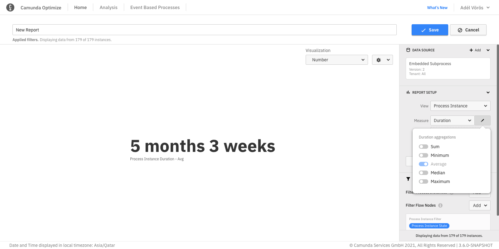

## Duration and variable report aggregation

For duration and variable views, the default aggregation type is the average. You can add and change different aggregations like minimum, maximum, and median in the report configuration panel. Note that the median is an estimate and the other operations are exact values.

Reports with multiple aggregations that have a [second "Group by"](./define-reports.md#reports-with-a-second-group-by-option) can only be visualized as table.

## User task duration time

:::note
The following information regarding idle versus work is currently applicable only to Camunda Platform 7.
:::

In user task duration reports, you have the opportunity to select which part of the user task's lifecycle you want to see in the report:

- Idle: View how long each user task was considered idle (not claimed by an assignee/user) during its execution.
- Work: View how long each user task was considered to be worked on by assignees/users (claimed by an assignee/user) during its execution.
- Total: View how long each user task took to complete.

It is possible to display and compare multiple user task duration times in the same report. Reports with multiple user task duration times that have a [second "Group by"](./define-reports.md#reports-with-a-second-group-by-option) can only be visualized as table.

:::note
User tasks which have been completed yet have no claim operations are evaluated as follows: if the user task was canceled, the task is considered to have been idle whereas user tasks which were completed are considered to have been worked on programmatically or via a custom UI, meaning the time between start and end is considered work time.
:::
