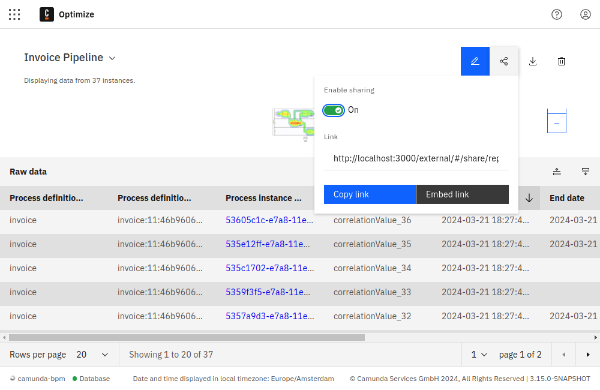
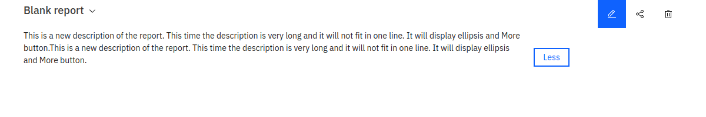

## View mode

Once you have defined what your report should look like, the view mode gives you a view of the report visualization and the raw instance data. To see more details about the report, you can interact with it, e.g. by moving your mouse over individual data points in diagrams or zooming in or out of heatmaps. The kind of interaction always depends on the report itself.

The view mode also provides you with different kinds of actions, such as:



- Download CSV: In case you want to download the data of the report, you can click the **Download CSV** button. The downloaded file will include the report information in a table format.

- Sharing: In case you want to share the report with other people or want to embed it in a webpage, you can use the sharing feature of the report. Just click on the **Share** button, which opens up a popover. After enabling the **Enable sharing** switch, a link is generated which you can send to people who do not have access to Camunda Optimize and thus enable them to see the report.

  You can also use the **Embed Link** button if you wish to insert the report into your webpage. Everyone that views the webpage can then see content of the report. The shared versions of the report allow you to view the report itself only. There is no possibility to alter it or interact with any other features of Optimize. You can revoke the sharing any time by disabling the share switch.

  If you prefer to hide the header of the shared report or specific part of it, you can do that by adding the following parameter to the share URL:

  ```
  header : titleOnly / linkOnly / hidden
  ```

  For example, to completely hide the header from the shared report, you can add `header=hidden` as shown:

  ```
  http://<report share url>?header=hidden
  ```

- Alerts: If the created report is inside a collection, you can use the **Alert** dropdown to create and manage Alerts for that report. Since alerts can only be created on reports that have a number visualization, the **Alerts** dropdown will be only be visible for such reports.

- Description: If a Report has a description, the description is displayed below the Report name. The **More/Less** button can show or hide the text for descriptions longer than a single line.


