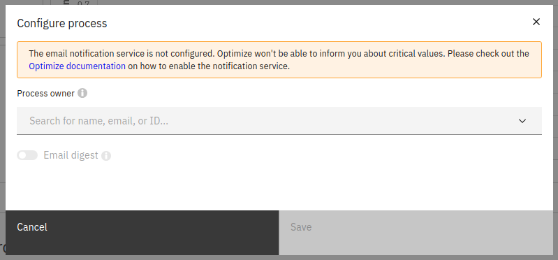

## Overview

The processes section gives you an overview of all the processes and their status on a single page.
This section also allows you to set a process owner to take responsibility of a process as well as viewing time and quality KPIs to track process performance. Additionally, a **Management Dashboard** can be found at the top of the page, which integrates data from all processes in one view. The optional date filters are applied to all the reports shown in this view.

The list of processes can be sorted by either the name of the process, or the name of the owner of the process.

## Set time and quality KPIs

KPIs are single number reports, which have a target set. A report can be configured as a KPI report through the report configuration panel and the classification to a time or quality KPI happens internally in Optimize based on the measure selected.
Once a report is configured as KPI, its status can be seen on the **Processes Overview** page. Hovering over its status allows previewing more specific information in regard to the KPIs, such as the target set, the actual current value of the single number report and a link to it. If a user accesses a report via this link and does not have authorization to view it, they will not be able to see any data in the report view.

## Configuring process owner and digests

The process can be configured by clicking the 'Configure' button when hovering over the process. From this modal, you can change the owner of the process, as well as enable/disable the process digest. The process digest is a scheduled email report summarizing the current and previous state of the KPI reports for that process. It will be emailed to the owner of that process at globally configurable regular intervals. Please note that process digests are an alpha feature.

do
