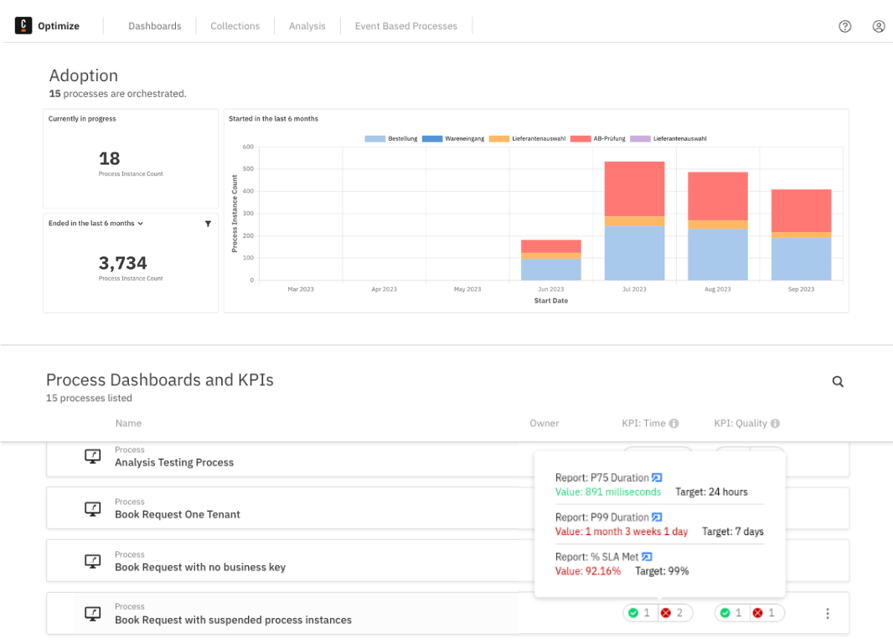
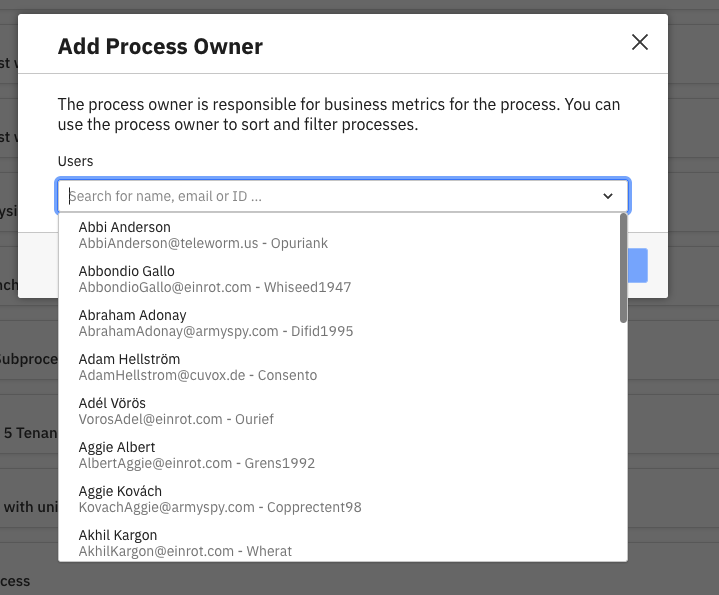
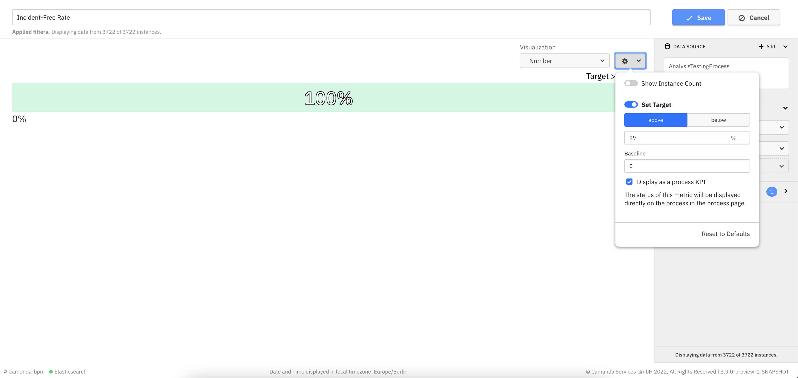

## Overview

The processes section gives you an overview of all the processes and their status on a single page.
This section also allows you to set a process owner to take responsibility of a process as well as creating time and quality kpis to track process performance. Additionally, a **Management Dashboard** can be found, which integrates data from all processes in one view.

## Assigning an owner

Assign an owner for process health to clarify who the responsible individual is for it. Once you open up the set owner modal, select one of the users in your organization to be the main person responsible for the process.

Once an owner is assigned to a process, you can sort the processes page by owner to quickly see which processes have a common owner.

## Set time and quality kpis

Kpis are single number reports, which have a target set. A report can be configured as kpi through the report configuration panel and the classification to a time or quality kpi happens internally in Optimize based on the measure selected.
Once a report is configured as kpi, its status can be seen on the **Processes Overview** page. Hoovering over its status allows previewing more specific information in regard to the kpis, such as the target set, the actual value of the single number report and a link to it.

